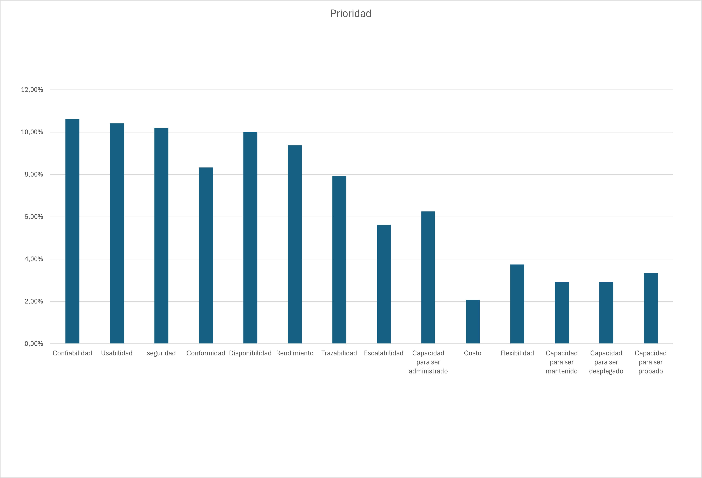
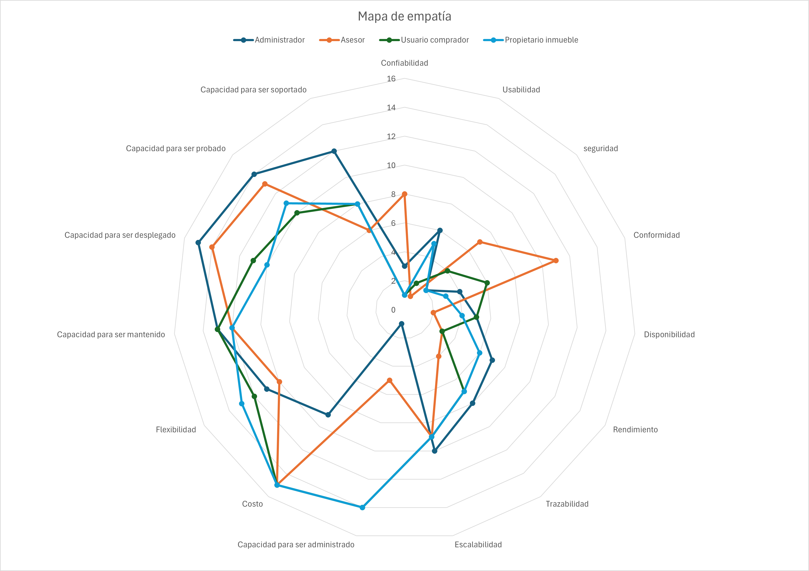
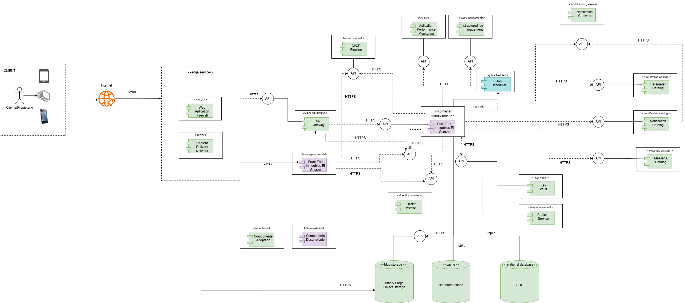
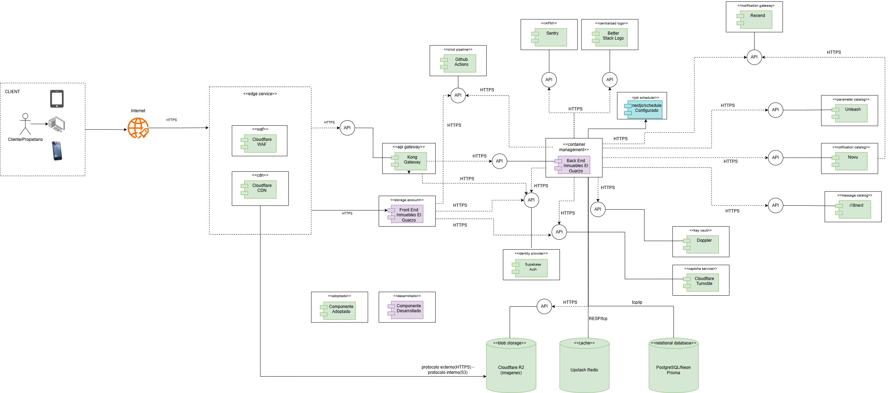
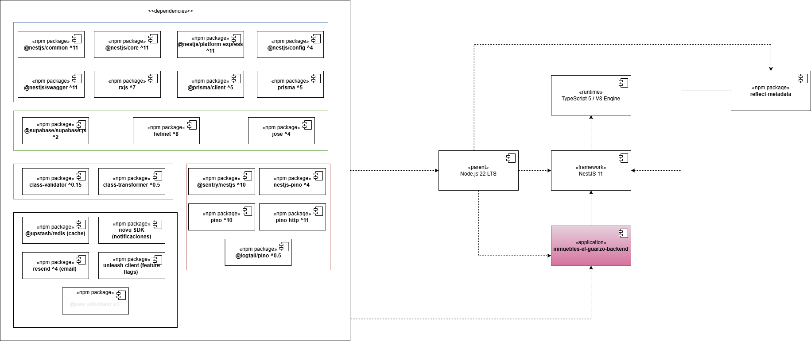
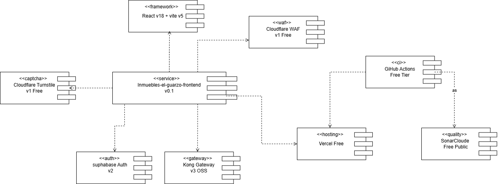
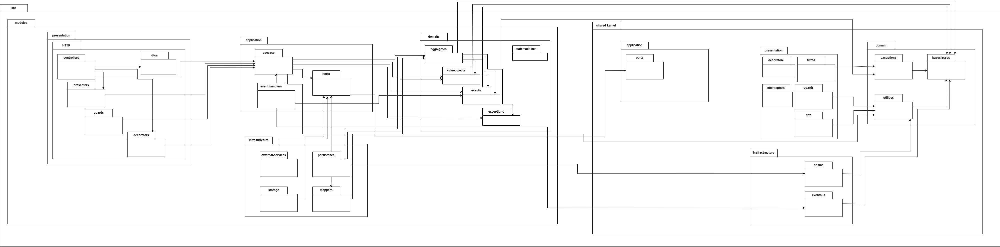
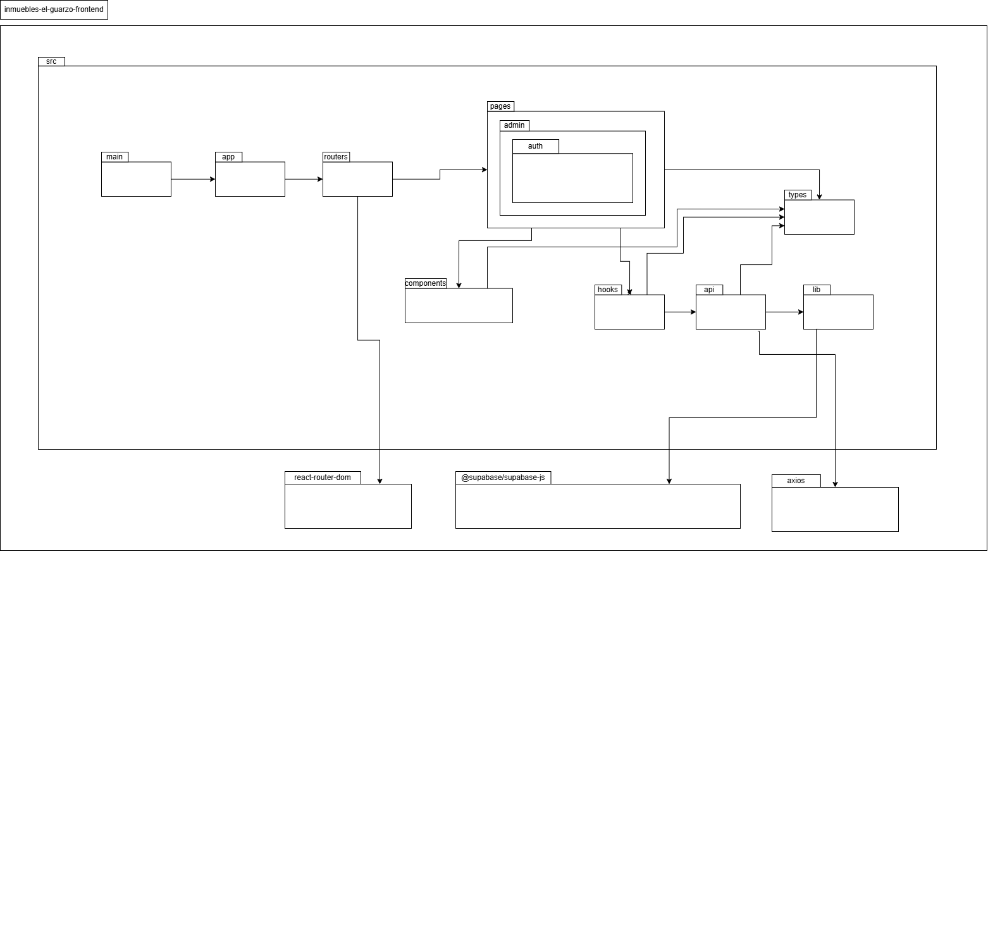
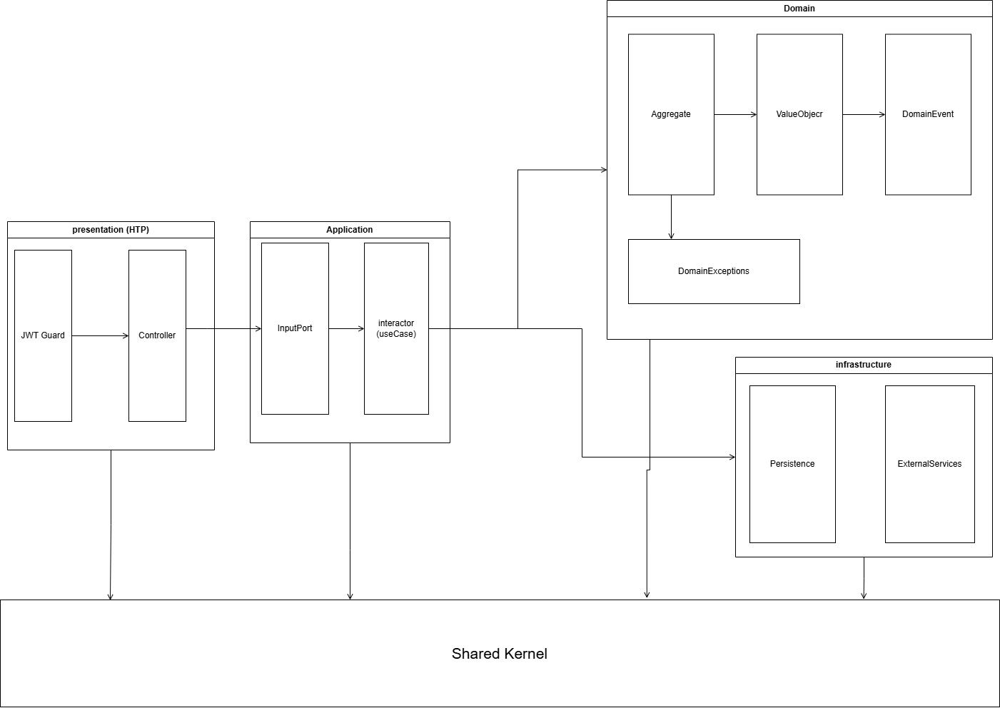
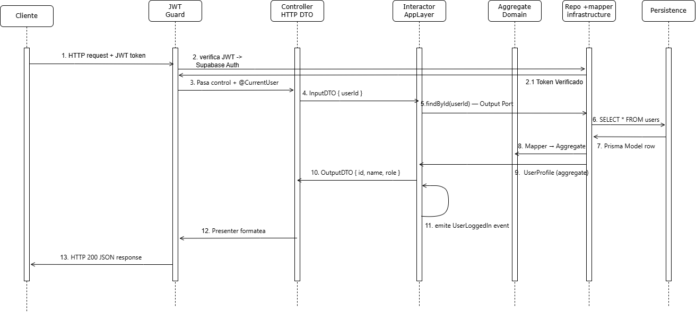

<p align="center">
  
</p>

<br>

<h1 align="center">Inmuebles El Guarzo</h1>

<p align="center">
  Plataforma backend inmobiliaria moderna desarrollada con arquitectura escalable y enfoque cloud-native.
</p>

<p align="center">

  

  

  

  

  

</p>

---

# Información del documento

| Campo       | Información                     |
| ----------- | ------------------------------- |
| Proyecto    | Inmuebles El Guarzo             |
| Versión     | 1.0                             |
| Año         | 2026                            |
| Universidad | Universidad Católica de Oriente |
| Asignatura  | Ingeniería de Software 2        |

---

# Integrantes del equipo

| Integrante               | Rol               |
| ------------------------ | ----------------- |
| Samuel Giraldo Villada   | Backend Developer |
| Juan Camilo Urrea Garcia | Backend Developer |

---

# Tabla de contenido

- [Objetivo del documento](#objetivo-del-documento)
- [1. Descripción general del proyecto](#1-descripción-general-del-proyecto)
- [2. Arquitectura del sistema](#2-arquitectura-del-sistema)
- [3. Restricciones técnicas](#3-restricciones-técnicas)
- [4. Restricciones de negocio](#4-restricciones-de-negocio)
- [5. Atributos de calidad](#5-atributos-de-calidad)
- [6. Funcionalidades críticas del sistema](#6-funcionalidades-críticas-del-sistema)
- [7. Tácticas y estrategias arquitectónicas](#7-tácticas-y-estrategias-arquitectónicas)
- [8. Arquetipo de solución](#8-arquetipo-de-solución)
- [9. Arquitectura de solución](#9-arquitectura-de-solución)
- [10. Diagramas de componentes](#10-diagramas-de-componentes)
- [11. Diagramas de paquetes](#11-diagramas-de-paquetes)
- [12. Escenarios de calidad priorizados](#12-escenarios-de-calidad-priorizados)
- [13. Diagramas de arquitectura del backend](#13-diagramas-de-arquitectura-del-backend)

---

# Objetivo del documento

El presente documento tiene como propósito describir la arquitectura de software definida para la plataforma Inmuebles El Guarzo, incluyendo decisiones de diseño, restricciones, atributos de calidad, componentes arquitectónicos y estrategias adoptadas durante el desarrollo del sistema.

Asimismo, busca servir como referencia técnica para comprender la estructura general de la solución, facilitar su evolución futura y respaldar las decisiones arquitectónicas tomadas durante el proyecto.

---

# 1. Descripción general del proyecto

## 1.1. Contexto y problemática

Inmuebles El Guarzo surge como respuesta a las dificultades que enfrentan muchas personas al buscar inmuebles mediante redes sociales, publicaciones dispersas o plataformas desconectadas, donde la información suele ser inconsistente, limitada o difícil de verificar.

Actualmente, gran parte de la gestión inmobiliaria continúa realizándose de manera manual o mediante herramientas poco integradas, dificultando la trazabilidad de procesos, la atención de clientes y la administración eficiente de propiedades.

---

## 1.2. Objetivo de la plataforma

El objetivo del proyecto es desarrollar una plataforma inmobiliaria moderna que permita centralizar, gestionar y optimizar la publicación y consulta de propiedades, ofreciendo una experiencia más organizada, segura y escalable tanto para clientes como para asesores inmobiliarios.

La plataforma permite administrar propiedades, gestionar ofertas, procesar solicitudes de publicación, manejar contactos y centralizar la comunicación mediante distintos canales digitales.

Además del enfoque funcional del negocio inmobiliario, el sistema fue diseñado siguiendo principios modernos de arquitectura de software, priorizando mantenibilidad, escalabilidad, seguridad y evolución tecnológica.

---

# 2. Arquitectura del sistema

## 2.1. Enfoque arquitectónico

El backend de Inmuebles El Guarzo fue diseñado bajo un enfoque de
**Monolito Modular**, donde cada módulo implementa internamente una
**arquitectura hexagonal (Ports & Adapters)** enriquecida con
**tácticas de Domain-Driven Design (DDD)**.

Clean Architecture de Robert C. Martin sirvió como referencia
conceptual para la separación de responsabilidades y la regla de
dependencia: las capas internas no conocen a las externas. Sin embargo,
la implementación concreta adoptó el vocabulario y los mecanismos de
la arquitectura hexagonal, que es más explícita en cómo se definen
y se cruzan los límites entre el dominio y el mundo exterior.

Esta combinación no fue accidental. Responde a una necesidad práctica:
mantener el dominio completamente aislado de frameworks, bases de datos
y servicios externos, mientras se organiza el código de forma predecible
y consistente en todos los módulos.

---

## 2.2. ¿Por qué un Monolito Modular?

El sistema maneja procesos altamente relacionados entre sí, como:

- Gestión de propiedades.
- Publicaciones inmobiliarias.
- Ofertas.
- Contactos.
- Notificaciones.
- Auditoría.
- Autenticación y autorización.

Debido a esta alta cohesión del dominio, se optó por un Monolito
Modular, ya que permite:

- Mantener una única unidad de despliegue.
- Reducir complejidad operativa.
- Evitar problemas de comunicación distribuida.
- Garantizar consistencia transaccional.
- Facilitar el mantenimiento del sistema.
- Organizar el proyecto mediante módulos desacoplados con límites
  de dominio claramente definidos.

A diferencia de una arquitectura de microservicios, este enfoque evita
introducir complejidad temprana relacionada con orquestación,
observabilidad distribuida, comunicación entre servicios y
administración de infraestructura adicional.

La separación modular deja preparada la aplicación para una posible
migración futura hacia microservicios, porque los límites del dominio
ya están claramente definidos y cada módulo es independiente del resto.

---

## 2.3. Arquitectura interna de cada módulo

Cada módulo del sistema está organizado en cuatro capas con
responsabilidades claramente delimitadas. La regla de dependencia es
estricta: **las capas internas no conocen a las externas**.

| Capa             | Responsabilidad                                                                                       |
| ---------------- | ----------------------------------------------------------------------------------------------------- |
| `domain`         | Aggregates, Value Objects, Domain Events y reglas de negocio. Sin dependencias externas.              |
| `application`    | Casos de uso (Interactors), Input/Output Ports y DTOs de aplicación. Orquesta el dominio.             |
| `infrastructure` | Adaptadores concretos: repositorios Prisma, servicios externos, mappers. Implementa los Output Ports. |
| `presentation`   | Controllers HTTP, Guards, Decorators y Presenters. Punto de entrada al sistema.                       |

### Arquitectura hexagonal dentro de cada módulo

La capa `application` define **Output Ports**: interfaces que
describen lo que necesita del exterior (un repositorio, un servicio
de autenticación, un proveedor de notificaciones) sin saber cómo
está implementado.

La capa `infrastructure` contiene los **adaptadores** que implementan
esos puertos con tecnologías concretas (Prisma para PostgreSQL,
Supabase para autenticación, Resend para email, Novu para
notificaciones).

Esto significa que si mañana se reemplaza Prisma por otro ORM, o
Supabase por otro proveedor de identidad, el dominio y la lógica
de aplicación no se modifican. Solo cambia el adaptador.

### DDD táctico en la capa de dominio

La capa `domain` de cada módulo aplica tácticas de Domain-Driven
Design:

- **Aggregates**: unidades de consistencia del dominio
  (ej. `UserProfile`, `Property`, `Offer`).
- **Value Objects**: tipos inmutables con validación propia
  (ej. `Email`, `FullName`, `UserRole`).
- **Domain Events**: hechos del negocio que ocurrieron
  (ej. `UserLoggedIn`, `UserProfileCreated`).
- **Domain Exceptions**: errores con semántica de negocio
  (ej. `InactiveUserCannotLogin`, `InvalidEmailFormat`).

### Shared Kernel

Existe un módulo transversal `shared-kernel` que provee las bases
que todos los módulos heredan:

- Clases base: `AggregateRoot`, `Entity`, `ValueObject`, `DomainEvent`.
- Tipos funcionales: `Result<T>` y `Maybe<T>` para manejo explícito
  de errores sin excepciones no controladas.
- `UniqueId` como value object base para identidades.
- `InputPort`: interfaz base para todos los casos de uso.
- `EventBus` in-memory para comunicación entre módulos.
- Filtros globales: `DomainExceptionFilter` y `PrismaExceptionFilter`.

---

## 2.4. Motivadores arquitectónicos

| Motivador               | Impacto en el diseño                                                        |
| ----------------------- | --------------------------------------------------------------------------- |
| Mantenibilidad          | Organización modular y separación estricta por capas                        |
| Escalabilidad evolutiva | Límites de dominio definidos, preparados para extracción a microservicios   |
| Seguridad               | Autenticación centralizada vía Supabase Auth con guard en capa Presentation |
| Desacoplamiento         | Output Ports en Application, adaptadores en Infrastructure                  |
| Testabilidad            | Interactors independientes de infraestructura, testeables con mocks simples |
| Evolución tecnológica   | Cambio de proveedor externo implica cambiar solo el adaptador               |
| Claridad organizacional | Estructura de carpetas idéntica en todos los módulos                        |

---

## 2.5. Estructura general del backend

```text
src/
 ├── modules/
 │    ├── iam/              # Identidad y acceso
 │    ├── properties/       # Gestión de propiedades
 │    ├── offers/           # Ofertas con máquina de estados
 │    ├── publications/     # Solicitudes de publicación
 │    ├── contacts/         # Mensajes de contacto
 │    ├── notifications/    # Notificaciones multicanal
 │    ├── audit/            # Registro de auditoría
 │    └── configuration/    # Parámetros y catálogos del sistema
 │
 ├── shared-kernel/         # Base compartida por todos los módulos
 │
 ├── app.module.ts
 └── main.ts
```

Cada módulo sigue internamente la misma estructura:

```text
modulo/
 ├── domain/
 │    ├── aggregates/
 │    ├── value-objects/
 │    ├── events/
 │    └── exceptions/
 ├── application/
 │    ├── features/ (o use-cases/)
 │    └── ports/output/
 ├── infrastructure/
 │    └── persistence/
 └── presentation/
      └── http/
```

---

# 3. Restricciones técnicas

## 3.1. Definición e impacto en el diseño

Las restricciones técnicas representan el conjunto de condiciones, estándares y lineamientos que limitan o guían las decisiones de diseño, desarrollo y despliegue del sistema.

Estas restricciones permiten garantizar que la solución cumpla criterios mínimos de:

- Calidad de software
- Seguridad
- Escalabilidad
- Mantenibilidad
- Observabilidad
- Automatización
- Rendimiento operativo

En el contexto de Inmuebles El Guarzo, las restricciones técnicas influyen directamente en la arquitectura del sistema, la selección de tecnologías, la organización del código, las prácticas DevOps y la estrategia de aseguramiento de calidad.

Además, estas restricciones permiten establecer estándares consistentes de desarrollo que facilitan la evolución progresiva del proyecto y reducen riesgos técnicos durante el ciclo de vida del software.

---

## 3.2. Restricciones de prácticas DevOps

Esta categoría agrupa las restricciones relacionadas con automatización de despliegues, integración continua, estabilidad operativa y estrategias de entrega del software.

| Restricción                          | Justificación                                              |
| ------------------------------------ | ---------------------------------------------------------- |
| Implementación de CI/CD automatizado | Garantiza validación automática y despliegues consistentes |
| Ejecución automática de smoke tests  | Permite detectar fallos críticos tras cada despliegue      |
| Soporte de rollback rápido           | Reduce impacto operativo ante errores en producción        |
| Estrategia estructurada de ramas     | Facilita el trabajo colaborativo y control de versiones    |
| Downtime máximo controlado           | Mejora disponibilidad y continuidad del servicio           |

---

## 3.3. Restricciones de diseño y arquitectura

Estas restricciones definen lineamientos relacionados con la estructura interna del sistema, modularidad y desacoplamiento de componentes.

| Restricción                    | Justificación                                  |
| ------------------------------ | ---------------------------------------------- |
| Uso de Clean Architecture      | Mantiene separación clara de responsabilidades |
| Uso de puertos y adaptadores   | Facilita independencia tecnológica             |
| Comunicación basada en eventos | Permite desacoplamiento entre módulos          |
| Reutilización de componentes   | Reduce duplicidad y deuda técnica              |

---

## 3.4. Restricciones de calidad y código limpio

Estas restricciones buscan mantener estándares consistentes de desarrollo y legibilidad del código.

| Restricción                               | Justificación                               |
| ----------------------------------------- | ------------------------------------------- |
| Validación automática de linting y tipado | Garantiza consistencia y calidad del código |
| Máximo de líneas por función              | Reduce complejidad y mejora mantenibilidad  |
| Máximo de líneas por archivo              | Favorece separación de responsabilidades    |
| Logging estructurado                      | Facilita monitoreo y diagnóstico            |
| Límite de dependencias externas           | Reduce complejidad y vulnerabilidades       |

---

## 3.5. Restricciones de testing y aseguramiento de calidad

Estas restricciones establecen mecanismos mínimos para garantizar estabilidad y confiabilidad del sistema.

| Restricción                                  | Justificación                                 |
| -------------------------------------------- | --------------------------------------------- |
| Cobertura mínima de pruebas                  | Mejora confiabilidad del sistema              |
| Pruebas de integración para módulos críticos | Validan comportamiento real del sistema       |
| Seeds versionados e idempotentes             | Facilitan pruebas y configuración de entornos |
| Gestión formal de incidentes                 | Permite trazabilidad y mejora continua        |

---

## 3.6. Restricciones de seguridad

Estas restricciones buscan proteger la información, reducir vulnerabilidades y garantizar buenas prácticas de seguridad.

| Restricción                           | Justificación                            |
| ------------------------------------- | ---------------------------------------- |
| Uso obligatorio de HTTPS              | Protege la comunicación cliente-servidor |
| Validación y sanitización de entradas | Previene ataques de inyección            |
| Implementación de rate limiting       | Reduce abuso y ataques automatizados     |
| Protección de errores internos        | Evita exposición de información sensible |
| Protección anti-bots                  | Reduce spam y automatización maliciosa   |

---

## 3.7. Restricciones de documentación técnica

Estas restricciones garantizan trazabilidad técnica y facilidad de mantenimiento del proyecto.

| Restricción                            | Justificación                                        |
| -------------------------------------- | ---------------------------------------------------- |
| README técnico documentado             | Facilita onboarding de desarrolladores               |
| Registro de decisiones arquitectónicas | Conserva contexto técnico del sistema                |
| Documentación automática de API        | Mantiene sincronización entre código y documentación |

---

## 3.8. Restricciones metodológicas

Estas restricciones definen lineamientos relacionados con la organización y gestión del desarrollo del proyecto.

| Restricción                                    | Justificación                           |
| ---------------------------------------------- | --------------------------------------- |
| Desarrollo iterativo                           | Facilita adaptación continua            |
| Gestión de backlog centralizada                | Mejora organización y trazabilidad      |
| Seguimiento de tareas mediante GitHub Projects | Permite control del avance del proyecto |

---

# 4. Restricciones de negocio

## 4.1. Definición e impacto en el diseño

Las restricciones de negocio representan el conjunto de condiciones organizacionales, operativas, legales, económicas y estratégicas que influyen directamente en el alcance, desarrollo y evolución del sistema.

Estas restricciones permiten establecer límites y prioridades para la toma de decisiones técnicas y funcionales, garantizando que la solución desarrollada responda adecuadamente a las necesidades reales del negocio y del contexto operativo del proyecto.

En el contexto de Inmuebles El Guarzo, las restricciones de negocio impactan directamente aspectos como:

- Priorización de funcionalidades
- Alcance del sistema
- Selección tecnológica
- Estrategia de despliegue
- Organización del equipo
- Gestión del tiempo
- Escalabilidad progresiva
- Sostenibilidad operativa

Además, estas restricciones condicionan múltiples decisiones arquitectónicas y metodológicas adoptadas durante el desarrollo, buscando equilibrar factores como complejidad técnica, tiempo de entrega, costos operativos y mantenibilidad del sistema.

---

## 4.2. Restricciones humanas

Estas restricciones están relacionadas con la capacidad operativa, tamaño del equipo y disponibilidad de recursos humanos para el desarrollo del proyecto.

| Restricción                                                                                                                                                                                                   | Justificación                                                                                                                                                                                                                                                                                                                                                                                                                                                                                                       | Plan de acción                                                                                                                                                                                                                                                                                                                                                                                                                                                                                           |
| :------------------------------------------------------------------------------------------------------------------------------------------------------------------------------------------------------------ | :------------------------------------------------------------------------------------------------------------------------------------------------------------------------------------------------------------------------------------------------------------------------------------------------------------------------------------------------------------------------------------------------------------------------------------------------------------------------------------------------------------------ | :------------------------------------------------------------------------------------------------------------------------------------------------------------------------------------------------------------------------------------------------------------------------------------------------------------------------------------------------------------------------------------------------------------------------------------------------------------------------------------------------------- |
| El equipo de negocio solamente cuenta con 2 horas y media diarias para trabajar en el proyecto.                                                                                                               | Si el equipo del negocio solo dispone de 2 horas y media al día, cualquier reunión mal planificada, sesión innecesariamente larga o solicitud de retroalimentación sin agenda clara puede consumir toda la disponibilidad de una jornada sin generar avance real. Perder un solo día equivale a acumular retraso, porque no hay horas de reserva para recuperar. El proyecto depende de que cada minuto de contacto con el negocio produzca decisiones concretas.                                                   | Planificar todas las sesiones con el equipo de negocio con agenda definida, duración máxima acordada y entregable esperado antes de cada reunión. Preparar previamente los materiales para que las sesiones sean de decisión, no de exploración. Documentar cada decisión en el momento para no repetir reuniones por falta de registro. Priorizar las validaciones más críticas primero, y dejar las revisiones menores para comunicación escrita.                                                      |
| Los asesores del negocio cuentan con una disponibilidad limitada, con horarios laborales en semana de 10:00 AM a 8:00 PM. Y sabados de 9:00 AM a 1:00PM                                                       | Los asesores son quienes conocen el día a día del negocio inmobiliario: cómo se capta un inmueble, cómo se atiende al cliente, qué información necesitan para cerrar un negocio. Si no se respeta su horario laboral (lunes a viernes de 10:00 AM a 8:00 PM, sábados de 9:00 AM a 1:00 PM), simplemente no van a estar disponibles para validar funcionalidades ni para aportar su conocimiento operativo. Intentar agendar sesiones fuera de esos horarios solo genera frustración y retrasos.                     | Agendar todas las sesiones de trabajo con asesores exclusivamente dentro de su horario laboral. Establecer un calendario semanal fijo con franjas reservadas para validación del proyecto, acordadas desde el inicio. Si se necesitan validaciones urgentes los sábados, concentrarlas en la franja de 9:00 AM a 1:00 PM y avisarles con mínimo 48 horas de anticipación.                                                                                                                                |
| Los integrantes deben tener conocimiento completo del negocio. Y tener conocimiento de todas las desiciones tomadas. Si alguno se incapacita el otro debe poder seguir sin problema                           | Si el conocimiento del proyecto queda concentrado en una sola persona y esa persona se incapacita, enferma o tiene una emergencia personal, el proyecto se paraliza completamente porque nadie más sabe qué se decidió, por qué se decidió ni en qué punto va cada tarea. En un equipo pequeño como el de este proyecto, la dependencia de una sola persona es un riesgo directo de fracaso. La inmobiliaria no puede darse el lujo de perder semanas porque alguien no está disponible temporalmente.              | Mantener toda la documentación de decisiones, diseños y acuerdos actualizada y accesible para todos los integrantes del equipo. Realizar sesiones periódicas de alineación donde ambos miembros compartan el estado de lo que están trabajando. Establecer la regla de que ninguna decisión importante se toma sin quedar documentada por escrito en un lugar compartido, de modo que cualquier integrante pueda retomar el trabajo del otro sin pérdida de contexto.                                    |
| Los asesores del negocio son personas con perfil comercial, no técnico, y su nivel de alfabetización digital es variable.                                                                                     | Los asesores de la inmobiliaria son personas con experiencia en ventas y atención al cliente, no en manejo de sistemas complejos. Si el sistema que se construye requiere conocimientos especializados para operarlo, los asesores no lo van a usar correctamente o simplemente lo van a rechazar y volverán a trabajar como lo hacían antes. Un sistema que el equipo del negocio no adopta es un sistema que fracasa, sin importar qué tan bien esté construido.                                                  | Diseñar todas las interfaces del sistema pensando en personas sin formación en sistemas: lenguaje claro, instrucciones visibles, flujos simples y sin jerga. Validar cada pantalla con al menos un asesor real antes de darla por terminada. Incluir mensajes de ayuda y guías visuales dentro del sistema para que los asesores puedan operar sin necesidad de un manual extenso ni de llamar a soporte.                                                                                                |
| El stakeholder principal (dueño de la inmobiliaria) tiene disponibilidad limitada para sesiones de validación y retroalimentación del proyecto.                                                               | El dueño de la inmobiliaria es quien tiene la visión del negocio, aprueba la dirección del proyecto y toma las decisiones finales sobre cómo debe funcionar el sistema. Si su tiempo es limitado y no se gestiona bien, el proyecto corre el riesgo de avanzar en una dirección equivocada durante semanas sin que nadie lo corrija, para luego tener que rehacer trabajo cuando finalmente el dueño revise y diga que no era lo que esperaba. Eso cuesta tiempo y esfuerzo que no se pueden desperdiciar.          | Programar sesiones cortas de validación con el dueño de la inmobiliaria en intervalos regulares (por ejemplo, cada 2 semanas) con agenda definida y entregables concretos para revisar. Presentarle avances visuales que pueda evaluar rápidamente, no documentos extensos. Escalar las decisiones más importantes a estas sesiones y resolver las operativas con el equipo directamente, para hacer el mejor uso posible de su tiempo limitado.                                                         |
| La capacidad total del equipo del negocio estimada, no supera las 30-40 horas-persona por semana                                                                                                              | Con un máximo de 30 a 40 horas-persona por semana del lado del negocio, la capacidad de acompañamiento, validación y retroalimentación es limitada. Si se intenta avanzar más rápido de lo que el equipo del negocio puede revisar y aprobar, se acumulan funcionalidades sin validar que después resultan incorrectas. El ritmo de desarrollo tiene que adaptarse a esta capacidad real, no al revés, porque construir algo que no ha sido validado por el negocio es construir algo con alto riesgo de estar mal. | Planificar las entregas y validaciones del proyecto en función de la capacidad real del equipo del negocio, no de la capacidad ideal. Distribuir las horas semanales disponibles de forma estratégica: dedicar la mayor parte a validación de funcionalidades críticas y reservar un porcentaje menor para revisiones de detalle. Si alguna semana el negocio no puede cumplir sus horas, ajustar el plan sin forzar sesiones improductivas.                                                             |
| No existe un equipo de soporte técnico dedicado para atender incidentes o consultas de los usuarios del sistema después del lanzamiento. El soporte recaerá inicialmente en el mismo equipo que lo construyó. | Después del lanzamiento, los asesores y el administrador van a tener dudas, van a encontrar situaciones que no saben resolver y van a necesitar ayuda. Si no se planifica quién les va a dar ese soporte y cómo, los usuarios se frustran, dejan de usar el sistema y todo el esfuerzo del proyecto se pierde. Además, si aparece un error que impide trabajar y no hay nadie asignado para resolverlo, la operación del negocio se detiene.                                                                        | Definir desde antes del lanzamiento quién será el responsable de atender consultas y resolver problemas del sistema en los primeros meses de operación. Crear una guía de preguntas frecuentes y soluciones a problemas comunes para que los usuarios puedan resolver por sí mismos las situaciones más sencillas. Establecer un canal de comunicación claro (por ejemplo, un grupo o un correo dedicado) donde el equipo del negocio pueda reportar problemas y recibir respuesta en un plazo definido. |

---

## 4.3. Restricciones de tiempo

Estas restricciones contemplan limitaciones relacionadas con cronogramas de entrega, duración del proyecto y tiempos de implementación.

| Restricción                                                                                                                                                                                    | Justificación                                                                                                                                                                                                                                                                                                                                                                                                                                                                                                        | Plan de acción                                                                                                                                                                                                                                                                                                                                                                                                                                                                                                |
| :--------------------------------------------------------------------------------------------------------------------------------------------------------------------------------------------- | :------------------------------------------------------------------------------------------------------------------------------------------------------------------------------------------------------------------------------------------------------------------------------------------------------------------------------------------------------------------------------------------------------------------------------------------------------------------------------------------------------------------- | :------------------------------------------------------------------------------------------------------------------------------------------------------------------------------------------------------------------------------------------------------------------------------------------------------------------------------------------------------------------------------------------------------------------------------------------------------------------------------------------------------------ |
| El producto debe estar listo antes de una temporada alta(al inicio del año suele haber temporada alta de inmuebles en Colombia), ya que despues de esa fecha la demanda se reduce notablemente | El negocio inmobiliario en Colombia tiene ciclos claros: al inicio del año la demanda de inmuebles sube significativamente. Si el sistema no está listo antes de esa temporada alta, la inmobiliaria pierde la oportunidad de captar clientes con una herramienta profesional justo cuando más gente está buscando propiedad. Lanzar después de la temporada alta significa esperar varios meses para tener un volumen de visitantes comparable, y mientras tanto la inversión en el sistema no genera retorno.      | Definir desde el inicio del proyecto la fecha de la próxima temporada alta como una fecha límite inamovible para el lanzamiento. Planificar las entregas hacia atrás desde esa fecha, priorizando las funcionalidades que más impacto tienen en la captación de clientes durante la temporada. Si hay riesgo de no llegar, recortar alcance en funcionalidades secundarias antes de mover la fecha, porque perder la temporada alta tiene un costo de oportunidad mayor que lanzar con menos funcionalidades. |
| El proyecto debe estar completo en un tiempo limite desde su inicio en febrero del 2026 hasta su lanzamiento de 20 meses (No MVP) en el ultimo trimestre de 2027                               | Un plazo de 20 meses desde febrero de 2026 hasta el último trimestre de 2027 para el producto completo (no solo un MVP) es un compromiso que define la viabilidad financiera y estratégica del proyecto. Si el proyecto se extiende más allá de ese plazo, la inmobiliaria lleva más tiempo invirtiendo esfuerzo sin retorno completo, la motivación del equipo se desgasta y el mercado puede cambiar. Este plazo es la promesa del proyecto al negocio, y si no se cumple, se pierde la confianza del stakeholder. | Elaborar un cronograma general del proyecto con hitos intermedios verificables cada 2 a 3 meses. Hacer seguimiento constante del avance contra esos hitos. Si en algún punto el avance se desvía del plan, tomar decisiones correctivas inmediatas: reasignar prioridades, simplificar funcionalidades o negociar con el stakeholder ajustes de alcance, pero nunca dejar pasar el desfase sin actuar. Cada hito debe tener un criterio claro de "terminado" para evitar ambigüedades.                        |
| La plataforma debe permitir la carga administrativa de inventario al menos 45 días antes de la apertura al público general (MVP).                                                              | La inmobiliaria necesita tiempo para cargar su inventario de inmuebles, revisar la información, subir las fotografías y verificar que todo se vea bien antes de abrir al público. Si la plataforma se lanza sin ese periodo de preparación, el catálogo estará vacío o incompleto cuando lleguen los primeros visitantes, dando una imagen poco profesional que espanta a los clientes en lugar de atraerlos. La primera impresión del catálogo público es crucial para la credibilidad del negocio.                 | Incluir en el cronograma del proyecto un periodo mínimo de 45 días calendario entre la entrega del MVP funcional al equipo administrativo y la fecha de apertura al público. Durante esos 45 días, acompañar al equipo del negocio en la carga del inventario, resolver dudas operativas y corregir problemas que surjan del uso real. No abrir al público hasta que el catálogo tenga un volumen mínimo de inmuebles que refleje una oferta seria.                                                           |

---

## 4.4. Restricciones legales

Estas restricciones agrupan condiciones relacionadas con cumplimiento normativo, protección de datos y requisitos legales aplicables al sistema.

| Restricción                                                                                                                                                                                                | Justificación                                                                                                                                                                                                                                                                                                                                                                                                                                                                                                                                                    | Plan de acción                                                                                                                                                                                                                                                                                                                                                                                                                                                                                                      |
| :--------------------------------------------------------------------------------------------------------------------------------------------------------------------------------------------------------- | :--------------------------------------------------------------------------------------------------------------------------------------------------------------------------------------------------------------------------------------------------------------------------------------------------------------------------------------------------------------------------------------------------------------------------------------------------------------------------------------------------------------------------------------------------------------- | :------------------------------------------------------------------------------------------------------------------------------------------------------------------------------------------------------------------------------------------------------------------------------------------------------------------------------------------------------------------------------------------------------------------------------------------------------------------------------------------------------------------ |
| El sistema debe cumplir con la Ley 1581 de 2012 (Protección de Datos Personales) y el Decreto 1377 de 2013 en todo tratamiento de datos de clientes, propietarios y asesores.                              | La Ley 1581 de 2012 y el Decreto 1377 de 2013 protegen los datos personales de todos los colombianos. La inmobiliaria maneja datos sensibles de clientes compradores, propietarios y asesores: nombres, teléfonos, correos, direcciones de propiedades. Si el sistema no cumple esta ley, la Superintendencia de Industria y Comercio puede imponer multas de hasta 2.000 salarios mínimos legales mensuales vigentes. Más allá de la multa, una violación de datos destruye la confianza que los clientes y propietarios depositan en la inmobiliaria.          | Definir desde el diseño del sistema qué datos personales se recogen, para qué se usan y cómo se protegen. Incluir en todos los formularios que recojan datos personales la política de tratamiento de datos y una casilla de aceptación que no venga marcada de antemano. Registrar automáticamente cuándo y cómo se obtuvo la autorización de cada persona. Establecer un procedimiento claro para que cualquier persona pueda pedir la consulta, corrección o eliminación de sus datos.                           |
| La información publicada en el catálogo debe cumplir con la Ley 1480 de 2011 (Estatuto del Consumidor), evitando publicidad engañosa o información que induzca a error.                                    | La Ley 1480 de 2011 (Estatuto del Consumidor) protege a los compradores de publicidad engañosa o información que induzca a error. Si el catálogo muestra un precio que no corresponde, una ubicación incorrecta, un área que no coincide con la realidad o fotografías de un inmueble diferente, la inmobiliaria se expone a sanciones y a reclamaciones de los consumidores. La credibilidad del catálogo depende de que la información publicada sea veraz, completa y actualizada.                                                                            | Establecer en las reglas del negocio que toda información publicada en el catálogo debe ser verificada por el asesor responsable antes de activar la oferta. Diseñar el sistema de manera que no se pueda activar una oferta sin que los campos críticos (precio, ubicación, área, tipo de inmueble) estén completos. Mantener actualizado el catálogo de forma que cuando un inmueble se venda, arriende o cambie de condiciones, la información se refleje rápidamente y no siga mostrándose la versión anterior. |
| El valor del canon de arriendo mensual no debe superar el 1% del valor comercial del inmueble, conforme al artículo 18 de la Ley 820 de 2003.                                                              | El artículo 18 de la Ley 820 de 2003 establece que el canon mensual de arriendo de vivienda urbana no puede superar el 1% del valor comercial del inmueble. Si la inmobiliaria publica ofertas de arriendo con cánones que excedan este tope, se expone a reclamaciones de los arrendatarios, demandas y sanciones. Además, publicar cánones ilegales afecta directamente la reputación del negocio como una inmobiliaria seria y confiable ante propietarios y arrendatarios.                                                                                   | Incluir en el proceso de creación de ofertas de arriendo una verificación que compare el canon mensual ingresado contra el 1% del valor comercial del inmueble. Si el canon supera ese límite, el sistema debe alertar al asesor para que revise la cifra antes de publicar. La alerta debe ser informativa (no bloqueante), ya que pueden existir excepciones legales que el asesor conozca, pero debe quedar registrado que se advirtió sobre la situación.                                                       |
| El catálogo público debe identificar claramente a Inmuebles El Guarzo como responsable de la publicación, incluyendo nombre comercial y canal de contacto verificable.                                     | Identificar claramente a la inmobiliaria como responsable de la publicación es una obligación de transparencia comercial y una exigencia legal. Los clientes necesitan saber con quién están tratando: quién publica, cómo contactarlos y quién responde ante cualquier inconveniente. Si el catálogo no muestra esta información de forma clara y accesible, genera desconfianza en los visitantes y expone a la inmobiliaria ante la autoridad de protección al consumidor por falta de identificación del anunciante.                                         | Incluir de forma permanente y visible en el catálogo público el nombre comercial de Inmuebles El Guarzo, junto con al menos un canal de contacto verificable (correo electrónico, teléfono o WhatsApp). Esta información debe estar presente en el pie de página de todas las secciones del catálogo y en la ficha de cada inmueble. El administrador debe poder actualizar estos datos desde el panel sin necesidad de ayuda externa.                                                                              |
| El sistema no debe almacenar ni procesar información financiera de clientes (números de cuenta, tarjetas de crédito) ya que la inmobiliaria no realiza transacciones monetarias a través de la plataforma. | La inmobiliaria no realiza cobros ni transacciones monetarias a través de la plataforma. Almacenar números de cuenta, tarjetas de crédito o información financiera de los clientes sería asumir una responsabilidad legal y de seguridad enorme sin ninguna necesidad de negocio. Si el sistema almacena datos financieros, la inmobiliaria queda obligada a cumplir regulaciones financieras adicionales, asumir el riesgo de una filtración de datos bancarios y enfrentar consecuencias legales severas por un dato que nunca necesitó tener.                 | No diseñar ni incluir en ningún formulario del sistema campos para capturar información financiera (números de cuenta, tarjetas de crédito, datos bancarios). Dejar explícitamente documentado en las reglas del negocio que la plataforma no procesa pagos ni almacena datos financieros de ningún tipo. Si en el futuro se considera agregar funcionalidad de pagos, tratarlo como un proyecto separado con su propio análisis legal y de seguridad.                                                              |
| El sistema debe permitir a cualquier titular de datos ejercer su derecho de consulta, actualización o supresión de datos en un plazo no mayor a 15 días hábiles.                                           | La Ley 1581 de 2012 otorga a toda persona el derecho de consultar, actualizar o solicitar la eliminación de sus datos personales, y obliga al responsable del tratamiento a responder en un plazo máximo de 15 días hábiles. Si la inmobiliaria no puede cumplir este plazo porque el sistema no facilita la localización y gestión de los datos de una persona, se expone a sanciones de la Superintendencia de Industria y Comercio. No es solo un requisito legal: es un compromiso de respeto con las personas que confían su información a la inmobiliaria. | Diseñar el sistema de manera que el administrador pueda localizar todos los datos asociados a una persona (por nombre, correo o teléfono) de forma rápida. Establecer un procedimiento interno documentado para atender solicitudes de consulta, actualización o supresión de datos, con un responsable asignado y un plazo de respuesta que no supere los 10 días hábiles (dejando margen frente al límite legal de 15). Registrar cada solicitud recibida y la respuesta dada como evidencia de cumplimiento.     |

---

## 4.5. Restricciones presupuestales

Estas restricciones están asociadas a limitaciones económicas y costos de infraestructura, herramientas y servicios externos.

| Restricción                                                                                | Justificación                                                                                                                                                                                                                                                                                                                                                                                                                                                                                                                                            | Plan de acción                                                                                                                                                                                                                                                                                                                                                                                                                                                                     |
| :----------------------------------------------------------------------------------------- | :------------------------------------------------------------------------------------------------------------------------------------------------------------------------------------------------------------------------------------------------------------------------------------------------------------------------------------------------------------------------------------------------------------------------------------------------------------------------------------------------------------------------------------------------------- | :--------------------------------------------------------------------------------------------------------------------------------------------------------------------------------------------------------------------------------------------------------------------------------------------------------------------------------------------------------------------------------------------------------------------------------------------------------------------------------- |
| El presupuesto mensual para mantener el sistema en producción es de $17 USD (~$62.527 COP) | El negocio es una inmobiliaria en etapa inicial que necesita validar su modelo con la menor inversión posible. Un presupuesto de $17 USD mensuales para mantener el sistema funcionando obliga a tomar decisiones inteligentes sobre cómo se construye y dónde se aloja. Si se diseña un sistema que necesita más recursos de los que este presupuesto puede pagar, el negocio no podrá sostenerlo después del lanzamiento y el proyecto habrá sido un esfuerzo inútil. La sostenibilidad económica del sistema es tan importante como su funcionalidad. | Evaluar desde la fase de diseño que toda decisión de infraestructura y servicios se ajuste a este presupuesto mensual. Documentar los costos estimados de cada componente del sistema en producción y sumarlos para verificar que no se exceda el límite. Si alguna funcionalidad implica un costo que supere el presupuesto, buscar alternativas más económicas o negociar con el stakeholder si está dispuesto a ajustar el presupuesto para esa funcionalidad específica.       |
| El presupuesto de desarrollo del proyecto es $0 COP en licencias de software.              | Al no haber presupuesto para licencias de software, todo lo que se utilice para construir el sistema debe ser de uso libre o gratuito. Si en algún punto del desarrollo se adopta una herramienta que después exige un pago por licencia, el proyecto se detiene o se ve obligado a rehacer esa parte con otra herramienta, perdiendo tiempo y esfuerzo. Esta restricción no es negociable: el proyecto no tiene cómo pagar licencias, y todas las decisiones deben tomarse con esta realidad desde el primer día.                                       | Verificar antes de adoptar cualquier herramienta, librería o servicio que su licencia de uso permita el uso comercial sin costo. Documentar cada herramienta seleccionada con su tipo de licencia para tener trazabilidad. Si en algún momento una herramienta gratuita cambia sus condiciones y empieza a cobrar, tener identificadas alternativas libres para hacer el reemplazo sin afectar el funcionamiento del sistema.                                                      |
| El costo del servicio de envío de correos electrónicos debe ser menor a $5 USD             | El sistema necesita enviar correos electrónicos para funciones esenciales del negocio: verificación de cuentas de asesores, recuperación de contraseñas, confirmación de solicitudes de contacto y notificación a propietarios sobre el estado de sus solicitudes de publicación. Si el costo del servicio de correo supera los $5 USD mensuales, se come una porción importante del presupuesto total de $17 USD y deja sin espacio para los demás costos de operación. Cada dólar cuenta cuando el presupuesto es tan ajustado.                        | Investigar y seleccionar un servicio de envío de correos que ofrezca un plan gratuito o de bajo costo que cubra el volumen estimado de correos mensuales del negocio (verificaciones de cuenta, recuperaciones de contraseña, confirmaciones de solicitudes, notificaciones a propietarios). Estimar el volumen mensual de correos esperado y verificar que no se exceda la cuota del plan seleccionado. Monitorear mensualmente el consumo para anticipar si se acerca al límite. |

---

## 4.6. Restricciones de escalabilidad

Estas restricciones contemplan limitaciones y estrategias relacionadas con el crecimiento progresivo del sistema y su capacidad operativa futura.

| Restricción                                                                                                                   | Justificación                                                                                                                                                                                                                                                                                                                                                                                                                                                                                                                                   | Plan de acción                                                                                                                                                                                                                                                                                                                                                                                                                         |
| :---------------------------------------------------------------------------------------------------------------------------- | :---------------------------------------------------------------------------------------------------------------------------------------------------------------------------------------------------------------------------------------------------------------------------------------------------------------------------------------------------------------------------------------------------------------------------------------------------------------------------------------------------------------------------------------------- | :------------------------------------------------------------------------------------------------------------------------------------------------------------------------------------------------------------------------------------------------------------------------------------------------------------------------------------------------------------------------------------------------------------------------------------- |
| El almacenamiento de imágenes debe estar desacoplado del servidor de la aplicación para poder escalar de forma independiente. | Las fotografías son el elemento más pesado del sistema y el que más espacio de almacenamiento consume. Si las imágenes se guardan en el mismo lugar donde funciona la aplicación, a medida que crezca el inventario de inmuebles el espacio se agotará y el sistema se volverá lento o dejará de funcionar. Separar las imágenes permite que el catálogo de fotos crezca sin afectar el funcionamiento del resto del sistema y sin necesidad de rediseñar todo cuando el volumen de fotos aumente.                                              | Definir desde el diseño del sistema que las fotografías de los inmuebles se almacenarán de forma separada al resto de la información del sistema. Estimar el volumen de almacenamiento necesario según la cantidad de inmuebles esperados y el límite de 15 fotos por inmueble (hasta 2 MB cada una comprimida). Verificar que esta estrategia de almacenamiento separado se pueda mantener dentro del presupuesto mensual de $17 USD. |
| El sistema se desarrollará exclusivamente para un entorno web                                                                 | Desarrollar para múltiples plataformas (aplicación móvil nativa, aplicación de escritorio, etc.) multiplicaría el esfuerzo de desarrollo, las pruebas y el mantenimiento, algo que no es viable con los recursos limitados del proyecto. Concentrar todo el esfuerzo en un entorno web permite llegar a clientes desde cualquier dispositivo con un navegador (computador, tablet o celular) sin tener que construir y mantener versiones separadas. Es la forma más eficiente de lograr el mayor alcance posible con los recursos disponibles. | Diseñar el sistema exclusivamente para funcionar en navegadores web, asegurando que se vea y funcione correctamente tanto en computadores de escritorio como en dispositivos móviles. No planificar ni comprometer recursos para el desarrollo de aplicaciones nativas para celulares. Si en el futuro el negocio crece y hay presupuesto para una aplicación móvil, se evaluará como un proyecto independiente.                       |

---

## 4.7. Restricciones organizacionales

Estas restricciones están relacionadas con procesos internos, coordinación del equipo y lineamientos organizativos definidos para el proyecto.

| Restricción                                                                                                                                                          | Justificación                                                                                                                                                                                                                                                                                                                                                                                                                                                                                                                                   | Plan de acción                                                                                                                                                                                                                                                                                                                                                                                                                                                                                                                        |
| :------------------------------------------------------------------------------------------------------------------------------------------------------------------- | :---------------------------------------------------------------------------------------------------------------------------------------------------------------------------------------------------------------------------------------------------------------------------------------------------------------------------------------------------------------------------------------------------------------------------------------------------------------------------------------------------------------------------------------------- | :------------------------------------------------------------------------------------------------------------------------------------------------------------------------------------------------------------------------------------------------------------------------------------------------------------------------------------------------------------------------------------------------------------------------------------------------------------------------------------------------------------------------------------ |
| Todo cambio significativo en diseño o arquitectura debe ser consultado y validado con el stakeholder (dueño de la inmobiliaria) antes de implementarse.              | El dueño de la inmobiliaria es quien mejor conoce su negocio, sus clientes y su visión de futuro. Si se toman decisiones importantes sobre cómo funciona el sistema sin consultarlo, existe un riesgo alto de construir algo que no se alinea con lo que el negocio necesita. Rehacer trabajo por falta de validación es más costoso que dedicar tiempo a una reunión de aprobación. Cada decisión importante que se toma sin su visto bueno es una apuesta que puede salir muy cara.                                                           | Establecer que todo cambio significativo en el diseño, la estructura del sistema o las reglas del negocio se presente al dueño de la inmobiliaria para su aprobación antes de empezar a construirlo. Preparar presentaciones visuales claras y concisas para que pueda evaluar rápidamente. Documentar su aprobación o sus observaciones para tener respaldo de cada decisión. No avanzar en la construcción de funcionalidades nuevas sin esta validación.                                                                           |
| El sistema debe poder ser mantenido y evolucionado por un desarrollador que no haya participado en el desarrollo original, sin asistencia directa del equipo actual. | Si el sistema solo puede ser entendido, modificado o corregido por las personas que lo construyeron originalmente, la inmobiliaria queda completamente dependiente de ellos para cualquier cambio futuro. Si esas personas ya no están disponibles (cambio de empleo, falta de tiempo, cualquier razón), el negocio se queda con un sistema que nadie puede tocar sin riesgo de dañarlo. Un sistema que no puede ser mantenido por otra persona es un sistema con fecha de vencimiento, y eso es inaceptable para un negocio que planea crecer. | Documentar las decisiones de diseño y la estructura del sistema de forma que una persona nueva pueda entenderlas sin necesidad de hablar con el equipo original. Escribir el código de forma clara y ordenada, siguiendo convenciones que cualquier profesional del área pueda reconocer. Incluir instrucciones de cómo poner en marcha el sistema, cómo hacer cambios comunes y cómo resolver problemas frecuentes. Validar esta documentación haciendo que una persona externa intente entender el sistema solo con lo documentado. |

---

# 5. Atributos de calidad

## 5.1 Definición e impacto en el diseño

Los atributos de calidad representan las características no funcionales que determinan qué tan bien debe comportarse un sistema frente a distintos escenarios operativos, técnicos y de negocio.

A diferencia de los requerimientos funcionales, los atributos de calidad no describen qué hace el sistema, sino cómo debe hacerlo, estableciendo criterios relacionados con desempeño, seguridad, confiabilidad, mantenibilidad y capacidad de evolución.

En el contexto de Inmuebles El Guarzo, los atributos de calidad fueron fundamentales para orientar decisiones arquitectónicas, tecnológicas y operativas del proyecto, permitiendo priorizar aspectos críticos como la seguridad de la información, la estabilidad del sistema, la escalabilidad de la plataforma y la facilidad de mantenimiento.

La priorización de estos atributos se realizó considerando las necesidades del negocio, los riesgos identificados, los objetivos del sistema y el análisis de usuarios realizado mediante herramientas como mapas de empatía y evaluación de escenarios arquitectónicos.

---

## 5.2 Atributos de calidad priorizados

Los siguientes atributos de calidad fueron seleccionados y organizados según su nivel de prioridad dentro del proyecto:

| Prioridad | Atributo de calidad             | Descripción                                                                                                   |
| --------- | ------------------------------- | ------------------------------------------------------------------------------------------------------------- |
| 1         | Confiabilidad                   | Garantizar que el sistema funcione correctamente y mantenga estabilidad operativa ante distintos escenarios.  |
| 2         | Usabilidad                      | Facilitar la interacción de los usuarios con la plataforma de manera clara, intuitiva y eficiente.            |
| 3         | Seguridad                       | Proteger la información, autenticación y comunicación del sistema frente a amenazas y accesos no autorizados. |
| 4         | Disponibilidad                  | Mantener el sistema accesible y operativo la mayor cantidad de tiempo posible.                                |
| 5         | Rendimiento                     | Garantizar tiempos de respuesta adecuados y eficiencia en el procesamiento de solicitudes.                    |
| 6         | Conformidad                     | Cumplir estándares técnicos, organizacionales y buenas prácticas de desarrollo.                               |
| 7         | Trazabilidad                    | Permitir seguimiento de eventos, operaciones y cambios realizados dentro del sistema.                         |
| 8         | Capacidad para ser administrado | Facilitar la supervisión, monitoreo y gestión operativa de la plataforma.                                     |
| 9         | Escalabilidad                   | Permitir el crecimiento progresivo del sistema sin afectar su estabilidad.                                    |
| 10        | Flexibilidad                    | Facilitar la adaptación del sistema frente a cambios futuros de negocio o tecnología.                         |
| 11        | Capacidad para ser probado      | Permitir la validación eficiente del comportamiento del sistema mediante pruebas.                             |
| 12        | Capacidad para ser desplegado   | Facilitar procesos de integración y despliegue continuo.                                                      |
| 13        | Capacidad para ser mantenido    | Reducir la complejidad de mantenimiento y evolución del software.                                             |
| 14        | Costo                           | Optimizar el uso de recursos tecnológicos y operativos del proyecto.                                          |

---

## 5.3 Relación de los atributos de calidad con la arquitectura

La priorización de estos atributos influyó directamente en múltiples decisiones arquitectónicas y tecnológicas del proyecto, incluyendo:

- Implementación de Clean Architecture para mejorar mantenibilidad, escalabilidad y separación de responsabilidades.
- Uso de Docker y contenedores para facilitar despliegues consistentes y automatizados.
- Integración de herramientas DevOps para fortalecer trazabilidad y automatización.
- Implementación de mecanismos de autenticación y protección perimetral para reforzar la seguridad.
- Organización modular del sistema para favorecer flexibilidad y evolución progresiva.
- Uso de servicios cloud-native para mejorar disponibilidad y rendimiento operativo.

---

## 5.4 Priorización y análisis de atributos

La selección y priorización de atributos de calidad se realizó mediante análisis de necesidades del negocio, escenarios de uso y evaluación de expectativas de los usuarios.

Para ello se utilizaron herramientas de apoyo como matrices de priorización y mapas de empatía, los cuales permitieron identificar los atributos más relevantes para el contexto operativo de la plataforma.

<table align="center">
  <tr>
    <td align="center">
      
    </td>
    <td align="center">
      
    </td>
  </tr>
</table>

---

<p align="center">
  Calidad de software · Escalabilidad · Seguridad · Arquitectura empresarial
</p>

---

# 6. Funcionalidades críticas del sistema

## 6.1 Definición e impacto en el diseño

Las funcionalidades críticas representan el conjunto de procesos, capacidades y operaciones esenciales para el correcto funcionamiento del sistema y el cumplimiento de los objetivos del negocio.

Estas funcionalidades corresponden a aquellos componentes cuyo correcto desempeño resulta fundamental para garantizar la continuidad operativa de la plataforma, la experiencia de los usuarios y la integridad de la información.

En el contexto de Inmuebles El Guarzo, las funcionalidades críticas permitieron identificar los procesos más relevantes del dominio inmobiliario, orientando decisiones relacionadas con arquitectura, seguridad, organización modular, persistencia de datos y diseño de APIs.

Además, estas funcionalidades influyen directamente en la priorización de atributos de calidad como confiabilidad, disponibilidad, seguridad y rendimiento, debido a que representan las operaciones centrales sobre las cuales se soporta la plataforma.

---

## 6.2 Funcionalidades críticas identificadas

| ID    | Funcionalidad crítica               | Historia de usuario                                                                                                                                                                                                                                                                                                                                                                                                                                                                                                                                                | Justificación                                                                                                                                                                                                                                                                                                                                                                                                                                                                                                                                                                                                                                                                                                                                                                                                                                                                                                                                                                                                                                                                                                                                                                                                                                                                         | Observaciones                                                                                                                                                                                                                                                                                                                                                                                                                                                                                                                                                                                                                                                                          |
| ----- | ----------------------------------- | ------------------------------------------------------------------------------------------------------------------------------------------------------------------------------------------------------------------------------------------------------------------------------------------------------------------------------------------------------------------------------------------------------------------------------------------------------------------------------------------------------------------------------------------------------------------ | ------------------------------------------------------------------------------------------------------------------------------------------------------------------------------------------------------------------------------------------------------------------------------------------------------------------------------------------------------------------------------------------------------------------------------------------------------------------------------------------------------------------------------------------------------------------------------------------------------------------------------------------------------------------------------------------------------------------------------------------------------------------------------------------------------------------------------------------------------------------------------------------------------------------------------------------------------------------------------------------------------------------------------------------------------------------------------------------------------------------------------------------------------------------------------------------------------------------------------------------------------------------------------------- | -------------------------------------------------------------------------------------------------------------------------------------------------------------------------------------------------------------------------------------------------------------------------------------------------------------------------------------------------------------------------------------------------------------------------------------------------------------------------------------------------------------------------------------------------------------------------------------------------------------------------------------------------------------------------------------- |
| HU-12 | Ciclo de vida de las ofertas        | Como asesor o administrador, necesito que las ofertas sigan el ciclo de vida definido (borrador → activa → pausada → activa → finalizada), que el sistema rechace transiciones no permitidas con un mensaje claro, y que la finalización requiera aprobación del administrador, para mantener la coherencia del catálogo según las reglas del negocio.                                                                                                                                                                                                             | El ciclo de vida de las ofertas es la columna vertebral operativa de la inmobiliaria. Si las transiciones no se validan correctamente, podrían reaparecer en el catálogo inmuebles ya vendidos o arrendados, generando confusión en los clientes, reclamos de los compradores y posibles problemas legales por publicidad engañosa conforme a la Ley 1480 de 2011. La aprobación obligatoria del administrador para la finalización es una regla de gobernanza del negocio que garantiza que ningún asesor cierre un negocio sin supervisión. Implementar esto requiere una máquina de estados como componente aislado y testeable, lo que representa un reto técnico que debe validarse con pruebas exhaustivas de todas las combinaciones de transiciones posibles.                                                                                                                                                                                                                                                                                                                                                                                                                                                                                                                 | Requiere implementar una máquina de estados con todas las transiciones permitidas y prohibidas definidas explícitamente. Probar cada combinación posible de transición (permitida y no permitida), verificar que la finalización genera solicitud de aprobación al administrador en vez de ejecutarse directamente, y verificar que cada intento de transición inválida produce un mensaje claro indicando la razón y el flujo correcto.                                                                                                                                                                                                                                               |
| HU-14 | Finalización de ofertas             | Como administrador, necesito que al marcar un inmueble como vendido o arrendado, el sistema finalice automáticamente todas sus ofertas activas, actualice la disponibilidad del inmueble y notifique al asesor asignado o a mi mismo, para reflejar la realidad de la oferta sin intervención manual adicional.                                                                                                                                                                                                                                                    | Esta es una operación que modifica múltiples entidades en una sola acción: cambia el estado de todas las ofertas activas del inmueble, actualiza la disponibilidad del inmueble en el catálogo público y genera una notificación al asesor. Si alguna de estas operaciones falla parcialmente (por ejemplo, las ofertas se finalizan pero el inmueble sigue apareciendo como disponible), el catálogo queda inconsistente y un cliente podría interesarse en un inmueble que ya fue vendido, generando una experiencia negativa y posibles reclamos. Técnicamente exige que todas las operaciones se ejecuten dentro de una transacción atómica donde o se completan todas o no se ejecuta ninguna.                                                                                                                                                                                                                                                                                                                                                                                                                                                                                                                                                                                   | Probar el flujo completo verificando que al marcar como vendido se finalizan todas las ofertas activas, que el inmueble deja de aparecer en el catálogo público, que el asesor recibe la notificación, y que si alguna operación falla la transacción se revierte completamente sin dejar estados parciales. Probar con un inmueble que tenga simultáneamente una oferta de venta activa y una de arriendo activa.                                                                                                                                                                                                                                                                     |
| HU-04 | Cuentas de asesores                 | Como administrador, necesito crear cuentas de asesor ingresando nombre y correo electrónico, donde el sistema envíe un correo de verificación con enlace de activación (vigencia 24 horas), para que el asesor establezca su propia contraseña y su cuenta se active solo tras verificar su identidad.                                                                                                                                                                                                                                                             | Este es el único mecanismo para incorporar asesores al sistema. Si el flujo falla, la inmobiliaria no puede crecer su equipo comercial. El flujo involucra integración con un servicio externo de correo para el envío del enlace de verificación, generación de tokens únicos con expiración temporal, y un proceso en dos fases (creación por el admin, activación por el asesor) que debe ser robusto ante escenarios como enlaces vencidos, correos no entregados o intentos de reutilización del enlace. Además, al manejar la definición de contraseñas, debe integrarse correctamente con las políticas de seguridad del sistema.                                                                                                                                                                                                                                                                                                                                                                                                                                                                                                                                                                                                                                              | Probar el flujo completo de creación: el administrador crea la cuenta, el correo de verificación llega a la dirección registrada, el enlace funciona dentro de las 24 horas, el asesor establece una contraseña que cumpla las políticas de seguridad, y la cuenta pasa a estado activa. Probar también los escenarios de fallo: enlace usado después de 24 horas (debe rechazarse), enlace usado por segunda vez (debe rechazarse), y correo de verificación no entregado (debe poder reenviarse).                                                                                                                                                                                    |
| RF-73 | Datos personales                    | Antes de enviar cualquier formulario que incluya datos personales (solicitud de contacto, formulario de publicación), el sistema debe presentar la política de tratamiento de datos personales conforme a la Ley 1581 de 2012 y requerir aceptación explícita mediante casilla de verificación NO preseleccionada.                                                                                                                                                                                                                                                 | La Ley 1581 de 2012 y el Decreto 1377 de 2013 establecen que toda recolección de datos personales en Colombia requiere autorización previa, expresa e informada del titular. El sistema recoge datos personales en al menos dos puntos públicos: el formulario de solicitud de contacto del comprador y el formulario de solicitud de publicación del propietario. Si en alguno de estos formularios la casilla viene preseleccionada, el consentimiento se invalida legalmente. Si la política no se presenta, la recolección es ilegal. La Superintendencia de Industria y Comercio puede imponer multas de hasta 2.000 salarios mínimos legales mensuales vigentes. No es técnicamente complejo, pero su ausencia o implementación incorrecta tiene la consecuencia legal más directa y costosa de todo el sistema.                                                                                                                                                                                                                                                                                                                                                                                                                                                                | Verificar que en el 100% de los formularios públicos que recogen datos personales aparece el enlace a la política de tratamiento de datos, que la casilla de aceptación no viene preseleccionada en ningún caso, que el formulario no permite el envío si la casilla no está marcada, y que la política de tratamiento de datos está accesible desde cualquier sección del sistema mediante un enlace visible permanente.                                                                                                                                                                                                                                                              |
| RF-75 | Registro propietarios               | Cuando un propietario registra su nombre, identificación, correo electronico, telefono y documentación de respaldo del inmueble validos(Verificados por el administrador o asesor) el sistema debe registrar la fecha y el medio por el cual se obtuvo la autorización para el tratamiento de datos, como respaldo ante requerimientos de la Superintendencia de Industria y Comercio.                                                                                                                                                                             | La Ley 1581 de 2012 no solo exige obtener la autorización del titular sino que obliga al responsable del tratamiento a poder demostrar que la obtuvo. Ante un requerimiento de la SIC, la inmobiliaria debe presentar evidencia de cuándo y cómo obtuvo la autorización de cada propietario cuyos datos tiene almacenados. Sin este registro, la inmobiliaria no tiene forma de probar cumplimiento y queda expuesta a sanciones. El registro debe ser automático e inmutable: el sistema debe capturar el timestamp y el canal de obtención sin depender de que el administrador lo haga manualmente, ya que un olvido humano dejaría un vacío probatorio.                                                                                                                                                                                                                                                                                                                                                                                                                                                                                                                                                                                                                           | Verificar que cada vez que se registra un propietario (ya sea por formulario público o por registro interno del administrador), el sistema almacena automáticamente la fecha, hora y medio de obtención de la autorización. Verificar que este registro no puede ser modificado ni eliminado por ningún usuario. Verificar que el administrador puede consultar esta información para cualquier propietario cuando la necesite.                                                                                                                                                                                                                                                        |
| RF-36 | Inmueble publicado para arriendo    | Cuando un inmueble se publique con oferta de arriendo, el sistema debe validar que el canon mensual ingresado no supere el 1% del valor comercial del inmueble conforme al artículo 18 de la Ley 820 de 2003, alertando al asesor si excede ese límite.                                                                                                                                                                                                                                                                                                            | La Ley 820 de 2003 establece un tope legal para el canon de arriendo de vivienda urbana en Colombia. Publicar ofertas con cánones que excedan este límite expone a la inmobiliaria a reclamaciones de los arrendatarios y sanciones. A diferencia de una validación técnica (como rechazar un precio negativo), esta validación requiere un cálculo que relaciona dos campos de entidades distintas (canon de la oferta versus valor comercial del inmueble), y debe alertar sin bloquear el guardado, ya que existen excepciones legales que el asesor puede conocer pero el sistema no.                                                                                                                                                                                                                                                                                                                                                                                                                                                                                                                                                                                                                                                                                             | Verificar que al crear o modificar una oferta de arriendo, el sistema calcula correctamente si el canon supera el 1% del valor comercial del inmueble y muestra la alerta correspondiente. Verificar que la alerta no bloquea el guardado sino que advierte. Verificar que si el valor comercial del inmueble se modifica posteriormente, el sistema recalcula y alerta si la oferta de arriendo existente ahora excede el límite. Probar con valores límite exactos (canon igual al 1%, canon de $1 por encima del 1%).                                                                                                                                                               |
| HU-10 | Fotografías del inmueble            | Como administrador o asesor inmobiliario, necesito cargar múltiples fotografías del inmueble en una sola operación (máximo 15 imágenes, formatos JPG/JPEG/PNG/WebP, máximo 10 MB cada una), que el sistema las comprima automáticamente a máximo 2 MB, y poder ordenarlas y definir la imagen principal, para que el inmueble se presente visualmente de forma atractiva en el catálogo.                                                                                                                                                                           | Las fotografías son el principal factor de atracción del catálogo inmobiliario. Sin embargo, el servidor de producción tiene recursos limitados , y comprimir imágenes de hasta 10 MB a 2 MB con generación simultánea de miniaturas es una operación intensiva en memoria y CPU. Si la compresión de una imagen de 10 MB consume 200 MB de RAM, dos cargas simultáneas podrían agotar los 512 MB disponibles y tumbar el servidor. Este riesgo técnico requiere una prueba de concepto para verificar que el procesamiento de imágenes es viable con los recursos de infraestructura disponibles sin afectar la estabilidad del sistema.                                                                                                                                                                                                                                                                                                                                                                                                                                                                                                                                                                                                                                             | Se debe decidir en el diseño con que herramientas haremos la compresion de imagenes en poco tiempo, estrategias para que la carga de las 15 imagenes simultaneas no agote la memoria del servidor y que los formatos aceptados se validan realmente en el diseño                                                                                                                                                                                                                                                                                                                                                                                                                       |
| RF-14 | Seguridad en la interfaz y servidor | Toda verificación de permisos debe ejecutarse tanto en la interfaz (ocultando opciones no autorizadas) como en el servidor (rechazando peticiones no autorizadas), impidiendo evasión por manipulación del navegador.                                                                                                                                                                                                                                                                                                                                              | Si la autorización se verifica únicamente en el frontend (ocultando botones o menús), un usuario con conocimientos técnicos básicos puede manipular el navegador o enviar peticiones HTTP directas a los endpoints del servidor para acceder a funcionalidades restringidas: un asesor podría acceder a inmuebles de otros asesores, consultar datos de auditoría exclusivos del administrador, o modificar configuraciones del sistema. Esto comprometería datos personales protegidos por la Ley 1581 de 2012, la integridad operativa del negocio y la confianza de los propietarios que confían sus inmuebles a la inmobiliaria. La verificación en servidor es la diferencia entre un sistema que parece seguro y uno que realmente lo es.                                                                                                                                                                                                                                                                                                                                                                                                                                                                                                                                       | Requiere pruebas de seguridad específicas: verificar que un asesor autenticado no puede acceder a endpoints del administrador mediante peticiones HTTP directas, verificar que un asesor no puede consultar ni modificar inmuebles asignados a otros asesores manipulando IDs en la URL, verificar que un usuario no autenticado no puede acceder a ningún endpoint privado, y verificar que las respuestas a peticiones no autorizadas retornan error 403 sin exponer información sobre la existencia del recurso.                                                                                                                                                                    |
| HU-63 | Envío de correos                    | Como administrador o asesor, necesito que cuando el sistema no logre entregar un correo electrónico (notificación a propietario, verificación de cuenta, confirmación de solicitud), el fallo se detecte y registre automáticamente con fecha, hora, destinatario y tipo de error, se reintente el envío hasta 3 veces de forma automática, y si después de agotar los reintentos no se entrega, aparezca una alerta visible en mi panel indicando la notificación pendiente, para garantizar que ninguna comunicación importante se pierda sin que nadie lo note. | El sistema depende de un servicio externo de correo electrónico para flujos críticos del negocio: la verificación de cuentas de asesores (HU-04), las notificaciones a propietarios sobre el estado de sus solicitudes de publicación (CON-C05-E09), y las confirmaciones de solicitudes de contacto de clientes. Si el servicio de correo falla y el sistema no detecta el problema, las consecuencias son silenciosas pero graves: un asesor nuevo no puede activar su cuenta y la inmobiliaria pierde capacidad operativa, un propietario nunca recibe respuesta sobre su solicitud y la inmobiliaria pierde una oportunidad de captación, o un cliente queda sin confirmación y pierde confianza en la inmobiliaria. A diferencia de un fallo interno que se manifiesta inmediatamente con un error visible, un fallo de correo puede pasar completamente desapercibido durante días si no existe un mecanismo de detección y alerta. Técnicamente requiere implementar una cola de reintentos con registro de fallos, lógica de reintentos progresivos, y un sistema de alertas que notifique al usuario encargado cuando la entrega no se completa, lo cual es un componente transversal que afecta múltiples módulos del sistema y no es trivial de implementar correctamente. | Verificar que ante un fallo del servicio de correo el sistema registra automáticamente el error con todos los datos (fecha, hora, destinatario, tipo de error). Verificar que se ejecutan exactamente 3 reintentos automáticos antes de generar la alerta. Verificar que la alerta aparece en el panel del usuario encargado de la solicitud (no en un panel genérico). Verificar que cuando el servicio de correo se restablece, los correos pendientes se envían correctamente. Probar con los tres flujos críticos afectados: verificación de cuenta de asesor, notificación a propietario por aceptación/rechazo de solicitud, y confirmación de solicitud de contacto de cliente. |

---

## 6.3 Relación de las funcionalidades críticas con la arquitectura

Las funcionalidades críticas identificadas influyeron directamente en la definición de múltiples decisiones arquitectónicas del sistema, incluyendo:

- Modularización de componentes mediante bounded contexts.
- Separación de responsabilidades utilizando Clean Architecture.
- Priorización de mecanismos de seguridad y autenticación.
- Diseño de APIs desacopladas y escalables.
- Estrategias de persistencia y validación de datos.
- Implementación de procesos automatizados de despliegue y monitoreo.
- Definición de integraciones con servicios externos.

Estas funcionalidades también permitieron establecer prioridades técnicas dentro del proyecto, enfocando esfuerzos de desarrollo sobre los procesos con mayor impacto funcional y operativo.

---

<p align="center">
  Funcionalidades críticas · Arquitectura empresarial · Procesos de negocio · Diseño del sistema
</p>

---

# 7. Tácticas y estrategias arquitectónicas

## 7.1 Definición e impacto en el diseño

Las tácticas y estrategias arquitectónicas representan el conjunto de decisiones, enfoques y mecanismos utilizados para cumplir los atributos de calidad, restricciones técnicas y necesidades funcionales del sistema.

Las estrategias corresponden a enfoques generales de diseño y organización del sistema, mientras que las tácticas representan mecanismos técnicos más específicos implementados para alcanzar objetivos concretos relacionados con seguridad, rendimiento, escalabilidad, mantenibilidad y confiabilidad.

En el contexto de Inmuebles El Guarzo, las tácticas y estrategias arquitectónicas permitieron orientar decisiones relacionadas con modularización, seguridad, automatización, despliegue, monitoreo y desacoplamiento del sistema.

Además, estas decisiones fueron fundamentales para responder a los escenarios de calidad identificados durante el análisis arquitectónico y para garantizar que las funcionalidades críticas del sistema pudieran evolucionar de manera sostenible y escalable.

---

## 7.2 Estrategias arquitectónicas identificadas

| ID        | Estrategia                                                  | Prioridad | Descripción                                                                                                                                                                                                                                                                                                                                                                                                                    | Justificación                                                                                                                                                                                                                                                                                            |
| :-------- | :---------------------------------------------------------- | :-------- | :----------------------------------------------------------------------------------------------------------------------------------------------------------------------------------------------------------------------------------------------------------------------------------------------------------------------------------------------------------------------------------------------------------------------------- | :------------------------------------------------------------------------------------------------------------------------------------------------------------------------------------------------------------------------------------------------------------------------------------------------------- |
| **EA-01** | **Monolito Modular (Modular Monolith)**                     | **Alta**  | Organización del código fuente en módulos lógicos estrictamente independientes y fuertemente cohesionados por dominio de negocio (ej. propiedades, usuarios, autenticación), compartiendo una única base de datos pero con límites claros de acceso.                                                                                                                                                                           | • Permite mitigar la restricción del equipo de desarrollo unipersonal al evitar la complejidad operativa de los microservicios.<br/>• Facilita una futura migración hacia microservicios si el volumen de negocio lo requiere, ya que las fronteras del dominio quedan bien delimitadas desde el inicio. |
| **EA-02** | **Arquitectura Hexagonal (Puertos y Adaptadores)**          | **Alta**  | Desacoplamiento del núcleo de lógica de negocio (dominio) de los agentes externos, frameworks y librerías de infraestructura, mediante el uso de interfaces (Output Ports) e implementaciones concretas (adaptadores). Cada módulo define en su capa `application` lo que necesita del exterior, y la capa `infrastructure` provee las implementaciones con tecnologías específicas como Prisma, Supabase Auth, Resend o Novu. | • Garantiza que un cambio de proveedor externo (por ejemplo, reemplazar Prisma por otro ORM, o Supabase por otro proveedor de identidad) no afecte la lógica de negocio ni los casos de uso.<br/>• Hace el dominio completamente testeable sin levantar infraestructura real.                            |
| **EA-03** | **Estrategia de Despliegue en la Nube PaaS / Contenedores** | **Media** | Adopción de un esquema de despliegue automatizado basado en contenedores Docker o plataformas como servicio (PaaS), gestionando la infraestructura de manera simplificada.                                                                                                                                                                                                                                                     | • Reduce los tiempos y costos de administración de servidores para un equipo reducido.<br/>• Asegura la reproducibilidad total del entorno de ejecución entre desarrollo, pruebas y producción.                                                                                                          |
| **EA-04** | **Estrategia de Persistencia Relacional Robusta**           | **Media** | Centralización del almacenamiento de datos del portal (propiedades, clientes, transacciones) en un motor relacional avanzado (PostgreSQL), modelando relaciones explícitas e integridad referencial estricta.                                                                                                                                                                                                                  | • Asegura la consistencia total de la información crítica del negocio (precios, estados de publicación, datos de contacto).<br/>• Permite realizar consultas geográficas o de filtrado complejo de manera nativa y eficiente.                                                                            |
| **EA-05** | **Estrategia de Seguridad por Capas (Defense in Depth)**    | **Baja**  | Implementación de barreras de seguridad perimetrales, de transporte y a nivel de aplicación, sin depender de un único mecanismo de defensa.                                                                                                                                                                                                                                                                                    | • Protege los activos digitales de la inmobiliaria y la privacidad de los usuarios contra ataques comunes de la web desde las fases iniciales del desarrollo.                                                                                                                                            |

---

## 7.3 Tácticas arquitectónicas identificadas

| ID        | Táctica                                                    | Atributo de calidad asociado | Prioridad | Descripción técnica de la táctica                                                                                                                                                                                                                                                                                                                                                                         | Razón de implementación                                                                                                                                                                                                                       |
| :-------- | :--------------------------------------------------------- | :--------------------------- | :-------- | :-------------------------------------------------------------------------------------------------------------------------------------------------------------------------------------------------------------------------------------------------------------------------------------------------------------------------------------------------------------------------------------------------------- | :-------------------------------------------------------------------------------------------------------------------------------------------------------------------------------------------------------------------------------------------- |
| **TA-01** | **Inyección de Dependencias (DI)**                         | Mantenibilidad               | **Alta**  | Uso del contenedor de inversión de control de NestJS para proveer las implementaciones de los adaptadores de infraestructura a los puertos del dominio en tiempo de ejecución.                                                                                                                                                                                                                            | • Elimina el acoplamiento duro entre clases.<br/>• Facilita la creación de pruebas unitarias al permitir sustituir componentes reales por mocks de manera directa.                                                                            |
| **TA-02** | **Validación de JWT y control de acceso por roles (RBAC)** | Seguridad                    | **Alta**  | El backend no gestiona el proceso de login ni la emisión de tokens. Supabase Auth actúa como proveedor de identidad externo y emite los JWT. El backend recibe el token en cada request, lo valida mediante un Guard en la capa Presentation usando el adaptador `SupabaseAuthAdapter`, extrae el `userId` y el rol, y restringe el acceso a los endpoints según el rol asignado (Asesor, Administrador). | • Delegar la autenticación a un proveedor especializado reduce la superficie de ataque y elimina la responsabilidad de gestionar contraseñas y sesiones.<br/>• El backend permanece stateless: no guarda sesiones ni estado de autenticación. |
| **TA-03** | **Validación y Saneamiento de Datos de Entrada (DTOs)**    | Seguridad / Robustez         | **Media** | Implementación de Data Transfer Objects estructurados combinados con pipes de validación (como `class-validator` en NestJS) para rechazar peticiones malformadas antes de que toquen el dominio.                                                                                                                                                                                                          | • Evita ataques de inyección de código o datos corruptos.<br/>• Actúa como primera línea de defensa del sistema asegurando que solo los tipos de datos correctos sean procesados.                                                             |
| **TA-04** | **Manejo Centralizado de Excepciones**                     | Confiabilidad                | **Media** | Uso de filtros globales de excepciones (Exception Filters) para capturar cualquier error inesperado en el ciclo de vida de la petición, formateando una respuesta estandarizada hacia el cliente.                                                                                                                                                                                                         | • Evita fugas de información sensible en los mensajes de error del sistema (como trazas de la base de datos).<br/>• Mejora la experiencia del cliente frontend al retornar siempre códigos HTTP correctos.                                    |
| **TA-05** | **Paginación en consultas de catálogo**                    | Rendimiento                  | **Baja**  | Aplicación de límites (limit/offset) en los endpoints de búsqueda de propiedades para evitar la devolución de conjuntos de datos irrestrictos. La implementación de caché sobre listados frecuentes está identificada como mejora futura pero no se encuentra implementada en la versión actual.                                                                                                          | • Previene la saturación del servidor cuando el catálogo crezca.<br/>• Optimiza los tiempos de respuesta para los usuarios finales desde las primeras versiones del sistema.                                                                  |
| **TA-06** | **Estrategia de Logging Estructurado**                     | Observabilidad               | **Baja**  | Integración de un servicio de registro de eventos (logs) que captura errores críticos, intentos de inicio de sesión fallidos y tiempos de respuesta anómalos.                                                                                                                                                                                                                                             | • Proporciona visibilidad total sobre el comportamiento del sistema en producción.<br/>• Agiliza drásticamente el diagnóstico y resolución de fallos sin necesidad de depurar en caliente.                                                    |

---

## 7.4 Relación de tácticas y estrategias con los escenarios de calidad

Las tácticas y estrategias arquitectónicas fueron analizadas con el objetivo de responder a los escenarios de calidad definidos para el sistema, permitiendo fortalecer aspectos como:

- Seguridad y protección de la información.
- Escalabilidad progresiva del sistema.
- Disponibilidad y estabilidad operativa.
- Facilidad de despliegue y automatización.
- Desacoplamiento entre componentes.
- Mantenibilidad y evolución del software.
- Observabilidad y monitoreo de eventos.
- Optimización del rendimiento operativo.

Estas decisiones también permitieron establecer una arquitectura preparada para futuras integraciones, crecimiento funcional y adaptación tecnológica.

---

## 7.5 Relación con funcionalidades críticas

Las tácticas y estrategias implementadas también se alinean con las funcionalidades críticas del sistema, garantizando que procesos esenciales como autenticación, gestión de propiedades, comunicación con usuarios y administración operativa puedan ejecutarse de manera segura, confiable y escalable.

La implementación de patrones arquitectónicos, mecanismos de desacoplamiento y automatización contribuye directamente a reducir riesgos técnicos y mejorar la sostenibilidad del proyecto a largo plazo.

---

## 7.6 Observaciones arquitectónicas

Debido a la naturaleza evolutiva del proyecto, las tácticas y estrategias arquitectónicas pueden ajustarse progresivamente conforme aumenten las necesidades funcionales, los requerimientos del negocio y la complejidad operativa de la plataforma.

Por esta razón, la arquitectura fue diseñada buscando flexibilidad, modularidad y capacidad de adaptación frente a futuros cambios tecnológicos y organizacionales.

---

<p align="center">
  Arquitectura empresarial · Escenarios de calidad · Tácticas arquitectónicas · Estrategias de diseño
</p>

---

# 8. Arquetipo de solución

## 8.1 Definición e impacto en el diseño

Un arquetipo de solución representa una visión conceptual y estructural de la arquitectura del sistema, permitiendo identificar los principales componentes tecnológicos, sus relaciones y las responsabilidades que cumplen dentro de la solución.

Este arquetipo sirve como referencia arquitectónica para comprender cómo interactúan los distintos elementos del ecosistema tecnológico, facilitando la toma de decisiones relacionadas con integración, despliegue, seguridad, escalabilidad y mantenibilidad.

A diferencia de una arquitectura completamente implementada, el arquetipo de solución se construye de manera agnóstica, enfocándose en las capacidades necesarias del sistema más que en tecnologías específicas.

En el contexto de Inmuebles El Guarzo, el arquetipo de solución permitió establecer una estructura tecnológica base para soportar los procesos críticos del negocio inmobiliario, priorizando modularidad, automatización, seguridad y capacidad de evolución.

Además, este arquetipo orientó la selección de componentes desarrollados y adoptados, garantizando coherencia arquitectónica entre infraestructura, backend, servicios externos y mecanismos de integración.

---

## 8.2 Objetivos del arquetipo de solución

El arquetipo de solución fue definido con el propósito de:

- Establecer una visión arquitectónica global del sistema.
- Identificar los principales componentes funcionales y tecnológicos.
- Definir relaciones e interacciones entre módulos y servicios.
- Facilitar decisiones relacionadas con integración y despliegue.
- Garantizar alineación con atributos de calidad y restricciones técnicas.
- Promover escalabilidad, mantenibilidad y desacoplamiento.
- Servir como referencia para futuras evoluciones arquitectónicas.

---

## 8.3 Componentes del arquetipo de solución

| Componente                                   | Tipo de adquisición | Descripción                                                                                                                                                                                                                                                                                                | Justificación                                                                                                                                                                                                                                                                                                                                                                                                                                                                                                                                                                                                                                                                                                                                                                                                                                                                                                                                                                                                                                                                                                                                                                                           |
| :------------------------------------------- | :------------------ | :--------------------------------------------------------------------------------------------------------------------------------------------------------------------------------------------------------------------------------------------------------------------------------------------------------- | :------------------------------------------------------------------------------------------------------------------------------------------------------------------------------------------------------------------------------------------------------------------------------------------------------------------------------------------------------------------------------------------------------------------------------------------------------------------------------------------------------------------------------------------------------------------------------------------------------------------------------------------------------------------------------------------------------------------------------------------------------------------------------------------------------------------------------------------------------------------------------------------------------------------------------------------------------------------------------------------------------------------------------------------------------------------------------------------------------------------------------------------------------------------------------------------------------ |
| **Web Application Firewall (WAF)**           | Adoptado            | Servicio perimetral de seguridad basado en la nube (ej. Cloudflare WAF) que intercepta el tráfico HTTP/HTTPS entrante.<br/><br/>_Referencia:_ [Cloudflare WAF Docs](https://www.cloudflare.com/es-es/learning/ddos/glossary/web-application-firewall-waf/)                                                 | Protege la aplicación de Inmuebles El Guarzo contra ataques web comunes (inyección SQL, XSS, CSRF, ataques de denegación de servicio) filtrando el tráfico malicioso antes de que llegue al sistema. Constituye la primera línea de defensa perimetral del catálogo público y los paneles privados, apoyando los siguientes drivers:<br/><br/>1. **SEG-C04-E01:** Sanitización y validación perimetral para neutralizar inyecciones antes de tocar la red.<br/>2. **SEG-C04-E05:** Limitación de peticiones (Rate Limiting) por origen para mitigar fuerza bruta.<br/>3. **DIS-C01:** Garantiza la disponibilidad operativa del catálogo público mitigando tráfico anómalo en horario laboral colombiano.<br/>4. **CFM-C01 (Legal):** Protege los datos personales recolectados en formularios conforme a la Ley 1581 de 2012.                                                                                                                                                                                                                                                                                                                                                                          |
| **Content Delivery Network (CDN)**           | Adoptado            | Red de servidores distribuidos geográficamente que almacenan en caché y sirven contenido estático de forma optimizada.<br/><br/>_Referencia:_ [Cloudflare CDN Docs](https://www.cloudflare.com/es-es/learning/cdn/what-is-a-cdn/)                                                                          | Asegura que el contenido estático del catálogo público de Inmuebles El Guarzo, incluyendo el sitio web del frontend y las fotografías de los inmuebles, pueda ser entregado al cliente o usuario final de forma rápida, eficiente, segura y comprimida desde nodos perimetrales cercanos geográficamente al usuario, apoyando los siguientes drivers:<br/><br/>1. **RF-38:** Carga del catálogo público en máximo 3 segundos con conexión normal en Colombia.<br/>2. **RF-42:** Carga de la ficha detallada de un inmueble en máximo 3 segundos con galería navegable de fotografías.<br/>3. **HU-49:** Carga del contenido textual y la primera imagen en máximo 5 segundos con conexión 3G desde dispositivos móviles.<br/>4. **Restricción de costo:** Reducción de carga sobre el servidor de aplicación para mantener el presupuesto mensual de $17 USD.                                                                                                                                                                                                                                                                                                                                           |
| **API Gateway**                              | Adoptado            | Punto de entrada unificado que centraliza, enruta y gestiona todas las solicitudes HTTP dirigidas al ecosistema del backend.<br/><br/>_Referencia:_ [IBM API Gateway Docs](https://www.ibm.com/es-es/topics/api-gateway)                                                                                   | Centraliza la entrada de todas las peticiones hacia el backend de Inmuebles El Guarzo, gestionando el enrutamiento, la validación de tokens de autenticación, el control de tasa de peticiones (rate limiting), la transformación de mensajes y el registro centralizado de tráfico, permitiendo separar las responsabilidades de seguridad perimetral de la lógica de negocio, apoyando los siguientes drivers:<br/><br/>1. **SEG-C04-E05:** Rate limiting en funcionalidades sensibles para prevenir abuso del sistema.<br/>2. **SEG-C01-E03:** Bloqueo temporal de cuentas tras 5 intentos fallidos consecutivos de inicio de sesión.<br/>3. **RF-14:** Verificación de permisos en el servidor para impedir evasión por manipulación del navegador.<br/>4. **CMNT-C04-E04:** Manejo centralizado de errores sin exponer información técnica sensible al cliente.                                                                                                                                                                                                                                                                                                                                    |
| **Frontend El Guarzo**                       | Desarrollado        | Aplicación web del lado del cliente construida con tecnologías modernas (ej. React o Next.js) que renderiza la interfaz de usuario.<br/><br/>_Referencia:_ [AWS Frontend Overview](https://aws.amazon.com/es/compare/the-difference-between-frontend-and-backend/)                                         | Implementa la interfaz de usuario con la que interactúan los clientes interesados en comprar o arrendar, los propietarios que desean publicar inmuebles, y los administradores y asesores que gestionan la operación inmobiliaria, proveyendo el catálogo público con filtros combinables, las fichas detalladas, los formularios de captación y los paneles privados de gestión, apoyando los siguientes drivers:<br/><br/>1. **USA-C01-E01:** Localización de inmuebles aplicando filtros de búsqueda en máximo 3 clics desde la página principal.<br/>2. **USA-C04-E01:** Filtros de búsqueda combinables con resultados actualizados dinámicamente sin recargar la página.<br/>3. **HU-49:** Interfaz responsiva adaptable a dispositivos móviles desde 360px de ancho.<br/>4. **USA-C02-E03:** Presentación de valores monetarios en formato colombiano con separadores de miles y símbolo de pesos.<br/>5. **HU-50:** Retroalimentación visual inmediata en máximo 3 segundos sobre el resultado de cada acción.                                                                                                                                                                                  |
| **Backend El Guarzo**                        | Desarrollado        | API REST robusta construida con un framework moderno (ej. NestJS) encargada de procesar las reglas de negocio del negocio inmobiliario.<br/><br/>_Referencia:_ [AWS Backend Overview](https://aws.amazon.com/es/compare/the-difference-between-frontend-and-backend/)                                      | Implementa la lógica de negocio del dominio inmobiliario de Inmuebles El Guarzo, incluyendo la máquina de estados del ciclo de vida de las ofertas, las validaciones de reglas de negocio, la gestión de inmuebles, la captación de propietarios y la atención de solicitudes de contacto, apoyando los siguientes drivers:<br/><br/>1. **CON-C02-E01:** Garantía de que las ofertas sigan estrictamente el ciclo de vida definido, rechazando transiciones no autorizadas.<br/>2. **HU-14:** Finalización automática de ofertas activas y actualización transaccional de la disponibilidad del inmueble al marcarlo como vendido.<br/>3. **RF-36:** Validación del canon de arriendo contra el 1% del valor comercial conforme al artículo 18 de la Ley 820 de 2003.<br/>4. **CON-C03:** Validación y completitud en el registro de información, rechazando registros incompletos o con datos contradictorios.<br/>5. **CON-C07:** Protección contra eliminación física de registros con dependencias activas.                                                                                                                                                                                         |
| **Identity Provider**                        | Adoptado            | Servicio encargado de gestionar el ciclo de vida de los perfiles de usuario, credenciales y asignación de tokens de acceso.<br/><br/>_Referencia:_ [Cloudflare IdP Docs](https://www.cloudflare.com/es-es/learning/access-management/what-is-an-identity-provider/)                                        | Gestiona la identidad y autenticación de los administradores y asesores de la inmobiliaria, encargándose de la verificación de credenciales, la emisión y validación de tokens JWT, las políticas de contraseñas, los flujos de verificación de cuentas en dos fases y los mecanismos de bloqueo por intentos fallidos, apoyando los siguientes drivers:<br/><br/>1. **SEG-C01-E01:** Autenticación con correo electrónico y contraseña verificados contra registros almacenados antes de conceder acceso.<br/>2. **SEG-C01-E03:** Bloqueo temporal de cuentas tras 5 intentos fallidos consecutivos durante mínimo 15 minutos.<br/>3. **SEG-C02-E02:** Almacenamiento de contraseñas usando algoritmo de hash seguro con salt individual.<br/>4. **SEG-C02-E03:** Mecanismo de recuperación de contraseña con enlace de un solo uso y vigencia de 30 minutos.<br/>5. **SEG-C07:** Creación y activación segura de cuentas mediante flujo de verificación por correo electrónico.                                                                                                                                                                                                                       |
| **Application Performance Management (APM)** | Adoptado            | Sistema de monitorización que rastrea la disponibilidad, errores y métricas de rendimiento en tiempo de ejecución de la aplicación.<br/><br/>_Referencia:_ [IBM APM Docs](https://www.ibm.com/es-es/topics/application-performance-management)                                                             | Monitorea en tiempo real el rendimiento de la aplicación de Inmuebles El Guarzo, capturando métricas de tiempos de respuesta, errores en producción, trazas distribuidas y salud del sistema, permitiendo detectar problemas de degradación del servicio antes de que afecten a los usuarios finales, apoyando los siguientes drivers:<br/><br/>1. **RF-21:** Validación en producción del tiempo de carga del formulario de edición de inmuebles en máximo 2 segundos.<br/>2. **RF-39:** Validación en producción de la respuesta de filtros del catálogo en máximo 3 segundos con hasta 2.000 inmuebles.<br/>3. **RF-50:** Validación en producción de búsquedas en el panel administrativo en máximo 2 segundos con más de 5.000 solicitudes.<br/>4. **HU-49:** Validación de tiempos de carga en máximo 5 segundos con conexión 3G desde dispositivos móviles.                                                                                                                                                                                                                                                                                                                                      |
| **Structured Logs Management**               | Adoptado            | Sistema centralizado de almacenamiento, indexación y análisis de trazas de eventos estructurados emitidos por la aplicación.<br/><br/>_Referencia:_ [Elastic Log Monitoring](https://www.elastic.co/es/what-is/log-monitoring)                                                                             | Centraliza la recolección, almacenamiento y consulta de las bitácoras estructuradas generadas por el backend, el frontend y los demás componentes del sistema, permitiendo la investigación de incidentes, el análisis de comportamiento del sistema y la auditoría operativa, apoyando los siguientes drivers:<br/><br/>1. **CMNT-C04:** Bitácoras estructuradas con niveles de criticidad, marca de tiempo en huso horario local e identificación del módulo de origen.<br/>2. **HU-30:** Consulta de registros de auditoría filtrando por entidad, usuario, operation y fechas con exportación a CSV/Excel.<br/>3. **HU-45:** Consulta del historial de inicios de sesión exitosos, intentos fallidos y cierres de sesión.<br/>4. **Restricción técnica:** Persistencia de registros de criticidad alta por mínimo 30 días para diagnóstico de incidentes.                                                                                                                                                                                                                                                                                                                                           |
| **Parameter Catalog**                        | Adoptado            | Módulo especializado para la gestión y aprovisionamiento dinámico de configuraciones globales y maestros de datos del sistema.<br/><br/>_Referencia:_ [Elastic Dynamic Config Concepts](https://www.elastic.co/es/what-is/log-monitoring)                                                                  | Centraliza la gestión de parámetros configurables del sistema (tipos de propiedad, comodidades, lugares cercanos, rangos de precios válidos, criterios de ordenamiento por defecto del catálogo) permitiendo al administrador modificarlos desde el panel administrativo sin necesidad de redespliegue del sistema, apoyando los siguientes drivers:<br/><br/>1. **HU-28:** Gestión de maestros de datos del catálogo (tipos de propiedad, subtipos, zonas, lugares cercanos, comodidades) con aplicación en menos de 10 segundos.<br/>2. **HU-38:** Configuración del rango válido de precios de inmuebles desde el panel administrativo.<br/>3. **HU-47:** Configuración del criterio de ordenamiento por defecto del catálogo público con reflejo en menos de 10 segundos.<br/>4. **HU-52:** Adición de nuevos atributos a las fichas de inmuebles sin afectar los registros existentes.<br/>5. **HU-27:** Gestión de canales de contacto de la inmobiliaria con reflejo en el catálogo público en máximo 10 segundos sin redespliegue.                                                                                                                                                              |
| **Notification Catalog**                     | Adoptado            | Plataforma centralizada para definir, gestionar y estructurar plantillas de mensajería y flujos de eventos de salida.<br/><br/>_Referencia:_ [Novu Template Concepts](https://docs.novu.co/concepts/templates)                                                                                             | Centraliza la gestión de plantillas de notificaciones del sistema y las reglas de envío asociadas, permitiendo al administrador modificar el contenido y la lógica de las notificaciones sin intervención del equipo de desarrollo, apoyando los siguientes drivers:<br/><br/>1. **RF-33:** Generación automática de alerta cuando una oferta permanezca en estado pausada por más de 15 días continuos.<br/>2. **RF-52:** Configuración de alerta visible en panel del administrador y notificación por correo cuando las solicitudes pendientes superen el umbral.<br/>3. **HU-15:** Configuración de alertas sobre ofertas pausadas con datos del inmueble, tiempo transcurrido y usuario que ejecutó la pausa.<br/>4. **HU-21:** Configuración de alertas sobre solicitudes pendientes acumuladas para administradores.                                                                                                                                                                                                                                                                                                                                                                             |
| **Message Catalog**                          | Adoptado            | Repositorio centralizado de cadenas de texto y localizaciones de mensajes para mantener consistencia idiomática y de interfaz.<br/><br/>_Referencia:_ [W3C Internationalization Standards](https://www.w3.org/International/questions/qa-i18n)                                                             | Centraliza la gestión de los textos del sistema, incluyendo mensajes de error, mensajes de validación, etiquetas de la interfaz y textos descriptivos, permitiendo mantener consistencia en el lenguaje del sistema, adaptar el contenido al contexto colombiano y modificar mensajes sin redespliegue, apoyando los siguientes drivers:<br/><br/>1. **HU-60:** Mensajes de error en lenguaje cotidiano que expliquen qué ocurrió y qué hacer para corregirlo, sin códigos técnicos.<br/>2. **USA-C02-E04:** Mensajes de error o validación en lenguaje claro evitando códigos genéricos como "Error 500".<br/>3. **HU-59:** Presentación de valores monetarios y fechas en formato colombiano con etiquetas descriptivas e indicadores visuales.<br/>4. **CMNT-C01-E01:** Comentarios y textos en español comprensibles para cualquier desarrollador colombiano.                                                                                                                                                                                                                                                                                                                                       |
| **Job Scheduler**                            | Adoptado            | Planificador de procesos asíncronos encargado de disparar tareas recurrentes en segundo plano según reglas de tiempo predefinidas.<br/><br/>_Referencia:_ [BMC Job Scheduling Overview](https://www-bmc-com.translate.goog/blogs/what-is-job-scheduling/?_x_tr_sl=en&_x_tr_tl=es&_x_tr_hl=es&_x_tr_pto=tc) | Ejecuta tareas programadas en segundo plano que el sistema requiere de forma automática, como la generación de alertas por ofertas pausadas durante más de 15 días, la verificación periódica del umbral de solicitudes de contacto pendientes y otras operaciones recurrentes que no requieren intervención manual del usuario, apoyando los siguientes drivers:<br/><br/>1. **RF-33:** Alerta cuando una oferta permanezca pausada más de 15 días calendario.<br/>2. **RF-52:** Alerta cuando solicitudes pendientes superen 15 en un período de 2 horas.<br/>3. **CON-C05-E05:** Notificación por correo al administrador en máximo 5 minutos desde que se supera el umbral.                                                                                                                                                                                                                                                                                                                                                                                                                                                                                                                         |
| **Relational Database (SQL)**                | Adoptado            | Motor de bases de datos relacional (ej. PostgreSQL) enfocado en mantener la integridad y consistencia de los datos del dominio.<br/><br/>_Referencia:_ [Oracle Relational Database Overview](https://www.oracle.com/co/database/what-is-a-relational-database/)                                            | Almacena de forma estructurada y persistente los datos del dominio inmobiliario de Inmuebles El Guarzo, incluyendo inmuebles, ofertas, usuarios, solicitudes de contacto, solicitudes de publicación, registros de auditoría y configuraciones del sistema. Garantiza la integridad referencial entre entidades relacionadas y soporta transacciones atómicas para operaciones que afectan múltiples registros, apoyando los siguientes drivers:<br/><br/>1. **HU-14:** Transacciones atómicas ACID para finalización de ventas.<br/>2. **CON-C07:** Integridad referencial mandatoria con claves foráneas (foreign keys).<br/>3. **SEG-C02-E02:** Almacenamiento seguro de contraseñas con hash y salt.<br/>4. **CON-C04-E03:** Preservación estricta de datos confirmados tras caída del servidor.<br/>5. **Restricción legal:** Ley 1581 de 2012: registro de fecha y medio de autorización de datos personales.<br/>6. **Restricción de negocio:** $0 USD en licencias de base de datos aplicando uso de free tier obligatorio.                                                                                                                                                                     |
| **Blob Storage**                             | Adoptado            | Servicio en la nube optimizado para almacenar objetos masivos no estructurados, especialmente archivos estáticos multimedia.<br/><br/>_Referencia:_ [Microsoft Azure Blob Storage Docs](https://learn.microsoft.com/es-es/azure/storage/blobs/storage-blobs-introduction)                                  | Almacena los archivos multimedia del sistema, principalmente las fotografías de los inmuebles cargadas por administradores y asesores, de forma desacoplada del servidor de aplicación. Permite escalar el almacenamiento de imágenes de forma independiente al crecimiento del catálogo y servirlas eficientemente a través del CDN, apoyando los siguientes drivers:<br/><br/>1. **Restricción de negocio:** Almacenamiento de imágenes desacoplado físicamente del servidor de aplicación.<br/>2. **RF-24:** Soporte para máximo 15 imágenes por inmueble, admitiendo hasta 10 MB por imagen raw.<br/>3. **RF-26:** Mecanismo de compresión automática a máximo 2 MB con generación paralela de miniatura.<br/>4. **SEG-C06-E01:** Validación de formato real de archivos verificando las cabeceras binarias (magic numbers).<br/>5. **CON-C01-E03:** Almacenar la totalidad de imágenes sin pérdida y respetando el orden definido por el usuario.                                                                                                                                                                                                                                                  |
| **Cache**                                    | Adoptado            | Almacenamiento en memoria volátil de alta velocidad (ej. Redis) utilizado para agilizar la lectura de datos de acceso frecuente.<br/><br/>_Referencia:_ [AWS Caching Overview](https://aws.amazon.com/es/caching/)                                                                                         | Almacena temporalmente en memoria los resultados de operaciones costosas o consultas frecuentes, reduciendo la carga sobre la base de datos relacional y mejorando los tiempos de respuesta del sistema, apoyando los siguientes drivers:<br/><br/>1. **RF-39:** Aplicación dinámica de filtros del catálogo público con respuesta en máximo 2 segundos y resultados de búsquedas combinadas en máximo 3 segundos con hasta 2.000 inmuebles.<br/>2. **RF-50:** Filtrado de solicitudes de contacto en máximo 2 segundos incluso con más de 5.000 registros.<br/>3. **USA-C05-E03:** Búsqueda de inmuebles u ofertas específicas en el panel administrativo sin demora perceptible para el usuario.<br/>4. **RF-46:** Reflejo de cambios de estado o precio en el catálogo público en máximo 2 minutos manteniendo la consistencia.                                                                                                                                                                                                                                                                                                                                                                      |
| **Notification Gateway**                     | Adoptado            | Pasarela externa especializada en el enrutamiento y entrega confiable de correos electrónicos corporativos y transaccionales.<br/><br/>_Referencia:_ [Capterra Push & Email Gateways](https://www.capterra.co/software/177426/push-notification-gateway)                                                   | Resuelve la entrega de correos en al menos 6 flujos diferentes (verificación de cuenta, recuperación de contraseña, confirmación a propietarios, aceptación/rechazo, alertas al admin y notificación de venta) de manera confiable, evitando implementar un servidor propio complejo, apoyando los siguientes drivers:<br/><br/>1. **HU-04:** Envío de correo de verificación para habilitar cuentas de asesor.<br/>2. **RF-07:** Envío seguro de enlaces de recuperación de contraseña.<br/>3. **CON-C05-E08:** Confirmación transaccional automática al propietario en máximo 2 minutos.<br/>4. **CON-C05-E09:** Asegura la entrega confiable de notificaciones al propietario sin caer en bandejas de spam.<br/>5. **Restricción de negocio:** Costo operativo menor a $5 USD mensuales mediante tiers de uso gratuito.                                                                                                                                                                                                                                                                                                                                                                              |
| **CAPTCHA Service**                          | Adoptado            | Servicio de validación automatizada diseñado para discernir de forma no intrusiva entre interacciones humanas y bots maliciosos.<br/><br/>_Referencia:_ [Cloudflare CAPTCHA Learning](https://www.cloudflare.com/es-es/learning/bots/how-captchas-work/)                                                   | Protege los tres puntos de entrada públicos que no requieren autenticación (formulario de contacto, formulario de publicación de propietario y login) previniendo que bots generen spam masivo, saturen las bandejas, agoten las cuotas mensuales de correos o degraden el sistema, apoyando los siguientes drivers:<br/><br/>1. **SEG-C01-E06:** Despliegue de CAPTCHA en login tras el segundo intento fallido de autenticación.<br/>2. **SEG-C04-E06:** Protección mandatoria con CAPTCHA en el formulario público de solicitud de contacto.<br/>3. **SEG-C04-E07:** Protección con CAPTCHA en el formulario de publicación externa de propietarios.<br/>4. **Restricción de negocio:** Proteger estrictamente la cuota limitada del servicio de correo electrónico ($5 USD/mes).                                                                                                                                                                                                                                                                                                                                                                                                                    |
| **Key Vault**                                | Adoptado            | Almacén criptográfico seguro y centralizado para la administración de credenciales sensibles, secretos y claves de API.<br/><br/>_Referencia:_ [Microsoft Azure Key Vault Docs](https://learn.microsoft.com/es-es/azure/key-vault/general/overview)                                                        | Almacena de forma segura y centralizada los secretos, claves de cifrado, credenciales de servicios externos y variables de entorno sensibles utilizadas por el sistema. Evita la exposición de credenciales en el código fuente o en archivos de configuración, apoyando los siguientes drivers:<br/><br/>1. **SEG-C02-E02:** Credenciales cifradas no legibles en texto plano bajo ninguna circunstancia dentro de los repositorios.<br/>2. **Restricción técnica:** Las respuestas del servidor no deben exponer información o credenciales técnicas sensibles en las cabeceras.<br/>3. **Restricción técnica:** Archivo `.env.example` documentado de manera pública sin contener valores reales de producción.                                                                                                                                                                                                                                                                                                                                                                                                                                                                                      |
| **CI/CD Pipeline**                           | Adoptado            | Flujo automatizado de integración y despliegue continuo encargado de compilar, probar y distribuir el software sin intervención manual.<br/><br/>_Referencia:_ [Red Hat CI/CD Overview](https://www.redhat.com/es/topics/devops/what-is-ci-cd)                                                             | Automatiza los despliegues y pruebas debido a la restricción del tamaño reducido del equipo, garantizando que solo código validado llegue a producción de forma consistente y minimizando errores humanos de configuración, apoyando los siguientes drivers:<br/><br/>1. **Restricción técnica:** Integración continua obligatoria completando el proceso de build en menos de 8 minutos.<br/>2. **Restricción técnica:** Cobertura de pruebas automatizadas mínima del 70% en la capa de lógica de negocio.<br/>3. **Restricción técnica:** Ejecución mandatoria de pruebas de integración para los 3 flujos más críticos del sistema.<br/>4. **Restricción técnica:** Despliegues de alta disponibilidad con un máximo de 30 segundos de inactividad técnica.<br/>5. **Restricción técnica:** Ejecución de smoke tests post-despliegue automáticos verificando catálogo, contacto y accesibilidad del panel.<br/>6. **Restricción técnica:** Capacidad de ejecución de rollback inmediato al último estado estable en un tiempo máximo de 10 minutos.<br/>7. **Restricción técnica:** Control de calidad estricto mediante revisión de pares obligatoria antes de realizar merge a la rama principal. |

---

## 8.4 Relaciones e interacción entre componentes

Los componentes definidos dentro del arquetipo de solución interactúan de manera coordinada para soportar las funcionalidades críticas del sistema y cumplir los atributos de calidad priorizados.

La arquitectura propuesta promueve desacoplamiento entre responsabilidades, separación de capas y comunicación controlada entre componentes internos y servicios externos, permitiendo una evolución progresiva de la plataforma sin comprometer la estabilidad del núcleo del negocio.

Asimismo, la combinación de componentes desarrollados y adoptados permite optimizar tiempos de implementación, reutilizar capacidades existentes y reducir complejidad operativa en distintos escenarios del sistema.

---

## 8.5 Diagrama del arquetipo de solución

El siguiente diagrama representa el arquetipo de solución propuesto para Inmuebles El Guarzo, mostrando los principales componentes arquitectónicos y sus relaciones dentro del ecosistema tecnológico de la plataforma.

<p align="center">
  
</p>

---

## 8.6 Consideraciones arquitectónicas

El arquetipo de solución fue diseñado siguiendo principios de modularidad, separación de responsabilidades y arquitectura cloud-native, buscando garantizar:

- Escalabilidad progresiva del sistema.
- Flexibilidad frente a cambios tecnológicos.
- Seguridad e integridad de la información.
- Automatización operativa y despliegues consistentes.
- Mantenibilidad y facilidad de evolución.
- Integración eficiente con servicios externos.

Estas decisiones arquitectónicas permiten que la plataforma pueda crecer de manera sostenible conforme evolucionen las necesidades del negocio y aumente la complejidad operativa del sistema.

---

<p align="center">
  Arquetipo de solución · Arquitectura cloud-native · Integración de componentes · Diseño empresarial
</p>

---

# 9. Arquitectura de solución

## 9.1 Definición e impacto en el diseño

La arquitectura de solución representa la materialización tecnológica del sistema, definiendo de manera concreta los componentes, plataformas, servicios, frameworks y herramientas seleccionadas para implementar la solución.

A diferencia del arquetipo de solución, que describe una visión conceptual y agnóstica de la arquitectura, la arquitectura de solución especifica las tecnologías reales adoptadas dentro del proyecto, permitiendo comprender cómo será construido, desplegado y operado el sistema.

En el contexto de Inmuebles El Guarzo, la arquitectura de solución fue diseñada buscando equilibrio entre escalabilidad, mantenibilidad, seguridad, automatización y optimización de costos, priorizando tecnologías modernas compatibles con entornos cloud-native y prácticas DevOps.

Además, esta arquitectura permite establecer estándares técnicos consistentes para el desarrollo del backend, integración de servicios externos, automatización de despliegues y administración de infraestructura.

---

## 9.2 Objetivos de la arquitectura de solución

La arquitectura de solución fue definida con los siguientes objetivos:

- Materializar técnicamente el arquetipo de solución.
- Definir tecnologías concretas para cada capacidad del sistema.
- Garantizar alineación con atributos de calidad y restricciones técnicas.
- Facilitar escalabilidad y evolución progresiva del proyecto.
- Promover automatización y despliegues consistentes.
- Reducir acoplamiento entre componentes tecnológicos.
- Optimizar costos operativos y de infraestructura.
- Mejorar seguridad, monitoreo y mantenibilidad del sistema.

---

## 9.3 Componentes tecnológicos de la arquitectura de solución

| Tipo Adquisición | Componente/Elemento Arquitectónico             | Fabricante                                          | Nombre Comercial                                  | Versión                   | Tipo Licenciamiento                                 | Justificación                                                                                                                                                                                                                                                                                                                                                                                                                                                                                                                                                                                                                                                                                                                                                                                                                                                                                                                                                                                                                                                                                                                                                                                                                                                                                                                                                                                                                                                                                                                                                                                                                                                                                                                                                                                                                                                                  | Motivación                                                                                                                                                                                                                                                                                                                                                                                                                                                                                                                                                                                       |
| :--------------- | :--------------------------------------------- | :-------------------------------------------------- | :------------------------------------------------ | :------------------------ | :-------------------------------------------------- | :----------------------------------------------------------------------------------------------------------------------------------------------------------------------------------------------------------------------------------------------------------------------------------------------------------------------------------------------------------------------------------------------------------------------------------------------------------------------------------------------------------------------------------------------------------------------------------------------------------------------------------------------------------------------------------------------------------------------------------------------------------------------------------------------------------------------------------------------------------------------------------------------------------------------------------------------------------------------------------------------------------------------------------------------------------------------------------------------------------------------------------------------------------------------------------------------------------------------------------------------------------------------------------------------------------------------------------------------------------------------------------------------------------------------------------------------------------------------------------------------------------------------------------------------------------------------------------------------------------------------------------------------------------------------------------------------------------------------------------------------------------------------------------------------------------------------------------------------------------------------------- | :----------------------------------------------------------------------------------------------------------------------------------------------------------------------------------------------------------------------------------------------------------------------------------------------------------------------------------------------------------------------------------------------------------------------------------------------------------------------------------------------------------------------------------------------------------------------------------------------- |
| Adoptado         | Web Application Firewall (WAF)                 | Cloudflare Inc.                                     | Cloudflare WAF                                    | Plan Free                 | Propietario - Free Tier                             | Provee protección perimetral contra ataques OWASP Top 10 sin costo, alineado con el presupuesto de $17 USD/mes y la restricción de $0 en licencias. La integración con el ecosistema Cloudflare (R2, CDN, Turnstile) reduce complejidad operativa.                                                                                                                                                                                                                                                                                                                                                                                                                                                                                                                                                                                                                                                                                                                                                                                                                                                                                                                                                                                                                                                                                                                                                                                                                                                                                                                                                                                                                                                                                                                                                                                                                             |                                                                                                                                                                                                                                                                                                                                                                                                                                                                                                                                                                                                  |
|                  |                                                |                                                     |                                                   |                           |                                                     | Se comparó Cloudflare WAF frente a AWS WAF, Azure WAF y ModSecurity. AWS WAF y Azure WAF se descartaron por sus costos basados en peticiones, impredecibles y que exceden el presupuesto fijo del proyecto. ModSecurity es open source y gratuito pero requiere autohospedaje, configuración manual de reglas y mantenimiento continuo, inviable para un equipo de dos personas. Cloudflare WAF en plan gratuito ofrece reglas administradas contra OWASP Top 10 sin configuración compleja, integración nativa con el resto del ecosistema Cloudflare ya seleccionado (CDN, R2, Turnstile), y cero costo de licencia.                                                                                                                                                                                                                                                                                                                                                                                                                                                                                                                                                                                                                                                                                                                                                                                                                                                                                                                                                                                                                                                                                                                                                                                                                                                         |                                                                                                                                                                                                                                                                                                                                                                                                                                                                                                                                                                                                  |
| Adoptado         | Content Delivery Network (CDN)                 | Cloudflare Inc.                                     | Cloudflare CDN                                    | Plan Free                 | Propietario - Free Tier                             | Distribución global de contenido estático con caché perimetral. Integración nativa con WAF y R2 del mismo ecosistema. Cumple el requisito de carga del catálogo en menos de 3 segundos (RF-38).                                                                                                                                                                                                                                                                                                                                                                                                                                                                                                                                                                                                                                                                                                                                                                                                                                                                                                                                                                                                                                                                                                                                                                                                                                                                                                                                                                                                                                                                                                                                                                                                                                                                                |                                                                                                                                                                                                                                                                                                                                                                                                                                                                                                                                                                                                  |
|                  |                                                |                                                     |                                                   |                           |                                                     | Se comparó Cloudflare CDN frente a AWS CloudFront, Fastly y Azure CDN. AWS CloudFront y Azure CDN cobran por tráfico de salida, generando costos variables que ponen en riesgo el presupuesto fijo, especialmente en un catálogo donde cada visita implica descarga de múltiples imágenes. Fastly tiene excelente rendimiento pero su plan gratuito es limitado y orientado a casos de prueba. Cloudflare CDN ofrece tráfico ilimitado en plan gratuito, presencia en más de 300 ciudades incluyendo Latinoamérica, e integración nativa con WAF y R2 ya seleccionados..                                                                                                                                                                                                                                                                                                                                                                                                                                                                                                                                                                                                                                                                                                                                                                                                                                                                                                                                                                                                                                                                                                                                                                                                                                                                                                       |                                                                                                                                                                                                                                                                                                                                                                                                                                                                                                                                                                                                  |
| Adoptado         | API Gateway                                    | Kong Inc.                                           | Kong Gateway (Open Source)                        | 3.x                       | Apache 2.0                                          | Estándar de la industria para API Gateway. Provee separación física de las responsabilidades de seguridad perimetral (rate limiting, validación de tokens, enrutamiento, transformaciones) respecto a la lógica de negocio. Apache 2.0, sin costo de licencia. Permite que las políticas de seguridad evolucionen independientemente del Backend.                                                                                                                                                                                                                                                                                                                                                                                                                                                                                                                                                                                                                                                                                                                                                                                                                                                                                                                                                                                                                                                                                                                                                                                                                                                                                                                                                                                                                                                                                                                              |                                                                                                                                                                                                                                                                                                                                                                                                                                                                                                                                                                                                  |
|                  |                                                |                                                     |                                                   |                           |                                                     | Se comparó Kong Gateway (Open Source) frente a AWS API Gateway, Traefik y Tyk. AWS API Gateway se descartó por su modelo de cobro por peticiones que excede el presupuesto del proyecto. Tyk es robusto pero su versión open source tiene funcionalidades limitadas frente a la versión enterprise de pago. Traefik es más simple y moderno, pero está orientado principalmente a enrutamiento de microservicios en entornos Kubernetes y ofrece menos plugins de seguridad maduros. Kong Gateway en su versión Open Source bajo licencia Apache 2.0 es el estándar de la industria para API Gateway, ofrece plugins maduros para rate limiting, autenticación JWT, transformaciones y logging, y tiene amplia documentación, lo que reduce la curva de aprendizaje del equipo.                                                                                                                                                                                                                                                                                                                                                                                                                                                                                                                                                                                                                                                                                                                                                                                                                                                                                                                                                                                                                                                                                                |                                                                                                                                                                                                                                                                                                                                                                                                                                                                                                                                                                                                  |
| Adoptado         | Identity Provider                              | Supabase Inc.                                       | Supabase Auth                                     | 2.x — Plan Free           | Apache 2.0 (core) / Free Tier (servicio gestionado) | Gestiona la autenticación, emisión y validación de tokens JWT, políticas de contraseñas, flujos de verificación de cuentas y recuperación de credenciales mediante un servicio externo especializado en identidad. Cubre los requisitos de autenticación del proyecto (RF-01 al RF-12) sin asumir la responsabilidad de implementar criptografía, hashing y gestión de sesiones desde cero, lo cual reduce significativamente la superficie de riesgo de seguridad del sistema.Se comparó Supabase Auth frente a Keycloak (autohospedado), Auth0 y Clerk. Keycloak es el estándar enterprise bajo Apache 2.0 pero requiere un servidor adicional para autohospedarse con consumo mínimo de 512 MB de RAM, lo cual excedería el presupuesto fijo de $17 USD/mes del proyecto y la capacidad operativa de un equipo de dos personas. Auth0 ofrece producto maduro líder del mercado pero su plan gratuito está limitado a 25.000 usuarios activos mensuales y tiene restricciones en personalización de la experiencia de marca. Clerk tiene excelente experiencia de desarrollo y componentes prefabricados para React pero su plan gratuito está limitado a 10.000 usuarios mensuales y está más orientado a startups que a sistemas con requisitos específicos del contexto colombiano. Supabase Auth ofrece plan gratuito de 50.000 usuarios activos mensuales (suficiente para el horizonte del proyecto), SDK oficial para JavaScript/TypeScript con integración directa en NestJS y React, soporte nativo para los flujos requeridos (verificación por correo, recuperación con enlaces de un solo uso, políticas de contraseñas, bloqueo por intentos fallidos, OAuth, MFA), y la base del servicio es Apache 2.0 lo cual permite migrar a autohospedaje en el futuro si se requiere control total sobre los datos para reforzar el cumplimiento de la Ley 1581 de 2012. |                                                                                                                                                                                                                                                                                                                                                                                                                                                                                                                                                                                                  |
| Adoptado         | Blob Storage                                   | Cloudflare Inc.                                     | Cloudflare R2                                     | Plan Free                 | Propietario - Free Tier                             | Almacenamiento de objetos compatible con API S3 sin costos de egreso, crítico para un catálogo donde cada vista implica descarga de imágenes. Plan gratuito de 10 GB suficiente dado el límite de 15 imágenes por inmueble comprimidas a 2 MB (RF-24, RF-26). Cumple la restricción de desacoplamiento del servidor de aplicación.                                                                                                                                                                                                                                                                                                                                                                                                                                                                                                                                                                                                                                                                                                                                                                                                                                                                                                                                                                                                                                                                                                                                                                                                                                                                                                                                                                                                                                                                                                                                             |                                                                                                                                                                                                                                                                                                                                                                                                                                                                                                                                                                                                  |
|                  |                                                |                                                     |                                                   |                           |                                                     | Se comparó Cloudflare R2 frente a Amazon S3, Google Cloud Storage y Backblaze B2. Amazon S3 es el estándar de la industria pero cobra significativamente por tráfico de salida, generando gastos impredecibles en un catálogo con muchas visitas. Google Cloud Storage tiene estructura de costos similar a S3. Backblaze B2 es económico pero su CDN integrado tiene menor presencia global que Cloudflare. Cloudflare R2 ofrece almacenamiento compatible con la API S3, cero costo de tráfico de salida (decisivo para el modelo de uso del proyecto), plan gratuito de 10 GB suficientes para el volumen estimado, e integración nativa con el CDN y WAF de Cloudflare.                                                                                                                                                                                                                                                                                                                                                                                                                                                                                                                                                                                                                                                                                                                                                                                                                                                                                                                                                                                                                                                                                                                                                                                                    |                                                                                                                                                                                                                                                                                                                                                                                                                                                                                                                                                                                                  |
| Adoptado         | Caché Distribuido                              | Upstash, Inc. (sobre Redis)                         | Upstash Redis                                     | Redis 7.x — Plan Free     | Propietario - Free Tier (Redis BSD-3)               | Servicio de caché distribuido completamente gestionado bajo modelo serverless. Plan gratuito de 10.000 comandos diarios y 256 MB. No requiere mantenimiento de infraestructura. Redis es el estándar de facto para caché distribuido.                                                                                                                                                                                                                                                                                                                                                                                                                                                                                                                                                                                                                                                                                                                                                                                                                                                                                                                                                                                                                                                                                                                                                                                                                                                                                                                                                                                                                                                                                                                                                                                                                                          |                                                                                                                                                                                                                                                                                                                                                                                                                                                                                                                                                                                                  |
|                  |                                                |                                                     |                                                   |                           |                                                     | Se comparó Upstash Redis frente a Memcached, Hazelcast y Redis autohospedado. Memcached es simple y rápido pero carece de tipos de datos avanzados (listas, hashes, sorted sets) y persistencia, limitando casos de uso futuros. Hazelcast es enterprise-grade pero su complejidad operativa y consumo de recursos exceden las necesidades del proyecto. Redis autohospedado en el mismo servidor compite por los limitados 512 MB de RAM del backend, afectando el rendimiento general. Upstash Redis ofrece Redis 7.x serverless, plan gratuito generoso, sin costos fijos, y elimina la necesidad de mantener infraestructura adicional.                                                                                                                                                                                                                                                                                                                                                                                                                                                                                                                                                                                                                                                                                                                                                                                                                                                                                                                                                                                                                                                                                                                                                                                                                                    |                                                                                                                                                                                                                                                                                                                                                                                                                                                                                                                                                                                                  |
| Adoptado         | Base de datos relacional                       | The PostgreSQL Global Development Group / Neon Inc. | PostgreSQL en Neon                                | PostgreSQL 16 — Plan Free | PostgreSQL License + Free Tier                      | Dominio claramente relacional con dependencias estrictas. PostgreSQL provee transacciones atómicas para flujos como HU-14, soporte JSONB para auditoría, búsqueda de texto completo (RF-39) y restricciones declarativas. Neon ofrece motor gestionado con branching para entornos de prueba.                                                                                                                                                                                                                                                                                                                                                                                                                                                                                                                                                                                                                                                                                                                                                                                                                                                                                                                                                                                                                                                                                                                                                                                                                                                                                                                                                                                                                                                                                                                                                                                  |                                                                                                                                                                                                                                                                                                                                                                                                                                                                                                                                                                                                  |
|                  |                                                |                                                     |                                                   |                           |                                                     | Se comparó PostgreSQL en Neon frente a MySQL en PlanetScale, Supabase Database y MariaDB en Aiven. MySQL en PlanetScale es robusto pero PlanetScale eliminó su plan gratuito en 2024, excediendo el presupuesto. Supabase Database está basada en PostgreSQL pero está optimizada para proyectos que usan todo el ecosistema Supabase, lo cual no aplica al proyecto. MariaDB en Aiven tiene buen plan gratuito pero MariaDB carece del soporte completo de tipos JSONB y búsqueda de texto avanzada de PostgreSQL. Neon ofrece PostgreSQL 16 completamente gestionado con plan gratuito de 0.5 GB, branching de bases de datos para entornos de prueba aislados, autoscaling, y la fortaleza nativa de PostgreSQL en transacciones, JSONB y full-text search.                                                                                                                                                                                                                                                                                                                                                                                                                                                                                                                                                                                                                                                                                                                                                                                                                                                                                                                                                                                                                                                                                                                 |                                                                                                                                                                                                                                                                                                                                                                                                                                                                                                                                                                                                  |
| Adoptado         | Notification Gateway                           | Resend, Inc.                                        | Resend                                            | API v2 — Plan Free        | Propietario - Free Tier                             | Plan gratuito de 3.000 correos mensuales suficiente para los flujos requeridos: verificación de cuentas (RF-08), recuperación de contraseñas (RF-07), confirmaciones a propietarios (RF-55, RF-57) y alertas (RF-52). SDK oficial para Node.js. Cumple la restricción de presupuesto.                                                                                                                                                                                                                                                                                                                                                                                                                                                                                                                                                                                                                                                                                                                                                                                                                                                                                                                                                                                                                                                                                                                                                                                                                                                                                                                                                                                                                                                                                                                                                                                          |                                                                                                                                                                                                                                                                                                                                                                                                                                                                                                                                                                                                  |
|                  |                                                |                                                     |                                                   |                           |                                                     | Se comparó Resend frente a SendGrid, Mailgun y Amazon SES. SendGrid y Mailgun tienen planes gratuitos limitados a 100 correos diarios o requieren validación compleja de dominio y reputación de remitente. Amazon SES es económico pero tiene curva de aprendizaje elevada para configuración inicial, requiere validación manual de dominios y su SDK no es tan amigable para desarrollo moderno. Resend ofrece SDK moderno para Node.js y React, configuración simple de dominios, soporte para plantillas con React Email, alta capacidad de entrega y precios escalables predecibles cuando se requiera crecer.                                                                                                                                                                                                                                                                                                                                                                                                                                                                                                                                                                                                                                                                                                                                                                                                                                                                                                                                                                                                                                                                                                                                                                                                                                                           |                                                                                                                                                                                                                                                                                                                                                                                                                                                                                                                                                                                                  |
| Adoptado         | Notification Catalog                           | Novu Inc.                                           | Novu (Self-Hosted Open Source)                    | 1.x                       | MIT                                                 | Plataforma open source para gestión centralizada de plantillas de notificaciones, canales y reglas de envío. Cumple los requisitos de notificaciones configurables del sistema (RF-33, RF-52, RF-55, RF-57). Se integra con Resend como proveedor de envío. Autohospedable, sin costo de licencia.                                                                                                                                                                                                                                                                                                                                                                                                                                                                                                                                                                                                                                                                                                                                                                                                                                                                                                                                                                                                                                                                                                                                                                                                                                                                                                                                                                                                                                                                                                                                                                             |                                                                                                                                                                                                                                                                                                                                                                                                                                                                                                                                                                                                  |
|                  |                                                |                                                     |                                                   |                           |                                                     | Se comparó Novu frente a Knock, Courier y MagicBell. Knock y Courier son plataformas robustas pero sus planes gratuitos son limitados y los planes pagos exceden el presupuesto del proyecto. MagicBell está más orientado a notificaciones in-app que a un catálogo completo multicanal. Novu en su versión Open Source bajo licencia MIT ofrece autohospedaje sin costo, gestión centralizada de plantillas con editor visual, soporte multicanal (correo, SMS, push, in-app), integración con Resend como proveedor de envío, y workflows configurables de notificaciones.                                                                                                                                                                                                                                                                                                                                                                                                                                                                                                                                                                                                                                                                                                                                                                                                                                                                                                                                                                                                                                                                                                                                                                                                                                                                                                  |                                                                                                                                                                                                                                                                                                                                                                                                                                                                                                                                                                                                  |
| Adoptado         | Message Catalog                                | i18next (comunidad)                                 | i18next + i18next-http-backend                    | 23.x                      | MIT                                                 | Estándar de facto para gestión centralizada de textos y mensajes en aplicaciones JavaScript/TypeScript. Cumple los requisitos de mensajes comprensibles (HU-60), validaciones específicas (RF-15), formatos colombianos (HU-59) y consistencia de textos. Permite carga dinámica desde backend sin redeploy.                                                                                                                                                                                                                                                                                                                                                                                                                                                                                                                                                                                                                                                                                                                                                                                                                                                                                                                                                                                                                                                                                                                                                                                                                                                                                                                                                                                                                                                                                                                                                                   |                                                                                                                                                                                                                                                                                                                                                                                                                                                                                                                                                                                                  |
|                  |                                                |                                                     |                                                   |                           |                                                     | Se comparó i18next frente a react-intl (FormatJS), Lingui y Polyglot.js. react-intl es robusto pero más verboso y orientado exclusivamente a React, complicando su uso compartido con el backend. Lingui ofrece buena experiencia de desarrollo pero menor adopción y comunidad. Polyglot.js es minimalista pero carece de funcionalidades avanzadas como carga dinámica desde backend, plurales o interpolación compleja. i18next es la librería más adoptada del ecosistema JavaScript, soporta carga dinámica desde backend con i18next-http-backend, funciona tanto en Node.js como en React con un solo paquete, ofrece plurales, interpolación, fallbacks y namespaces.                                                                                                                                                                                                                                                                                                                                                                                                                                                                                                                                                                                                                                                                                                                                                                                                                                                                                                                                                                                                                                                                                                                                                                                                  |                                                                                                                                                                                                                                                                                                                                                                                                                                                                                                                                                                                                  |
| Adoptado         | Parameter Catalog                              | Unleash (Bricks Software AS                         | Unleash (Self-Hosted Open Source)                 | 5.X                       | Apache 2.0                                          | Plataforma open source de gestión de configuración dinámica y feature flags. Permite al administrador modificar parámetros del sistema sin redeploy (HU-27, HU-28, HU-47, HU-52). Autohospedable, sin costo.                                                                                                                                                                                                                                                                                                                                                                                                                                                                                                                                                                                                                                                                                                                                                                                                                                                                                                                                                                                                                                                                                                                                                                                                                                                                                                                                                                                                                                                                                                                                                                                                                                                                   |                                                                                                                                                                                                                                                                                                                                                                                                                                                                                                                                                                                                  |
|                  |                                                |                                                     |                                                   |                           |                                                     | Se comparó Unleash frente a LaunchDarkly, ConfigCat y Flagsmith. LaunchDarkly es líder de mercado pero sus costos parten desde varios cientos de dólares mensuales, fuera del presupuesto. ConfigCat tiene plan gratuito pero limitado a configuraciones simples y con restricciones en flags por entorno. Flagsmith es similar a Unleash pero con menor adopción y comunidad. Unleash en su versión Open Source bajo Apache 2.0 ofrece autohospedaje sin costo, soporte completo para feature flags y parámetros configurables, panel administrativo robusto, SDK para Node.js y React, y mayor madurez como proyecto open source.                                                                                                                                                                                                                                                                                                                                                                                                                                                                                                                                                                                                                                                                                                                                                                                                                                                                                                                                                                                                                                                                                                                                                                                                                                            |                                                                                                                                                                                                                                                                                                                                                                                                                                                                                                                                                                                                  |
| Adoptado         | CAPTCHA Service                                | Cloudflare, Inc.                                    | Cloudflare Turnstile                              | Free                      | Propietario - Free Tier                             | Gratuito sin límite de uso, integrado con el ecosistema Cloudflare. No rastrea usuarios, preferible bajo Ley 1581 de 2012. Cumple verificación antibot (RF-47, RF-54) y autenticación progresiva (RF-03).                                                                                                                                                                                                                                                                                                                                                                                                                                                                                                                                                                                                                                                                                                                                                                                                                                                                                                                                                                                                                                                                                                                                                                                                                                                                                                                                                                                                                                                                                                                                                                                                                                                                      |                                                                                                                                                                                                                                                                                                                                                                                                                                                                                                                                                                                                  |
|                  |                                                |                                                     |                                                   |                           |                                                     | Se comparó Cloudflare Turnstile frente a Google reCAPTCHA v3, hCaptcha y Friendly Captcha. Google reCAPTCHA v3 funciona pero rastrea usuarios mediante cookies de terceros, lo cual entra en conflicto con la Ley 1581 de 2012 que el sistema debe cumplir. hCaptcha ofrece menor invasión que reCAPTCHA pero su experiencia de usuario es más intrusiva con desafíos visuales. Friendly Captcha es respetuoso con la privacidad pero tiene plan gratuito limitado y menor adopción. Cloudflare Turnstile es gratuito sin límite de uso, no muestra desafíos visuales molestos, no rastrea con cookies de terceros, e integración nativa con el ecosistema Cloudflare.                                                                                                                                                                                                                                                                                                                                                                                                                                                                                                                                                                                                                                                                                                                                                                                                                                                                                                                                                                                                                                                                                                                                                                                                         |                                                                                                                                                                                                                                                                                                                                                                                                                                                                                                                                                                                                  |
| Adoptado         | Application Performance Management (APM)       | Sentry                                              | Sentry (Self-Hosted Open Source) o Plan Developer | 24.x — Plan Developer     | Funcional Source License (BSL) / Free Tier          | Monitoreo de rendimiento, errores en producción, trazas de transacciones y salud del sistema. Cumple requisitos de tiempos de respuesta (RF-21, RF-39, RF-50) al permitir validar su cumplimiento en producción. Plan Developer gratuito con 5.000 errores y 10.000 trazas mensuales.                                                                                                                                                                                                                                                                                                                                                                                                                                                                                                                                                                                                                                                                                                                                                                                                                                                                                                                                                                                                                                                                                                                                                                                                                                                                                                                                                                                                                                                                                                                                                                                          |                                                                                                                                                                                                                                                                                                                                                                                                                                                                                                                                                                                                  |
|                  |                                                |                                                     |                                                   |                           |                                                     | Se comparó Sentry frente a Datadog, New Relic y Grafana + Prometheus. Datadog y New Relic son líderes del mercado pero sus costos exceden ampliamente el presupuesto, con planes que parten desde $15 USD mensuales por host. Grafana + Prometheus ofrece monitoreo open source pero requiere configuración y mantenimiento de infraestructura adicional para almacenamiento de métricas y trazas. Sentry en plan Developer gratuito ofrece captura de errores, trazas de rendimiento y monitoreo de salud con 5.000 errores y 10.000 trazas mensuales suficientes para etapa inicial, e integración mediante SDK con NestJS y React sin infraestructura adicional.                                                                                                                                                                                                                                                                                                                                                                                                                                                                                                                                                                                                                                                                                                                                                                                                                                                                                                                                                                                                                                                                                                                                                                                                            |                                                                                                                                                                                                                                                                                                                                                                                                                                                                                                                                                                                                  |
| Adoptado         | Logs centralizados                             | Better Stack                                        | Better Stack Logs                                 | Plan Free                 | Propietario - Free Tier                             | Bitácoras estructuradas con niveles de criticidad, búsqueda por texto, marca de tiempo en huso horario local. Plan gratuito de 1 GB mensual. Cumple requisitos técnicos de logging estructurado.                                                                                                                                                                                                                                                                                                                                                                                                                                                                                                                                                                                                                                                                                                                                                                                                                                                                                                                                                                                                                                                                                                                                                                                                                                                                                                                                                                                                                                                                                                                                                                                                                                                                               |                                                                                                                                                                                                                                                                                                                                                                                                                                                                                                                                                                                                  |
|                  |                                                |                                                     |                                                   |                           |                                                     | Se comparó Better Stack frente al stack ELK (Elasticsearch + Logstash + Kibana), Datadog Logs y Papertrail. ELK es potente pero requiere autohospedaje, alto consumo de recursos y administración continua, inviable para el equipo. Datadog Logs tiene costos elevados que exceden el presupuesto. Papertrail tiene plan gratuito pero su interfaz y capacidades de búsqueda son limitadas frente a alternativas modernas. Better Stack ofrece interfaz moderna, búsqueda por texto rápida, integración directa con Pino para Node.js, alertas configurables sobre patrones de logs, y dashboards de visualización incluidos.                                                                                                                                                                                                                                                                                                                                                                                                                                                                                                                                                                                                                                                                                                                                                                                                                                                                                                                                                                                                                                                                                                                                                                                                                                                 |                                                                                                                                                                                                                                                                                                                                                                                                                                                                                                                                                                                                  |
| Adoptado         | Key Vault / Secrets Manager                    | Doppler Inc.                                        | Doppler                                           | Plan Free                 | Propietario - Free Tier                             | Centraliza la gestión de variables de entorno y secretos entre múltiples plataformas, evitando configuración fragmentada. Plan gratuito hasta 5 usuarios. Relevante dado que el sistema integra múltiples servicios externos cuyas credenciales deben gestionarse de forma segura.                                                                                                                                                                                                                                                                                                                                                                                                                                                                                                                                                                                                                                                                                                                                                                                                                                                                                                                                                                                                                                                                                                                                                                                                                                                                                                                                                                                                                                                                                                                                                                                             |                                                                                                                                                                                                                                                                                                                                                                                                                                                                                                                                                                                                  |
|                  |                                                |                                                     |                                                   |                           |                                                     | Se comparó Doppler frente a HashiCorp Vault, AWS Secrets Manager e Infisical. HashiCorp Vault es robusto pero requiere autohospedaje y configuración compleja con curva de aprendizaje elevada. AWS Secrets Manager tiene costos por secreto almacenado y vincula al ecosistema AWS. Infisical es alternativa moderna open source pero con comunidad y madurez menores que Doppler. Doppler ofrece plan gratuito hasta 5 usuarios con proyectos ilimitados, sincronización automática con múltiples proveedores de hosting, interfaz moderna, integración con CI/CD y rotación de secretos, todo sin requerir infraestructura adicional.                                                                                                                                                                                                                                                                                                                                                                                                                                                                                                                                                                                                                                                                                                                                                                                                                                                                                                                                                                                                                                                                                                                                                                                                                                       |                                                                                                                                                                                                                                                                                                                                                                                                                                                                                                                                                                                                  |
| Adoptado         | Internacionalización (I18N)                    | i18next (comunidad)                                 | i18next                                           | 23.x                      | MIT                                                 | Soporte de internacionalización y localización. Cumple HU-59 sobre formatos colombianos. Mismo paquete que el Message Catalog para consistencia.                                                                                                                                                                                                                                                                                                                                                                                                                                                                                                                                                                                                                                                                                                                                                                                                                                                                                                                                                                                                                                                                                                                                                                                                                                                                                                                                                                                                                                                                                                                                                                                                                                                                                                                               |                                                                                                                                                                                                                                                                                                                                                                                                                                                                                                                                                                                                  |
|                  |                                                |                                                     |                                                   |                           |                                                     | Se comparó i18next frente a react-intl (FormatJS), Lingui y Polyglot.js. react-intl es robusto pero más verboso y orientado exclusivamente a React, complicando su uso compartido con el backend. Lingui ofrece buena experiencia de desarrollo pero menor adopción y comunidad. Polyglot.js es minimalista pero carece de funcionalidades avanzadas como carga dinámica desde backend, plurales o interpolación compleja. i18next es la librería más adoptada del ecosistema JavaScript, soporta carga dinámica de mensajes desde backend con i18next-http-backend, funciona tanto en Node.js como en React con un solo paquete, ofrece plurales, interpolación, fallbacks y namespaces.                                                                                                                                                                                                                                                                                                                                                                                                                                                                                                                                                                                                                                                                                                                                                                                                                                                                                                                                                                                                                                                                                                                                                                                      |                                                                                                                                                                                                                                                                                                                                                                                                                                                                                                                                                                                                  |
| Adoptado         | gestor de Contendores                          | Docker Inc.                                         | Docker Inc.                                       | Docker 26.x / Compose 2.x | Apache 2.0                                          | Empaqueta los componentes del sistema en contenedores aislados y reproducibles, garantizando consistencia entre los ambientes de desarrollo, pruebas y producción, y cumpliendo la restricción técnica de capacidad para ser desplegado.Se comparó Docker frente a Podman, ejecución directa sin contenedores y Kubernetes. Podman es alternativa válida pero no agrega valor diferencial para el contexto del proyecto y reduciría la compatibilidad con la documentación oficial de las herramientas elegidas. La ejecución directa sin contenedores genera inconsistencia entre los ambientes de los desarrolladores y dificulta el despliegue reproducible exigido por las restricciones técnicas. Kubernetes está diseñado para orquestar contenedores a escala con múltiples nodos, representando complejidad operativa desproporcionada para un equipo de dos personas con presupuesto limitado. Docker es el estándar de la industria con más de una década de adopción universal, y Docker Compose permite definir toda la infraestructura del proyecto en un único archivo declarativo.                                                                                                                                                                                                                                                                                                                                                                                                                                                                                                                                                                                                                                                                                                                                                                              |                                                                                                                                                                                                                                                                                                                                                                                                                                                                                                                                                                                                  |
| Adoptado         | CI/CD Pipeline — Motor de pipeline             | GitHub, Inc. (Microsoft)                            | GitHub Actions                                    | Plan Free                 | Propietario - Free Tier                             | Integración nativa con el repositorio y GitHub Projects ya especificado en restricciones técnicas. 2.000 minutos mensuales gratuitos suficientes. Permite implementar todos los requisitos del pipeline (cobertura mínima 70%, smoke tests, rollback automático) mediante YAML versionado.                                                                                                                                                                                                                                                                                                                                                                                                                                                                                                                                                                                                                                                                                                                                                                                                                                                                                                                                                                                                                                                                                                                                                                                                                                                                                                                                                                                                                                                                                                                                                                                     |                                                                                                                                                                                                                                                                                                                                                                                                                                                                                                                                                                                                  |
|                  |                                                |                                                     |                                                   |                           |                                                     | Se comparó GitHub Actions frente a GitLab CI/CD, Jenkins y CircleCI. Jenkins es robusto pero requiere autohospedaje, configuración compleja y mantenimiento continuo, inviable para el equipo. GitLab CI/CD es excelente pero implicaría migrar el repositorio desde GitHub, contradiciendo la decisión ya tomada de usar GitHub Projects para gestión del backlog. CircleCI tiene un plan gratuito limitado y su integración con GitHub no es tan fluida como la nativa. GitHub Actions ofrece integración nativa con repositorio y issues, configuración mediante YAML versionado junto al código, marketplace amplio de acciones reutilizables, y permite implementar todos los requisitos del pipeline (cobertura mínima 70%, smoke tests, rollback automático).                                                                                                                                                                                                                                                                                                                                                                                                                                                                                                                                                                                                                                                                                                                                                                                                                                                                                                                                                                                                                                                                                                           |                                                                                                                                                                                                                                                                                                                                                                                                                                                                                                                                                                                                  |
| Adoptado         | CI/CD Pipeline — Repositorio de código         | GitHub, Inc. (Microsoft)                            | GitHub                                            | Plan Free                 | Propietario - Free Tier                             | Plataforma de hosting del código del proyecto con soporte para la estrategia de ramificación estructurada exigida por las restricciones técnicas.Se comparó GitHub frente a GitLab, Bitbucket y Azure DevOps. GitLab tiene buen plan gratuito pero implicaría duplicar herramientas si se mantiene GitHub Actions y obligaría a migrar la gestión de tareas. Bitbucket tiene plan gratuito limitado a 5 usuarios y su integración con GitHub Actions es menos directa. Azure DevOps es robusto pero más orientado a empresas y su integración con tecnologías open source es menos fluida. GitHub ofrece repositorios privados ilimitados gratuitos, integración nativa con GitHub Actions y GitHub Projects, sistema de pull requests con revisión de código entre pares, protección de ramas para evitar fusiones sin aprobación, y es la plataforma más usada por desarrolladores en Colombia y el mundo.                                                                                                                                                                                                                                                                                                                                                                                                                                                                                                                                                                                                                                                                                                                                                                                                                                                                                                                                                                   |                                                                                                                                                                                                                                                                                                                                                                                                                                                                                                                                                                                                  |
| Adoptado         | CI/CD Pipeline — Gestión del backlog           | GitHub, Inc. (Microsoft)                            | GitHub Projects                                   | Plan Free                 | Propietario - Free Tier                             | Gestión del backlog y tablero Kanban del proyecto integrado nativamente con el repositorio, cumpliendo la restricción técnica explícita de gestión de tareas mediante GitHub Projects.Se comparó GitHub Projects frente a Jira, Trello y Linear. Jira es estándar empresarial pero su plan gratuito está limitado a 10 usuarios y su complejidad es excesiva para un equipo pequeño. Trello es simple pero carece de integración con GitHub para vincular issues a tareas automáticamente. Linear es moderno pero su plan gratuito está limitado a 250 issues. GitHub Projects está integrado nativamente con el repositorio, permite vincular issues y pull requests automáticamente a tarjetas del tablero, soporta múltiples vistas (tablero Kanban, tabla, roadmap), es completamente gratuito sin límite de usuarios, y cumple explícitamente la restricción técnica del proyecto.                                                                                                                                                                                                                                                                                                                                                                                                                                                                                                                                                                                                                                                                                                                                                                                                                                                                                                                                                                                        |                                                                                                                                                                                                                                                                                                                                                                                                                                                                                                                                                                                                  |
| Adoptado         | CI/CD Pipeline — Análisis de calidad de código | SonarSource S.A.                                    | SonarCloud                                        | Plan Free                 | Propietario - Free Tier                             | Análisis estático de calidad, detección de code smells, vulnerabilidades de seguridad y duplicación de código integrado al pipeline. Cumple el requisito de cobertura mínima del 70% validada en CI/CD.Se comparó SonarCloud frente a CodeClimate, Codacy y SonarQube autohospedado. CodeClimate y Codacy tienen planes gratuitos limitados o con restricciones severas. SonarQube autohospedado es robusto pero requiere mantener infraestructura propia y consume recursos adicionales que el equipo no puede sostener. SonarCloud ofrece plan gratuito completo para proyectos de evaluación académica, integración nativa con GitHub Actions, panel web con métricas históricas, detección de vulnerabilidades de seguridad mediante análisis SAST, análisis de cobertura de tests, y reglas configurables para TypeScript, React y NestJS.                                                                                                                                                                                                                                                                                                                                                                                                                                                                                                                                                                                                                                                                                                                                                                                                                                                                                                                                                                                                                                |                                                                                                                                                                                                                                                                                                                                                                                                                                                                                                                                                                                                  |
| Desarrollado     | Frontend Inmuebles El Guarzo                   | Microsoft Corporation                               | TypeScript                                        | 5.x                       | Apache 2.0                                          | El frontend requiere un lenguaje que garantice integridad entre capas en un sistema que debe crecer en módulos y mantenerse durante 20 meses. TypeScript fue elegido sobre JavaScript puro porque JavaScript es dinámico por naturaleza y no detecta errores de tipo hasta tiempo de ejecución, representando un riesgo en un sistema con reglas de negocio claras como la máquina de estados de ofertas y las validaciones legales colombianas. TypeScript fue elegido sobre Flow porque la propia Meta (creadora de Flow) ha migrado parte de sus proyectos a TypeScript y el ecosistema ha consolidado a TypeScript como el estándar. TypeScript fue elegido sobre CoffeeScript porque CoffeeScript carece de tipado estático y está descontinuado en la práctica. La verificación es parte del compilador mismo, lo que lo hace estructuralmente más robusto y se alinea con la restricción técnica documentada de tipado estricto y análisis estático automatizado.                                                                                                                                                                                                                                                                                                                                                                                                                                                                                                                                                                                                                                                                                                                                                                                                                                                                                                       | Lenguaje principal de implementación del frontend de Inmuebles El Guarzo, sobre el cual se construyen todos los componentes React, los hooks personalizados, los servicios de comunicación con el backend y la capa de presentación, garantizando que los tipos definidos en los DTOs del backend se compartan con el frontend para detectar errores de integración en tiempo de compilación antes de que lleguen a producción.                                                                                                                                                                  |
| Desarrollado     | Frontend Inmuebles El Guarzo                   | Meta Platforms, Inc.                                | React                                             | 18.x                      | MIT                                                 | El frontend requiere un framework que soporte construcción de interfaces complejas con múltiples paneles (cliente público, asesor, administrador, propietario), reactividad ante cambios de estado y mantenibilidad por desarrolladores externos al equipo original. React fue elegido sobre Angular porque, aunque Angular es robusto para aplicaciones empresariales, su rigidez arquitectónica y curva de aprendizaje empinada representan fricción sin beneficio proporcional para un equipo de dos personas con tiempo limitado. React fue elegido sobre Vue 3 porque, aunque Vue es elegante y simple, su comunidad y mercado laboral en Colombia es significativamente menor al de React, comprometiendo la restricción organizacional de mantenibilidad por desarrolladores externos. React fue elegido sobre Svelte porque, aunque Svelte ofrece excelente rendimiento mediante compilación, su ecosistema aún es inmaduro y su adopción en el mercado colombiano es marginal. React combinado con TypeScript ofrece el ecosistema frontend más adoptado mundialmente, abundante documentación, mayor disponibilidad de desarrolladores en Colombia y compatibilidad nativa con shadcn/ui y Tailwind CSS ya seleccionados                                                                                                                                                                                                                                                                                                                                                                                                                                                                                                                                                                                                                                             | Framework principal del frontend que estructura todos los componentes de la interfaz de usuario, gestiona el ciclo de vida y el estado local de los componentes, y permite construir el catálogo público con filtros dinámicos, los formularios de captación, los paneles de gestión y la galería navegable de fotografías de inmuebles mediante composición de componentes reutilizables..                                                                                                                                                                                                      |
| Desarrollado     | Frontend Inmuebles El Guarzo                   | Tailwind Labs Inc.                                  | Tailwind CSS                                      | 3.x                       | MIT                                                 | El frontend requiere un sistema de estilos que permita construir interfaces consistentes y responsivas rápidamente, sin escribir CSS personalizado para cada componente. Tailwind CSS fue elegido sobre Bootstrap porque Bootstrap impone una estética genérica reconocible y customizarlo es engorroso, comprometiendo la diferenciación visual del producto inmobiliario. Tailwind CSS fue elegido sobre CSS Modules porque CSS Modules requiere escribir CSS desde cero para cada componente, ralentizando el desarrollo en un equipo pequeño con plazo limitado. Tailwind CSS fue elegido sobre styled-components porque styled-components ofrece CSS-in-JS pero impacta el rendimiento de runtime y aumenta el tamaño del bundle final. Tailwind CSS ofrece desarrollo rápido mediante composición de clases utilitarias, customización completa mediante archivo de configuración para alinearse con la identidad visual de El Guarzo, purga automática de clases no usadas para bundles mínimos, soporte responsivo declarativo (sm:, md:, lg:) que cumple HU-49 sobre adaptabilidad a dispositivos móviles, y compatibilidad nativa con shadcn/ui ya seleccionado para componentes UI.                                                                                                                                                                                                                                                                                                                                                                                                                                                                                                                                                                                                                                                                                 | Sistema de estilos del frontend que define la apariencia visual del catálogo público y los paneles privados, asegurando consistencia entre las distintas pantallas del sistema, adaptabilidad responsiva a dispositivos móviles desde 360px de ancho según HU-49, y permitiendo al equipo construir la interfaz sin alternar constantemente entre archivos CSS y componentes JSX.                                                                                                                                                                                                                |
| Desarrollado     | Frontend Inmuebles El Guarzo                   | Axios (comunidad)                                   | Axios                                             | 1.x                       | MIT                                                 | Cliente HTTP estándar para JavaScript/TypeScript. Soporte para interceptores, transformaciones y cancelación de requests. Mejor manejo de errores que fetch nativo.                                                                                                                                                                                                                                                                                                                                                                                                                                                                                                                                                                                                                                                                                                                                                                                                                                                                                                                                                                                                                                                                                                                                                                                                                                                                                                                                                                                                                                                                                                                                                                                                                                                                                                            | Sirve como el cliente que el frontend utiliza para comunicarse con la API del backend, gestionando todas las peticiones HTTP, autenticación, manejo de errores y transformación de datos. Ofrece interceptores que permiten inyectar automáticamente el token JWT en todas las peticiones, transformación automática de JSON, manejo correcto de errores HTTP que distingue 4xx de 5xx, cancelación de peticiones con AbortController para evitar race conditions, y configuración global mediante instancias para distintos contextos (autenticado, público).                                   |
|                  |                                                |                                                     |                                                   |                           |                                                     | Se comparó Axios frente a fetch nativo, ky y SuperAgent. fetch nativo carece de interceptores, transformación automática de JSON, cancelación robusta, y maneja errores HTTP de forma poco intuitiva (no rechaza promesas en respuestas 4xx/5xx). ky es moderno y ligero, basado en fetch, pero con menor adopción que Axios. SuperAgent es maduro pero su API es menos elegante. Axios ofrece interceptores para inyección automática de tokens JWT, transformación automática de JSON, manejo correcto de errores HTTP, soporte para cancelación con AbortController, configuración global mediante instancias, y la mayor adopción del ecosistema React.                                                                                                                                                                                                                                                                                                                                                                                                                                                                                                                                                                                                                                                                                                                                                                                                                                                                                                                                                                                                                                                                                                                                                                                                                    |                                                                                                                                                                                                                                                                                                                                                                                                                                                                                                                                                                                                  |
| Desarrollado     | Frontend Inmuebles El Guarzo                   | Marsidev (comunidad)                                | marsidev/react-turnstile                          | 0.7.x                     | MIT                                                 | Componente React oficial para integración con Cloudflare Turnstile. Manejo declarativo del widget de CAPTCHA en formularios públicos.                                                                                                                                                                                                                                                                                                                                                                                                                                                                                                                                                                                                                                                                                                                                                                                                                                                                                                                                                                                                                                                                                                                                                                                                                                                                                                                                                                                                                                                                                                                                                                                                                                                                                                                                          | Sirve como el componente React que integra el widget de Cloudflare Turnstile en los formularios públicos del sistema (solicitud de contacto, publicación de propietarios, inicio de sesión), manejando todo el ciclo de vida del CAPTCHA de forma declarativa. Ofrece API idiomática de React mediante un componente reutilizable, manejo automático de la inicialización y limpieza del widget, callbacks tipados para éxito y error, soporte completo de TypeScript y configuración mediante props sin necesidad de manipular el script externo manualmente.                                   |
|                  |                                                |                                                     |                                                   |                           |                                                     | Se comparó @marsidev/react-turnstile frente a la integración manual con el script JS de Turnstile, react-google-recaptcha y react-hcaptcha. Integración manual requiere manejo manual del ciclo de vida del widget, callbacks y limpieza, agregando boilerplate en cada formulario. react-google-recaptcha está vinculado a Google reCAPTCHA, ya descartado por temas de privacidad. react-hcaptcha está vinculado a hCaptcha, también descartado. @marsidev/react-turnstile envuelve Turnstile en componente React idiomático, maneja automáticamente el ciclo de vida, soporta TypeScript, y es la librería más usada de la comunidad para esta integración.                                                                                                                                                                                                                                                                                                                                                                                                                                                                                                                                                                                                                                                                                                                                                                                                                                                                                                                                                                                                                                                                                                                                                                                                                 |                                                                                                                                                                                                                                                                                                                                                                                                                                                                                                                                                                                                  |
| Desarrollado     | Frontend Inmuebles El Guarzo                   | Supabase Inc.                                       | @supabase/supabase-js                             | 2.x                       | MIT                                                 | Cliente oficial de Supabase para JavaScript/TypeScript que permite la integración del Frontend y el Backend con Supabase Auth. Provee métodos para inicio de sesión, registro, recuperación de contraseña, gestión de sesiones, manejo de tokens JWT y suscripción a eventos de autenticación.Se comparó @supabase/supabase-js frente a integración manual con la API REST de Supabase, supabase-py (descartado por ser para Python) y wrappers de la comunidad. La integración manual con la API REST funcionaría pero implicaría reimplementar el manejo de tokens, refresh, sesiones y eventos, perdiendo el valor del SDK oficial. Los wrappers de la comunidad tienen menor mantenimiento y pueden quedar desactualizados frente a cambios de la API. @supabase/supabase-js es el SDK oficial mantenido por Supabase, ofrece API tipada para TypeScript, manejo automático de refresh tokens, persistencia de sesión configurable, integración tanto en Frontend (React) como en Backend (NestJS), y se actualiza al ritmo de la plataforma sin desfase.                                                                                                                                                                                                                                                                                                                                                                                                                                                                                                                                                                                                                                                                                                                                                                                                                  | Sirve como el cliente oficial que conecta tanto el frontend como el backend con Supabase Auth, encapsulando toda la complejidad de los flujos de autenticación detrás de una API tipada y simple de usar. Ofrece métodos para inicio de sesión, registro, recuperación de contraseña, gestión de sesiones, manejo automático de refresh tokens, suscripción a eventos de autenticación en tiempo real y persistencia de sesión configurable según necesidad de seguridad.                                                                                                                        |
| Desarrollado     | Backend Inmuebles El Guarzo                    | Microsoft Corporation                               | TypeScript (Backend)                              | 5.x                       | Apache 2.0                                          | El backend requiere un lenguaje que cumpla la restricción técnica explícita de tipado estricto con análisis estático automatizado integrado al pipeline de CI/CD. TypeScript fue elegido sobre JavaScript puro porque JavaScript carece de tipado estático y no detecta errores de tipo hasta tiempo de ejecución, contradiciendo directamente las restricciones técnicas. TypeScript fue elegido sobre Python porque, aunque Python ofrece sintaxis simple, su tipado dinámico (incluso con type hints opcionales) requiere herramientas externas como mypy para enforzar tipado estricto, complicando el cumplimiento de la restricción y reduciendo la coherencia con el frontend. TypeScript fue elegido sobre Java porque, aunque Java tiene tipado estático fuerte, su verbosidad ralentiza el desarrollo en un equipo de dos personas con plazo limitado, y su ecosistema de despliegue gratuito es más complejo. TypeScript ofrece tipado estricto sin sacrificar productividad, permite compartir tipos con el frontend mediante DTOs garantizando integridad end-to-end, e integración nativa con NestJS y Prisma.                                                                                                                                                                                                                                                                                                                                                                                                                                                                                                                                                                                                                                                                                                                                                   | Lenguaje principal de implementación del backend de Inmuebles El Guarzo, sobre el cual se construye toda la lógica de negocio del dominio inmobiliario, los adaptadores de infraestructura, los DTOs compartidos con el frontend y los servicios de comunicación con servicios externos como Supabase Auth, Cloudflare R2 y Resend, garantizando que los contratos entre capas se verifiquen en tiempo de compilación antes del despliegue.                                                                                                                                                      |
| Desarrollado     | Backend Inmuebles El Guarzo                    | NestJS Team                                         | NestJS                                            | 10.x                      | MIT                                                 | El backend requiere un framework que provea de forma nativa los componentes que las restricciones técnicas exigen explícitamente: inyección de dependencias para inversión de dependencias y arquitectura limpia, interceptores para manejo centralizado de excepciones y logging estructurado, guards para control de acceso basado en roles, decoradores para rate limiting declarativo, generación automática de OpenAPI desde el código y soporte nativo para eventos de dominio mediante Event Emitters. NestJS fue elegido sobre Express.js porque Express es minimalista y carece de estructura opinionada, lo que obligaría al equipo a implementar manualmente todos estos componentes contradiciendo las restricciones técnicas. NestJS fue elegido sobre Fastify porque, aunque Fastify es más rápido que Express, comparte la misma falta de estructura nativa para arquitectura limpia. NestJS fue elegido sobre AdonisJS porque, aunque AdonisJS ofrece estructura completa similar, su menor adopción mundial y comunidad reducida comprometen la mantenibilidad por desarrolladores externos. NestJS combina la flexibilidad de Node.js con la estructura empresarial inspirada en Angular y se alinea naturalmente con la arquitectura hexagonal exigida por el profesor.                                                                                                                                                                                                                                                                                                                                                                                                                                                                                                                                                                                     | Framework principal del backend que estructura todos los módulos del dominio inmobiliario (inmuebles, ofertas, contactos, propietarios, usuarios), provee la inyección de dependencias necesaria para implementar la arquitectura hexagonal exigida por el profesor, expone los endpoints REST documentados con Swagger, y orquesta los interceptores, guards y eventos del sistema de forma declarativa mediante decoradores.                                                                                                                                                                   |
| Desarrollado     | Backend Inmuebles El Guarzo                    | Prisma Data, Inc.                                   | Prisma ORM                                        | 5.x                       | Apache 2.0                                          | El backend requiere un ORM que cumpla la restricción técnica de mapeo de datos relacionales con parametrización automática de consultas para neutralizar inyección SQL. Prisma fue elegido sobre TypeORM porque, aunque TypeORM tiene buena integración con NestJS, su API y tipado son menos refinados que Prisma, y ha tenido problemas históricos de mantenimiento del proyecto. Prisma fue elegido sobre Sequelize porque Sequelize es maduro pero su tipado en TypeScript es débil y requiere configuración adicional para aprovecharlo. Prisma fue elegido sobre Drizzle ORM porque, aunque Drizzle es prometedor con sintaxis SQL-like y excelente tipado, tiene menor madurez, comunidad y herramientas comparado con Prisma. Prisma ofrece el mejor tipado TypeScript del mercado generando tipos automáticamente desde el esquema de la base de datos, parametrización automática de consultas que neutraliza inyección SQL conforme a las restricciones técnicas, sistema de migraciones versionadas integrado al control de versiones, y panel administrativo Prisma Studio incluido.                                                                                                                                                                                                                                                                                                                                                                                                                                                                                                                                                                                                                                                                                                                                                                              | ORM del backend responsable de mapear las entidades de dominio inmobiliario hacia PostgreSQL en Neon, gestionar las transacciones atómicas necesarias para flujos críticos como la finalización automática de ofertas al marcar un inmueble como vendido (HU-14), administrar el esquema de la base de datos a través de migraciones versionadas en el repositorio, y generar automáticamente los tipos TypeScript que aseguran integridad entre el modelo de datos y el código de negocio.                                                                                                      |
| Desarrollado     | Backend Inmuebles El Guarzo                    | NestJS Team                                         | nestjs/jose                                       | 10.x                      | MIT                                                 | El backend requiere validar en cada petición autenticada los tokens JWT emitidos por Supabase Auth (Identity Provider adoptado), verificando firma, expiración y claims antes de procesar la lógica de negocio. jose fue elegido sobre jsonwebtoken puro porque, aunque jsonwebtoken es la librería base más usada en Node.js, requiere wrappers manuales para integrarla idiomáticamente con NestJS y los Guards del framework. jose fue elegido sobre @nestjs/jwt porque, jose es moderna y soporta más estándares (JWE, JWS, JWK), para NestJS, ofrece configuración mediante módulos, integración con guards y decoradores, y mantiene compatibilidad con el ecosistema oficial del framework.                                                                                                                                                                                                                                                                                                                                                                                                                                                                                                                                                                                                                                                                                                                                                                                                                                                                                                                                                                                                                                                                                                                                                                             | Librería del backend que valida la firma y vigencia de los tokens JWT emitidos por Supabase Auth en cada petición autenticada hacia los endpoints protegidos del sistema, se integra con los Guards de NestJS para verificar automáticamente la autenticación antes de ejecutar la lógica de negocio, y permite extraer del token los claims del usuario (rol, identificador, permisos) para aplicar las reglas de control de acceso basadas en roles.                                                                                                                                           |
| Desarrollado     | Backend Inmuebles El Guarzo                    | Supabase Inc.                                       | supabase/supabase-js                              | 2.x                       | MIT                                                 | El backend requiere un cliente oficial para comunicarse con Supabase Auth (Identity Provider adoptado) en operaciones administrativas como creación de cuentas de asesores por parte del administrador, desactivación de cuentas, gestión de usuarios y validación adicional de tokens contra el servidor de Supabase. La integración manual con la API REST de Supabase fue descartada porque implicaría reimplementar el manejo de autenticación administrativa, sesiones y eventos, perdiendo el valor del SDK oficial. Los wrappers de la comunidad fueron descartados por tener menor mantenimiento y poder quedar desactualizados frente a cambios de la API. @supabase/supabase-js fue elegido porque es el SDK oficial mantenido por Supabase, ofrece API tipada para TypeScript con métodos administrativos del lado servidor, soporte para operaciones que requieren la service role key (no expuesta al frontend), e integración directa con NestJS mediante providers e inyección de dependencias.                                                                                                                                                                                                                                                                                                                                                                                                                                                                                                                                                                                                                                                                                                                                                                                                                                                                 | SDK oficial del backend que ejecuta las operaciones administrativas contra Supabase Auth que requieren privilegios elevados y no pueden realizarse desde el frontend, incluyendo la creación de cuentas de asesor por parte del administrador (RF-08), la desactivación e invalidación inmediata de sesiones de asesores (RF-10), la consulta de información de usuarios para los paneles administrativos, y la sincronización de datos de usuarios entre Supabase y la base de datos relacional propia del proyecto.                                                                            |
| Desarrollado     | Backend Inmuebles El Guarzo                    | TypeStack (comunidad)                               | class-validator + class-transformer               | 0.14.x / 0.5.x            | MIT                                                 | El backend requiere validación declarativa de toda la información que ingresa a través de DTOs, rechazando datos malformados antes de que toquen la lógica de negocio del dominio inmobiliario. class-validator fue elegido sobre Joi porque, aunque Joi es maduro y potente, su API basada en chains es menos elegante que la de decoradores y no se integra naturalmente con DTOs tipados. class-validator fue elegido sobre Yup porque Yup tiene buena integración con formularios pero su tipado TypeScript es más débil. class-validator fue elegido sobre Zod porque, aunque Zod es moderno y con excelente tipado, requiere configuración adicional para integrarse con el sistema de pipes de NestJS. class-validator es la librería oficialmente recomendada en la documentación de NestJS, se integra nativamente con ValidationPipe, permite definir validaciones directamente en las clases DTO mediante decoradores, y class-transformer complementa con la transformación automática de objetos planos a instancias tipadas.                                                                                                                                                                                                                                                                                                                                                                                                                                                                                                                                                                                                                                                                                                                                                                                                                                     | Librerías del backend que validan declarativamente todos los datos que ingresan a través de los DTOs antes de que la lógica de negocio los procese, aplicando reglas de negocio como rangos válidos de precios (RF-16), formato de campos obligatorios en el registro de inmuebles (RF-15), validación de tipos de archivo en uploads de fotografías (RF-24), y rechazo de campos no autorizados, garantizando que los datos malformados nunca lleguen a la base de datos ni a la lógica del dominio                                                                                             |
| Desarrollado     | Backend Inmuebles El Guarzo                    | Cure53                                              | DOMPurify                                         | 3.x                       | Apache 2.0 / MPL 2.0                                | El backend requiere sanitización de contenido HTML proveniente de los usuarios (descripciones de inmuebles, mensajes de solicitudes de contacto, notas de asesores) para prevenir ataques XSS conforme a la restricción técnica explícita de seguridad. DOMPurify fue elegido sobre sanitize-html porque, aunque sanitize-html es popular, es más permisivo por defecto y requiere configuración cuidadosa para alcanzar el nivel de seguridad de DOMPurify. DOMPurify fue elegido sobre xss porque la librería xss es ligera pero menos exhaustiva en su cobertura de vectores de ataque. DOMPurify fue elegido sobre validator.js porque validator.js está orientado a validación general y no específicamente a sanitización HTML profunda. DOMPurify es desarrollada por el equipo de seguridad Cure53 reconocido en la industria, es la librería recomendada por OWASP, audita activamente nuevos vectores de ataque XSS, y mantiene una whitelist por defecto extremadamente segura.                                                                                                                                                                                                                                                                                                                                                                                                                                                                                                                                                                                                                                                                                                                                                                                                                                                                                     | Librería del backend que sanitiza el contenido HTML proveniente de los formularios públicos y de los paneles internos antes de almacenarlo o procesarlo, neutralizando vectores de ataque XSS en campos como descripciones de inmuebles donde los asesores pueden incluir formato de texto, mensajes de solicitudes de contacto enviados por clientes (RF-47), notas de seguimiento registradas por asesores sobre el estado de cada solicitud, y cualquier otro contenido textual que pueda contener código malicioso.                                                                          |
| Desarrollado     | Backend Inmuebles El Guarzo                    | Lovell Fuller (comunidad)                           | Sharp                                             | 0.33.x                    | Apache 2.0                                          | Librería de procesamiento de imágenes de alto rendimiento basada en libvips. Cumple el requisito de compresión automática a 2 MB sin pérdida visual perceptible (RF-26). Genera miniaturas para tarjetas del catálogo.                                                                                                                                                                                                                                                                                                                                                                                                                                                                                                                                                                                                                                                                                                                                                                                                                                                                                                                                                                                                                                                                                                                                                                                                                                                                                                                                                                                                                                                                                                                                                                                                                                                         | Sirve como el procesador de imágenes del backend que comprime automáticamente las fotografías de inmuebles cargadas por asesores y administradores, reduciéndolas a un tamaño máximo de 2 MB sin pérdida visual perceptible y generando miniaturas para las tarjetas del catálogo. Ofrece procesamiento de alto rendimiento basado en libvips escrito en C, soporte para los formatos requeridos (JPEG, PNG, WebP), redimensionamiento, ajuste de calidad y generación de variantes en una sola operación, manteniendo el consumo de memoria bajo control en el servidor con recursos limitados. |
|                  |                                                |                                                     |                                                   |                           |                                                     | Se comparó Sharp frente a Jimp, ImageMagick y squoosh-lib. Jimp es escrito en JavaScript puro y por tanto más lento que Sharp, lo cual es problemático considerando los recursos limitados del servidor (512 MB de RAM). ImageMagick es potente pero requiere instalación como dependencia del sistema operativo, complicando el despliegue. squoosh-lib de Google ofrece excelente compresión pero está orientado a uso en navegador. Sharp procesa imágenes hasta 4-5 veces más rápido que Jimp gracias a libvips escrito en C, soporta los formatos requeridos (JPEG, PNG, WebP), redimensionamiento, compresión con calidad ajustable, y generación de miniaturas en una sola operación.                                                                                                                                                                                                                                                                                                                                                                                                                                                                                                                                                                                                                                                                                                                                                                                                                                                                                                                                                                                                                                                                                                                                                                                   |                                                                                                                                                                                                                                                                                                                                                                                                                                                                                                                                                                                                  |
| Desarrollado     | Backend Inmuebles El Guarzo                    | NestJS Team                                         | nestjs/schedule                                   | 4.x                       | MIT                                                 | Solución oficial de NestJS para tareas programadas. Permite implementar alertas automáticas (RF-33, RF-52) mediante decoradores @Cron sin infraestructura adicional.                                                                                                                                                                                                                                                                                                                                                                                                                                                                                                                                                                                                                                                                                                                                                                                                                                                                                                                                                                                                                                                                                                                                                                                                                                                                                                                                                                                                                                                                                                                                                                                                                                                                                                           | Sirve como el módulo que ejecuta tareas programadas dentro del mismo proceso del backend, automatizando operaciones recurrentes que el sistema requiere sin intervención manual del usuario, como la verificación periódica de ofertas pausadas o el cálculo de umbrales de solicitudes acumuladas. Ofrece definición declarativa de tareas mediante decoradores @Cron, integración nativa con la inyección de dependencias del framework, soporte para expresiones cron estándar, manejo de zonas horarias y testabilidad de las tareas programadas.                                            |
|                  |                                                |                                                     |                                                   |                           |                                                     | Se comparó @nestjs/schedule frente a node-cron, BullMQ y Agenda. node-cron es minimalista pero carece de integración con el sistema de inyección de dependencias de NestJS y requiere código manual para gestión de errores y logging. BullMQ es potente pero está orientado a colas de trabajo distribuidas y requiere Redis como dependencia obligatoria, agregando complejidad innecesaria. Agenda usa MongoDB como backend, contradiciendo la decisión de usar exclusivamente PostgreSQL. @nestjs/schedule es módulo oficial integrado nativamente, basado internamente en node-cron pero con decoradores y soporte nativo para inyección de dependencias y testing.                                                                                                                                                                                                                                                                                                                                                                                                                                                                                                                                                                                                                                                                                                                                                                                                                                                                                                                                                                                                                                                                                                                                                                                                       |                                                                                                                                                                                                                                                                                                                                                                                                                                                                                                                                                                                                  |
| Desarrollado     | Backend Inmuebles El Guarzo                    | OpenAPI Initiative + NestJS Team                    | nestjs/swagger (OpenAPI 3)                        | 7.x                       | MIT                                                 | Genera documentación OpenAPI automáticamente desde decoradores en el código. Cumple la restricción técnica de documentación dinámica de API. Sin mantenimiento manual.                                                                                                                                                                                                                                                                                                                                                                                                                                                                                                                                                                                                                                                                                                                                                                                                                                                                                                                                                                                                                                                                                                                                                                                                                                                                                                                                                                                                                                                                                                                                                                                                                                                                                                         | Sirve como el generador automático de la especificación OpenAPI 3 del backend, manteniendo la documentación de la API siempre sincronizada con el código sin necesidad de mantenimiento manual paralelo. Ofrece generación de documentación a partir de los decoradores y tipos del código, UI Swagger interactiva para explorar y probar endpoints desde el navegador, soporte para autenticación, ejemplos de payloads y esquemas de respuesta, cumpliendo el requisito explícito de documentación dinámica de las restricciones técnicas.                                                     |
|                  |                                                |                                                     |                                                   |                           |                                                     | Se comparó @nestjs/swagger frente a Postman, Apidoc y Stoplight. Postman es excelente para pruebas manuales pero su documentación se mantiene fuera del código, generando desincronización entre código y docs. Apidoc se basa en comentarios JSDoc, requiriendo mantenimiento paralelo al código. Stoplight es una plataforma robusta pero requiere mantenimiento manual de los archivos OpenAPI. @nestjs/swagger es módulo oficial de NestJS, genera la especificación OpenAPI 3 directamente desde los decoradores y tipos del código, expone una UI Swagger interactiva sin configuración adicional, y mantiene la documentación siempre sincronizada con la implementación.                                                                                                                                                                                                                                                                                                                                                                                                                                                                                                                                                                                                                                                                                                                                                                                                                                                                                                                                                                                                                                                                                                                                                                                               |                                                                                                                                                                                                                                                                                                                                                                                                                                                                                                                                                                                                  |
| Desarrollado     | Backend Inmuebles El Guarzo                    | Express Team                                        | Multer                                            | 1.x                       | MIT                                                 | Manejo de uploads multipart/form-data para carga de fotografías de inmuebles (RF-24, RF-25). Estándar en aplicaciones Node.js con NestJS.                                                                                                                                                                                                                                                                                                                                                                                                                                                                                                                                                                                                                                                                                                                                                                                                                                                                                                                                                                                                                                                                                                                                                                                                                                                                                                                                                                                                                                                                                                                                                                                                                                                                                                                                      | Sirve como el middleware que maneja la carga de archivos multipart/form-data en el backend, específicamente para procesar las fotografías de inmuebles que envían los administradores y asesores. Ofrece integración nativa con NestJS mediante FileInterceptor, validación de tipos MIME para rechazar archivos no permitidos, configuración de límites de tamaño por archivo y total, almacenamiento configurable (memoria, disco o servicios externos como R2) y soporte para múltiples archivos en una sola petición.                                                                        |
|                  |                                                |                                                     |                                                   |                           |                                                     | Se comparó Multer frente a Busboy, Formidable y express-fileupload. Busboy es la librería de bajo nivel sobre la que se construye Multer, requiriendo más código para casos comunes. Formidable es alternativa válida pero su integración con NestJS requiere wrappers manuales. express-fileupload es más simple pero menos flexible para validaciones complejas. Multer es la librería estándar para uploads en Node.js, tiene integración nativa en NestJS mediante FileInterceptor, soporta validación de tipos MIME, límites de tamaño y almacenamiento configurable (memoria, disco, S3-compatible), todos requisitos del proyecto.                                                                                                                                                                                                                                                                                                                                                                                                                                                                                                                                                                                                                                                                                                                                                                                                                                                                                                                                                                                                                                                                                                                                                                                                                                      |                                                                                                                                                                                                                                                                                                                                                                                                                                                                                                                                                                                                  |
| Desarrollado     | Backend Inmuebles El Guarzo                    | NestJS Team                                         | nestjs/cache-manager + cache-manager-redis-yet    | 2.x / 5.x                 | MIT                                                 | Módulo oficial de NestJS para gestión de caché con soporte para Redis. Permite caché de consultas frecuentes del catálogo público.                                                                                                                                                                                                                                                                                                                                                                                                                                                                                                                                                                                                                                                                                                                                                                                                                                                                                                                                                                                                                                                                                                                                                                                                                                                                                                                                                                                                                                                                                                                                                                                                                                                                                                                                             | Sirve como la capa de abstracción que permite al backend usar el caché distribuido (Upstash Redis) para almacenar resultados de consultas frecuentes y datos de sesión, sin acoplar el código de negocio al cliente Redis específico. Ofrece decoradores declarativos como @CacheKey y @CacheTTL para cachear endpoints completos sin escribir lógica imperativa, soporte para múltiples backends de caché intercambiables, integración con el sistema de módulos de NestJS y configuración centralizada del comportamiento de caché.                                                            |
|                  |                                                |                                                     |                                                   |                           |                                                     | Se comparó @nestjs/cache-manager frente a ioredis directo, node-redis y Keyv. ioredis y node-redis son clientes Redis de bajo nivel que requieren código manual para integrar caché en endpoints. Keyv es una abstracción genérica pero con menor integración con NestJS. @nestjs/cache-manager wrappea cache-manager (ampliamente probado) y expone decoradores como @CacheKey y @CacheTTL para caché declarativa en controladores, soporta múltiples backends (memoria, Redis) sin cambiar código, y tiene integración oficial con el sistema de módulos de NestJS.                                                                                                                                                                                                                                                                                                                                                                                                                                                                                                                                                                                                                                                                                                                                                                                                                                                                                                                                                                                                                                                                                                                                                                                                                                                                                                          |                                                                                                                                                                                                                                                                                                                                                                                                                                                                                                                                                                                                  |
| Desarrollado     | Backend Inmuebles El Guarzo                    | Pino Contributors                                   | Pino                                              | 9.x                       | MIT                                                 | El backend requiere un sistema de generación de bitácoras estructuradas para enviar logs al sistema de logs centralizados adoptado (Better Stack), cumpliendo la restricción técnica de bitácoras estructuradas con niveles de criticidad, marca de tiempo en huso horario local e identificación del módulo de origen. Pino fue elegido sobre Winston porque, aunque Winston es popular, es significativamente más lento que Pino debido a su arquitectura síncrona por defecto. Pino fue elegido sobre Bunyan porque, aunque Bunyan es similar a Pino, su comunidad y mantenimiento han disminuido. Pino fue elegido sobre console.log nativo porque console.log no produce logs estructurados ni soporta niveles de criticidad, incumpliendo las restricciones técnicas. Pino es 5 veces más rápido que Winston, produce JSON estructurado por defecto, tiene impacto mínimo en el rendimiento del backend, ofrece módulo oficial nestjs-pino para integración nativa, y exporta directamente a Better Stack mediante transports configurables                                                                                                                                                                                                                                                                                                                                                                                                                                                                                                                                                                                                                                                                                                                                                                                                                              | Logger del backend que registra todos los eventos relevantes del sistema en formato JSON estructurado, incluyendo peticiones HTTP entrantes con su contexto (usuario autenticado, identificador de traza, tiempo de respuesta), errores capturados con stack trace completo, eventos de dominio críticos como cambios de estado de ofertas, operaciones del Job Scheduler, y excepciones del sistema, enviando los logs en tiempo real a Better Stack para su consulta centralizada y permitiendo la investigación de incidentes mediante búsqueda por contexto.                                 |
| Desarrolaldo     | Backend Inmuebles El Guarzo                    | date-fns (comunidad)                                | date-fns                                          | 3.x                       | MIT                                                 | Librería ligera y modular para manipulación de fechas. Cumple HU-59 sobre formato de fechas colombiano (DD/MM/YYYY). Más pequeña que Moment.js y con mejor tree-shaking.                                                                                                                                                                                                                                                                                                                                                                                                                                                                                                                                                                                                                                                                                                                                                                                                                                                                                                                                                                                                                                                                                                                                                                                                                                                                                                                                                                                                                                                                                                                                                                                                                                                                                                       | Sirve como la librería de manipulación de fechas que asegura que todas las fechas del sistema se muestren en formato colombiano (DD/MM/YYYY o "15 de junio de 2025") y se calculen correctamente respetando zonas horarias. Ofrece arquitectura modular que permite importar solo las funciones necesarias minimizando el tamaño del bundle, soporte completo para locales incluido español de Colombia, manipulación inmutable de fechas para evitar bugs sutiles, y rendimiento superior gracias a su diseño funcional.                                                                        |
|                  |                                                |                                                     |                                                   |                           |                                                     | Se comparó date-fns frente a Moment.js, Day.js y Luxon. Moment.js está oficialmente en modo de mantenimiento desde 2020 y su tamaño de bundle es significativamente mayor que las alternativas modernas. Day.js es una alternativa ligera con API similar a Moment pero su soporte para zonas horarias y locales es menos robusto. Luxon es excelente pero su API es más verbosa que date-fns. date-fns ofrece arquitectura modular que permite importar solo las funciones necesarias, soporte completo para locales incluido español de Colombia, manipulación inmutable de fechas, y rendimiento superior gracias a su diseño funcional.                                                                                                                                                                                                                                                                                                                                                                                                                                                                                                                                                                                                                                                                                                                                                                                                                                                                                                                                                                                                                                                                                                                                                                                                                                    |                                                                                                                                                                                                                                                                                                                                                                                                                                                                                                                                                                                                  |
| Desarrollado     | Backend Inmuebles El Guarzo                    | Microsoft Corporation                               | Visual Studio Code                                | 1.95.x                    | MIT                                                 | IDE más adoptado para desarrollo JavaScript/TypeScript. Soporte nativo para TypeScript, extensiones para NestJS, React, Prisma, Tailwind. Gratuito.                                                                                                                                                                                                                                                                                                                                                                                                                                                                                                                                                                                                                                                                                                                                                                                                                                                                                                                                                                                                                                                                                                                                                                                                                                                                                                                                                                                                                                                                                                                                                                                                                                                                                                                            | Sirve como el entorno de desarrollo principal donde el equipo escribe, depura y prueba el código del proyecto. Ofrece soporte nativo para TypeScript desarrollado por los mismos creadores del lenguaje, debugger integrado para Node.js y aplicaciones web, control de versiones Git incorporado, terminal integrada, ecosistema masivo de extensiones para NestJS, React, Prisma, Tailwind y ESLint, y sincronización de configuraciones entre desarrolladores mediante Settings Sync.                                                                                                         |
|                  |                                                |                                                     |                                                   |                           |                                                     | Se comparó VS Code frente a WebStorm, Cursor y Sublime Text. WebStorm es excelente pero requiere licencia paga (~$70 USD anuales por desarrollador), excediendo la restricción de $0 en licencias. Cursor está basado en VS Code con funcionalidades de IA pero su modelo de cobro por uso de IA puede generar costos imprevistos. Sublime Text es ligero pero su soporte para TypeScript y herramientas modernas es inferior a VS Code. VS Code es gratuito, open source bajo MIT, tiene el ecosistema de extensiones más amplio, soporte nativo de Microsoft (creadores de TypeScript), debugger integrado, control de versiones Git incorporado, y es el IDE más usado por desarrolladores de Node.js a nivel mundial.                                                                                                                                                                                                                                                                                                                                                                                                                                                                                                                                                                                                                                                                                                                                                                                                                                                                                                                                                                                                                                                                                                                                                      |                                                                                                                                                                                                                                                                                                                                                                                                                                                                                                                                                                                                  |
| Adoptado         | Pruebas unitarias                              | OpenJS Foundation                                   | Jest                                              | 29.x                      | MIT                                                 | El proyecto requiere un framework de pruebas unitarias para alcanzar la cobertura mínima del 70% exigida por las restricciones técnicas, validando el comportamiento de funciones, clases, casos de uso y componentes individuales del sistema de forma aislada.Se comparó Jest frente a Vitest, Mocha y Jasmine. Mocha es maduro pero requiere combinarse con librerías adicionales (Chai para asertions, Sinon para mocks), aumentando complejidad de configuración y dependencias. Jasmine es robusto pero menos adoptado en el ecosistema moderno de TypeScript y NestJS. Vitest es moderno y muy rápido al estar basado en Vite, pero su integración con NestJS aún no es tan madura como la de Jest y carece de la extensa documentación que tiene Jest específicamente para flujos de NestJS. Jest viene preconfigurado en NestJS y en proyectos React modernos, ofrece test runners, asertions, mocks y reportes de cobertura en un solo paquete sin dependencias adicionales, soporta snapshot testing para validar estructuras complejas, ejecución paralela de pruebas para mayor velocidad, e integra nativamente con Istanbul para reportes de cobertura que SonarCloud puede consumir directamente.                                                                                                                                                                                                                                                                                                                                                                                                                                                                                                                                                                                                                                                              |                                                                                                                                                                                                                                                                                                                                                                                                                                                                                                                                                                                                  |
| Adoptado         | Pruebas de integración                         | Express Team                                        | Supertest                                         | 7.x                       | MIT                                                 | El proyecto requiere pruebas de integración que validen los flujos críticos del sistema completos contra una base de datos de prueba aislada, conforme a la restricción técnica explícita de cobertura de pruebas de integración para los 3 flujos críticos del proyecto (autenticación, gestión de inmuebles y solicitudes de contacto).Se comparó Supertest frente a Pactum, Chai HTTP y Newman (Postman). Pactum es moderno y potente pero su comunidad y documentación son menores, dificultando la búsqueda de soluciones a problemas específicos. Chai HTTP requiere combinarse con Mocha, contradiciendo la decisión ya tomada de usar Jest como framework de pruebas. Newman ejecuta colecciones de Postman pero está orientado a pruebas de aceptación más que a integración técnica versionada en el repositorio del proyecto. Supertest es la combinación estándar para pruebas de integración en NestJS, está documentada oficialmente por NestJS, permite probar endpoints sin levantar el servidor en un puerto específico (más rápido y sin conflictos de puerto), se integra con transacciones de Prisma para revertir cambios al final de cada prueba manteniendo aislamiento, y se ejecuta junto con Jest reutilizando todo el ecosistema de pruebas.                                                                                                                                                                                                                                                                                                                                                                                                                                                                                                                                                                                                        |                                                                                                                                                                                                                                                                                                                                                                                                                                                                                                                                                                                                  |
| Adoptado         | Pruebas E2E (End-to-End)                       | Microsoft Corporation                               | Playwright                                        | 1.4x                      | Apache 2.0                                          | El proyecto requiere pruebas end-to-end que validen los flujos completos del usuario desde el frontend hasta el backend, automatizando navegadores reales para verificar que las interacciones del cliente, propietario, asesor y administrador funcionen correctamente en producción.Se comparó Playwright frente a Cypress, Selenium y Puppeteer. Cypress es excelente y popular, pero su versión gratuita tiene limitaciones de paralelización, su Dashboard de reportes requiere licencia paga para equipos, y solo soporta nativamente Chromium-based browsers (con soporte experimental para Firefox y WebKit). Selenium es maduro pero su API es verbosa, su ejecución es lenta comparada con alternativas modernas, y la configuración de drivers es compleja. Puppeteer está limitado a Chromium, no soporta Firefox ni WebKit (Safari), lo cual es problemático considerando que el catálogo público debe funcionar correctamente en todos los navegadores usados en Colombia. Playwright es desarrollado por Microsoft (creadores también de VS Code y TypeScript), soporta Chromium, Firefox y WebKit con la misma API permitiendo cubrir todos los navegadores principales, ejecuta pruebas en paralelo de forma nativa, ofrece grabación visual de pruebas mediante codegen, modo headless para CI/CD y headful para debugging, y es completamente gratuito bajo Apache 2.0 sin restricciones comerciales.                                                                                                                                                                                                                                                                                                                                                                                                                                                       |                                                                                                                                                                                                                                                                                                                                                                                                                                                                                                                                                                                                  |
| Adoptado         | Pruebas de seguridad                           | OWASP Foundation                                    | OWASP ZAP                                         | 2.15.x                    | Apache 2.0                                          | El proyecto requiere pruebas de seguridad automatizadas para detectar vulnerabilidades comunes (XSS, inyección SQL, CSRF, exposición de datos sensibles) en el sistema desplegado, complementando las pruebas funcionales con verificación de seguridad conforme a las restricciones técnicas de seguridad y al cumplimiento de la Ley 1581 de 2012.Se comparó OWASP ZAP frente a Burp Suite, Acunetix y Snyk. Burp Suite Professional requiere licencia paga (aproximadamente $450 USD anuales) que excede el presupuesto del proyecto. Acunetix es una solución comercial enterprise con costos significativos fuera del alcance del proyecto. Snyk se enfoca principalmente en vulnerabilidades de dependencias (SCA) más que en pruebas activas de penetración del sistema desplegado, cubriendo solo una parte de la superficie de pruebas requerida. OWASP ZAP es desarrollado por la fundación OWASP (referencia mundial en seguridad web), es completamente gratuito bajo licencia Apache 2.0, soporta tanto escaneo activo (con simulación de ataques reales) como escaneo pasivo (no intrusivo durante navegación), tiene integración con CI/CD mediante una GitHub Action oficial que permite ejecutar el escaneo automáticamente en el pipeline, detecta las vulnerabilidades del OWASP Top 10 que son la referencia internacional en seguridad de aplicaciones web, y genera reportes detallados con explicación técnica de cada vulnerabilidad y recomendaciones de mitigación.                                                                                                                                                                                                                                                                                                                                                                                  |                                                                                                                                                                                                                                                                                                                                                                                                                                                                                                                                                                                                  |

---

## 9.4 Relación entre componentes tecnológicos

La arquitectura de solución integra múltiples componentes tecnológicos especializados que trabajan de manera coordinada para soportar las funcionalidades críticas y atributos de calidad priorizados del sistema.

La interacción entre backend, bases de datos, herramientas DevOps, mecanismos de seguridad y servicios externos permite construir una plataforma desacoplada, escalable y preparada para evolucionar progresivamente conforme aumenten las necesidades del negocio.

Asimismo, la adopción de tecnologías cloud-native y herramientas de automatización favorece la reducción de complejidad operativa y mejora la consistencia de despliegues en distintos entornos.

---

## 9.5 Diagrama de arquitectura de solución

El siguiente diagrama representa la arquitectura de solución implementada para Inmuebles El Guarzo, mostrando los componentes tecnológicos concretos, sus relaciones y las principales integraciones del sistema.

<p align="center">
  
</p>

---

## 9.6 Consideraciones tecnológicas

La selección de tecnologías dentro de la arquitectura de solución se realizó considerando criterios relacionados con:

- Compatibilidad con arquitectura cloud-native.
- Facilidad de integración y automatización.
- Comunidad y soporte tecnológico.
- Escalabilidad y mantenibilidad.
- Seguridad y estabilidad operativa.
- Curva de aprendizaje y productividad del equipo.
- Costos operativos y disponibilidad de servicios.

Estas decisiones permiten construir una plataforma moderna, flexible y alineada con las necesidades actuales y futuras del proyecto.

---

<p align="center">
  Arquitectura de solución · Cloud Native · Integración tecnológica · DevOps · Escalabilidad
</p>

---

# 10. Diagramas de componentes

## 10.1 Definición e impacto en el diseño

Un diagrama de componentes representa la organización estructural de los principales módulos, servicios y elementos funcionales que conforman un sistema de software, mostrando sus responsabilidades y relaciones de interacción.

Este tipo de diagramas permite visualizar cómo se divide la solución en componentes desacoplados, facilitando la comprensión de la arquitectura interna del sistema y la distribución de responsabilidades técnicas y funcionales.

En el contexto de Inmuebles El Guarzo, los diagramas de componentes fueron utilizados para representar la organización del backend y frontend de la plataforma, permitiendo identificar módulos funcionales, capas arquitectónicas, integraciones y relaciones entre componentes principales del sistema.

Además, estos diagramas sirven como apoyo para tareas de mantenimiento, evolución tecnológica, incorporación de nuevas funcionalidades y comunicación arquitectónica dentro del equipo de desarrollo.

---

## 10.2 Diagrama de componentes del backend

### 10.2.1 Descripción general

El diagrama de componentes del backend representa la estructura modular del sistema, mostrando los principales módulos funcionales, capas arquitectónicas, servicios internos y componentes de infraestructura que soportan la lógica de negocio de la plataforma.

La organización propuesta sigue principios de Clean Architecture y modularidad, buscando mantener separación clara de responsabilidades y desacoplamiento entre dominio, aplicación e infraestructura.

---

### 10.2.2 Diagrama de componentes del backend

El siguiente diagrama representa las dependencias técnicas del backend,
organizadas por grupos funcionales, junto con la jerarquía de ejecución
sobre la que corre la aplicación.

---

#### Jerarquía de ejecución

| Componente                      | Estereotipo       | Descripción                                                                                                                                                                         |
| ------------------------------- | ----------------- | ----------------------------------------------------------------------------------------------------------------------------------------------------------------------------------- |
| **TypeScript 5 / V8 Engine**    | `<<runtime>>`     | Motor de ejecución real del código. TypeScript se compila a JavaScript antes de desplegarse; en producción es el motor V8 de Google quien ejecuta ese JavaScript dentro de Node.js. |
| **Node.js 22 LTS**              | `<<parent>>`      | Runtime de servidor que provee el event loop, el sistema de módulos, acceso a red y sistema de archivos. Todo el backend vive dentro de Node.js.                                    |
| **NestJS 11**                   | `<<framework>>`   | Framework que estructura el backend. Provee inyección de dependencias, sistema de módulos, decoradores, guards, filtros de excepción y el ciclo de vida completo de la aplicación.  |
| **inmuebles-el-guarzo-backend** | `<<application>>` | El proyecto en sí. Construido sobre NestJS y Node.js, consume todos los grupos de dependencias descritos a continuación.                                                            |
| **reflect-metadata**            | `<<npm package>>` | Polyfill requerido para que los decoradores de TypeScript funcionen en tiempo de ejecución. Sin este paquete el sistema de inyección de dependencias de NestJS no opera.            |

---

#### Grupo 1 — Núcleo NestJS y persistencia

Dependencias sin las cuales el backend no arranca ni puede operar.

| Paquete                    | Versión | Descripción                                                                                                                      |
| -------------------------- | ------- | -------------------------------------------------------------------------------------------------------------------------------- |
| `@nestjs/common`           | ^11     | Provee los decoradores, pipes, guards, interceptores y utilidades base de NestJS.                                                |
| `@nestjs/core`             | ^11     | Núcleo del framework. Gestiona el ciclo de vida de la aplicación, el contenedor de inyección de dependencias y el bootstrapping. |
| `@nestjs/platform-express` | ^11     | Adaptador que conecta NestJS con Express como servidor HTTP subyacente.                                                          |
| `@nestjs/config`           | ^4      | Módulo para la gestión de variables de entorno y configuración por ambiente dentro de NestJS.                                    |
| `@nestjs/swagger`          | ^11     | Genera documentación OpenAPI automáticamente a partir de los decoradores y DTOs del código.                                      |
| `rxjs`                     | ^7      | Librería de programación reactiva requerida internamente por NestJS para el manejo de streams y operadores asíncronos.           |
| `@prisma/client`           | ^5      | Cliente generado por Prisma para ejecutar consultas tipadas contra PostgreSQL desde la capa de infraestructura.                  |
| `prisma`                   | ^5      | CLI y motor de Prisma. Gestiona el esquema de base de datos, genera el cliente tipado y administra las migraciones.              |

---

#### Grupo 2 — Seguridad y autenticación

| Paquete                 | Versión | Descripción                                                                                                                                                                                              |
| ----------------------- | ------- | -------------------------------------------------------------------------------------------------------------------------------------------------------------------------------------------------------- |
| `@supabase/supabase-js` | ^2      | SDK oficial de Supabase. Utilizado en el adaptador de infraestructura para verificar tokens JWT emitidos por Supabase Auth. El backend no gestiona login propio; delega completamente en este proveedor. |
| `helmet`                | ^8      | Middleware que agrega automáticamente headers HTTP de seguridad en cada respuesta del servidor (CSP, X-Frame-Options, HSTS, entre otros).                                                                |
| `jose`                  | ^4      | Librería de bajo nivel para parseo y validación de tokens JWT. Complementa la verificación de identidad en el guard de autenticación.                                                                    |

---

#### Grupo 3 — Validación

| Paquete             | Versión | Descripción                                                                                                                                                                                                |
| ------------------- | ------- | ---------------------------------------------------------------------------------------------------------------------------------------------------------------------------------------------------------- |
| `class-validator`   | ^0.15   | Valida que los datos de entrada del request cumplan las reglas declaradas mediante decoradores en los DTOs de la capa Presentation. Es la primera línea de defensa antes de que el dato llegue al dominio. |
| `class-transformer` | ^0.5    | Convierte el JSON crudo del request en instancias de clases TypeScript con tipos correctos. Trabaja en conjunto con `class-validator` en los pipes de validación de NestJS.                                |

---

#### Grupo 4 — Observabilidad

| Paquete          | Versión | Descripción                                                                                                                                                                          |
| ---------------- | ------- | ------------------------------------------------------------------------------------------------------------------------------------------------------------------------------------ |
| `@sentry/nestjs` | ^10     | Integración de Sentry con NestJS. Captura errores no controlados, excepciones de dominio no manejadas y trazas de contexto, enviándolos a la plataforma de monitoreo en tiempo real. |
| `nestjs-pino`    | ^4      | Integra el logger Pino con el sistema de módulos de NestJS, reemplazando el logger interno del framework.                                                                            |
| `pino`           | ^10     | Logger de alto rendimiento con salida en formato JSON estructurado. Base de toda la estrategia de logging del backend.                                                               |
| `pino-http`      | ^11     | Middleware que agrega logging automático de cada request HTTP entrante, registrando método, ruta, status code y tiempo de respuesta.                                                 |
| `@logtail/pino`  | ^0.5    | Transporte que envía los logs estructurados generados por Pino hacia Better Stack Logs en la nube para centralización y consulta.                                                    |

---

#### Grupo 5 — Dependencias pendientes de implementación

Paquetes planificados que corresponden a servicios del diagrama de
arquitectura de referencia pero que aún no están instalados en la
versión actual del proyecto.

| Paquete              | Descripción                                                                                                                                       |
| -------------------- | ------------------------------------------------------------------------------------------------------------------------------------------------- |
| `@upstash/redis`     | Cliente para Upstash Redis. Necesario para implementar caché distribuida y soporte de rate limiting a nivel de aplicación.                        |
| `novu SDK`           | SDK de Novu para la orquestación de notificaciones multicanal y gestión de plantillas de comunicación.                                            |
| `resend ^4`          | SDK de Resend para el envío de correos electrónicos transaccionales (confirmaciones, verificaciones y notificaciones al propietario).             |
| `unleash-client`     | Cliente del servicio Unleash para la gestión de feature flags en tiempo de ejecución sin necesidad de redespliegue.                               |
| `@aws-sdk/client-s3` | SDK de AWS S3 utilizado para conectar con Cloudflare R2, que expone una API compatible con S3 para el almacenamiento de fotografías de inmuebles. |

---

### 10.2.3 Diagrama de componentes del backend

<p align="center">
  
</p>

---

## 10.3 Diagrama de componentes del frontend

### 10.3.1 Descripción general

El diagrama de componentes del frontend representa la organización estructural de la interfaz de usuario, mostrando páginas, módulos visuales, componentes reutilizables, mecanismos de navegación y servicios de comunicación con el backend.

Este diagrama permite comprender cómo se distribuyen las responsabilidades dentro de la capa de presentación y cómo interactúan los distintos componentes de experiencia de usuario.

La arquitectura frontend fue diseñada buscando reutilización, mantenibilidad, escalabilidad visual y separación lógica entre componentes de interfaz y lógica de consumo de servicios.

---

### 10.3.2 Componentes identificados

| Componente                       | Descripción                                                                                                                                                               |
| -------------------------------- | ------------------------------------------------------------------------------------------------------------------------------------------------------------------------- |
| **React 18 + Vite 5**            | Framework y herramienta de construcción utilizados para desarrollar el frontend del sistema como una aplicación web moderna, reactiva y optimizada para alto rendimiento. |
| **Inmuebles-el-guarzo-frontend** | Aplicación frontend principal encargada de la interfaz de usuario del catálogo inmobiliario, panel administrativo y formularios interactivos del sistema.                 |
| **Cloudflare WAF**               | Firewall de aplicaciones web encargado de proteger el frontend contra tráfico malicioso, ataques automatizados y vulnerabilidades web comunes.                            |
| **Cloudflare Turnstile**         | Servicio CAPTCHA utilizado para validar usuarios reales en formularios públicos del frontend, evitando bots y envíos automatizados.                                       |
| **Supabase Auth**                | Servicio de autenticación integrado en el frontend para gestionar inicio de sesión, recuperación de contraseñas, sesiones y validación de usuarios.                       |
| **Kong Gateway**                 | API Gateway utilizado como punto de acceso entre el frontend y el backend, gestionando enrutamiento seguro de peticiones y control de acceso.                             |
| **Vercel**                       | Plataforma de hosting y despliegue utilizada para publicar el frontend en producción con integración continua y distribución optimizada.                                  |
| **GitHub Actions**               | Servicio CI/CD utilizado para automatizar procesos de construcción, pruebas y despliegue continuo del frontend.                                                           |
| **SonarCloud**                   | Plataforma de análisis de calidad de código utilizada para inspección estática, mantenibilidad y detección de vulnerabilidades en el frontend.                            |

---

### 10.3.3 Diagrama de componentes del frontend

<p align="center">
  
</p>

---

## 10.4 Relación entre componentes del sistema

Los componentes definidos dentro del backend y frontend interactúan de manera coordinada para soportar las funcionalidades críticas del sistema y garantizar el cumplimiento de los atributos de calidad priorizados.

La separación entre capas de presentación, lógica de negocio, persistencia e infraestructura permite reducir acoplamiento, facilitar mantenibilidad y favorecer la evolución progresiva del proyecto.

Asimismo, la modularización de componentes facilita pruebas, reutilización de funcionalidades y escalabilidad funcional de la plataforma.

---

## 10.5 Consideraciones arquitectónicas

La definición de componentes del sistema fue realizada considerando principios de:

- Modularidad y separación de responsabilidades.
- Desacoplamiento entre capas arquitectónicas.
- Reutilización de componentes.
- Escalabilidad funcional y técnica.
- Facilidad de mantenimiento y evolución.
- Integración con servicios externos.
- Consistencia estructural del sistema.

Estas decisiones permiten mantener una arquitectura organizada y preparada para futuras ampliaciones funcionales y tecnológicas.

---

<p align="center">
  Diagramas de componentes · Clean Architecture · Modularidad · Backend · Frontend
</p>

---

# 11. Diagramas de paquetes

## 11.1 Definición e impacto en el diseño

Un diagrama de paquetes representa la organización lógica del sistema mediante agrupaciones estructuradas de módulos, componentes o elementos relacionados según sus responsabilidades y dependencias.

Este tipo de diagramas permite visualizar cómo se distribuyen las distintas áreas funcionales y técnicas dentro del proyecto, facilitando la comprensión de la arquitectura interna, la modularización del sistema y las relaciones entre paquetes.

En el contexto de Inmuebles El Guarzo, los diagramas de paquetes fueron utilizados para representar la organización estructural tanto del backend como del frontend, permitiendo identificar agrupaciones funcionales, separación de responsabilidades y dependencias entre módulos del sistema.

Además, estos diagramas ayudan a mantener consistencia arquitectónica, facilitar mantenimiento y apoyar la evolución progresiva de la solución.

---

## 11.2 Diagrama de paquetes del backend

### 11.2.1 Descripción general

El diagrama de paquetes del backend representa la organización lógica de módulos, capas y dominios funcionales que conforman la arquitectura interna del sistema.

La estructura propuesta sigue principios de Clean Architecture y modularización basada en bounded contexts, buscando mantener independencia entre componentes, separación clara de responsabilidades y reducción de acoplamiento entre capas.

---

### 11.2.2 Paquetes identificados

## 11.2.2 Paquetes identificados

| Paquete        | Paquete padre                | Descripción                                                                                                                        |
| -------------- | ---------------------------- | ---------------------------------------------------------------------------------------------------------------------------------- |
| src            | Sistema raíz                 | Contiene la totalidad de la estructura fuente del backend, incluyendo módulos funcionales y componentes transversales compartidos. |
| modules        | src                          | Agrupa los bounded contexts del sistema siguiendo una organización modular basada en dominios funcionales independientes.          |
| shared-kernel  | src                          | Contiene componentes reutilizables y transversales compartidos entre todos los módulos del sistema.                                |
| Presentation   | modules                      | Gestiona la exposición HTTP del sistema, recepción de solicitudes, validación de entrada y serialización de respuestas.            |
| Application    | modules                      | Contiene los casos de uso del sistema, coordinación de reglas de negocio y definición de contratos de aplicación.                  |
| Domain         | modules                      | Implementa las reglas de negocio, invariantes, entidades de dominio y eventos desacoplados del framework y la infraestructura.     |
| Infrastructure | modules                      | Implementa detalles técnicos como persistencia, almacenamiento, servicios externos y adaptadores de infraestructura.               |
| UseCases       | Application                  | Contiene la implementación de casos de uso específicos del sistema siguiendo el patrón Interactor.                                 |
| Ports          | Application                  | Define contratos e interfaces utilizados para desacoplar la lógica de aplicación de implementaciones externas.                     |
| Aggregates     | Domain                       | Representa agregados de dominio encargados de mantener consistencia e invariantes de negocio.                                      |
| ValueObjects   | Domain                       | Implementa objetos de valor inmutables utilizados dentro del dominio.                                                              |
| DomainEvents   | Domain                       | Contiene eventos de dominio utilizados para comunicación desacoplada entre componentes.                                            |
| Persistence    | Infrastructure               | Gestiona la persistencia de datos mediante repositorios y mecanismos de acceso a base de datos.                                    |
| Controllers    | Presentation                 | Gestiona endpoints HTTP y coordina la ejecución de casos de uso.                                                                   |
| Presenters     | Presentation                 | Transforma respuestas internas en estructuras adecuadas para exposición HTTP.                                                      |
| BaseClasses    | shared-kernel/Domain         | Contiene clases base reutilizables como AggregateRoot, Entity y ValueObject.                                                       |
| Utilities      | shared-kernel/Domain         | Implementa utilidades compartidas como Result, Maybe y UniqueId.                                                                   |
| EventBus       | shared-kernel/Infrastructure | Gestiona publicación y suscripción de eventos de dominio desacoplados.                                                             |

---

### 11.2.3 Diagrama de paquetes del backend

<p align="center">
  
</p>

---

## 11.3 Diagrama de paquetes del frontend

### 11.3.1 Descripción general

El diagrama de paquetes del frontend representa la organización lógica de módulos visuales, páginas, componentes reutilizables y servicios de comunicación que conforman la interfaz de usuario de la plataforma.

La arquitectura propuesta busca mantener separación entre presentación, navegación, consumo de APIs y componentes compartidos, favoreciendo mantenibilidad, reutilización y escalabilidad visual del sistema.

---

| Paquete                   | Paquete padre              | Descripción                                                                                                                                          |
| ------------------------- | -------------------------- | ---------------------------------------------------------------------------------------------------------------------------------------------------- |
| **src**                   | Raíz del proyecto frontend | Paquete principal que contiene toda la estructura fuente de la aplicación frontend desarrollada en React y TypeScript.                               |
| **main**                  | src                        | Punto de entrada principal de la aplicación frontend encargado de inicializar React, montar la aplicación y configurar el entorno base de ejecución. |
| **app**                   | src                        | Paquete encargado de configurar la aplicación principal, proveedores globales, contextos y composición general del frontend.                         |
| **routers**               | src                        | Gestiona las rutas de navegación de la aplicación utilizando React Router DOM, definiendo accesos públicos y privados.                               |
| **pages**                 | src                        | Contiene las páginas principales del sistema, agrupando las vistas funcionales utilizadas por los distintos actores del sistema.                     |
| **admin**                 | pages                      | Subpaquete que agrupa las páginas y funcionalidades correspondientes al panel administrativo del sistema inmobiliario.                               |
| **auth**                  | admin                      | Contiene las vistas y componentes relacionados con autenticación, inicio de sesión y validación de acceso administrativo.                            |
| **components**            | src                        | Contiene componentes reutilizables de interfaz gráfica utilizados en diferentes páginas y módulos del frontend.                                      |
| **hooks**                 | src                        | Contiene hooks personalizados de React utilizados para encapsular lógica reutilizable y manejo de estado compartido.                                 |
| **api**                   | src                        | Gestiona la comunicación entre el frontend y el backend mediante servicios HTTP y configuración de clientes API.                                     |
| **lib**                   | src                        | Contiene librerías internas, utilidades y configuraciones auxiliares reutilizadas en toda la aplicación frontend.                                    |
| **types**                 | src                        | Define interfaces, tipos y contratos TypeScript utilizados para tipado fuerte y validación estructural de datos.                                     |
| **react-router-dom**      | Dependencia externa        | Librería utilizada para gestionar navegación, rutas dinámicas y protección de vistas dentro de la aplicación React.                                  |
| **@supabase/supabase-js** | Dependencia externa        | SDK oficial utilizado para integrar autenticación y comunicación con Supabase desde el frontend.                                                     |
| **axios**                 | Dependencia externa        | Librería HTTP utilizada para realizar solicitudes REST hacia el backend y consumir servicios externos.                                               |

---

### 11.3.3 Diagrama de paquetes del frontend

<p align="center">
  
</p>

---

## 11.4 Relación entre paquetes del sistema

Los paquetes definidos dentro del backend y frontend permiten organizar el sistema en agrupaciones lógicas coherentes, facilitando la separación de responsabilidades y reduciendo dependencias innecesarias entre módulos.

La organización estructural propuesta favorece:

- Modularidad y desacoplamiento.
- Escalabilidad funcional.
- Facilidad de mantenimiento.
- Reutilización de componentes.
- Evolución progresiva de la arquitectura.
- Claridad organizacional del proyecto.

Asimismo, esta estructura facilita la incorporación de nuevas funcionalidades y la administración de dependencias técnicas dentro del sistema.

---

## 11.5 Consideraciones arquitectónicas

La definición de paquetes fue realizada siguiendo principios de arquitectura empresarial y buenas prácticas de organización de software, buscando mantener consistencia estructural entre backend y frontend.

Estas decisiones permiten construir una solución organizada, mantenible y preparada para futuras ampliaciones funcionales y tecnológicas.

---

<p align="center">
  Diagramas de paquetes · Modularidad · Clean Architecture · Organización estructural · Arquitectura empresarial
</p>

---

# 12. Escenarios de calidad priorizados

## 12.1. Metodología de priorización

Los escenarios de calidad fueron priorizados mediante un proceso de votación con los stakeholders del sistema, representados por cuatro roles: Administrador, Asesor, Usuario comprador y Propietario de inmueble. Se realizaron tres rondas de votación con 60 puntos por rol en cada ronda, eliminando los escenarios con menor relevancia progresivamente hasta llegar a los 10 escenarios más críticos para el negocio.

El proceso completo de elicitación, características y escenarios se encuentra documentado en el archivo `Atributos_de_calidad_El_Guarzo.xlsx`.

---

## 12.2. Escenarios priorizados

Los 10 escenarios resultantes de la priorización final, ordenados por votos obtenidos:

| Posición |   Código    | Nombre del escenario                                                    |    Atributo    | Votos |
| :------: | :---------: | ----------------------------------------------------------------------- | :------------: | :---: |
|    1     | CON-C04-E03 | Preservación de datos confirmados tras caída del servidor               | Confiabilidad  |  15   |
|    2     | CON-C01-E01 | Integridad de la información desde registro hasta visualización pública | Confiabilidad  |  11   |
|    3     | SEG-C01-E01 | Acceso al panel administrativo con correo y contraseña                  |   Seguridad    |  10   |
|    4     | USA-C01-E02 | Orientación permanente del usuario dentro del sistema                   |   Usabilidad   |   9   |
|    5     | DIS-C06-E02 | Autonomía del administrador para actualizar canales de contacto         | Disponibilidad |   7   |
|    6     | CON-C05-E09 | Entrega confiable de notificaciones al propietario sobre su solicitud   | Confiabilidad  |   6   |
|    7     | USA-C01-E05 | Facilidad para que un propietario encuentre dónde publicar su inmueble  |   Usabilidad   |   6   |
|    8     | USA-C01-E01 | Facilidad para que un cliente encuentre inmuebles de su interés         |   Usabilidad   |   6   |
|    9     | CON-C05-E01 | Entrega confiable de solicitudes de contacto al panel de gestión        | Confiabilidad  |   6   |
|    10    | CON-C02-E01 | Consistencia del ciclo de vida de las ofertas ante cualquier acción     | Confiabilidad  |   5   |

---

## 12.3. Detalle de los escenarios priorizados

---

### CON-C04-E03 — Preservación de datos confirmados tras caída del servidor

**Atributo de calidad:** Confiabilidad
**Característica:** CON-C04 — Recuperación ante fallos durante operaciones de registro
**Votos obtenidos:** 15

**Objetivo:** Asegurar que cuando el servidor sufra una caída inesperada (corte eléctrico, interrupción del proveedor de hosting, reinicio inesperado o agotamiento de memoria), toda la información que ya había sido guardada exitosamente antes del fallo se conserve intacta al restablecerse el sistema, sin pérdidas, alteraciones ni registros incompletos.

**Criterio de éxito:** Al restablecerse el sistema después de una caída, cualquier usuario administrativo puede consultar la información que había guardado previamente y verificar que está completa, correcta y sin alteraciones.

**Prerequisitos:**

1. El sistema debe estar en operación normal con información ya registrada y confirmada.
2. Al menos un administrador o asesor debe haber registrado inmuebles y ofertas antes del momento del fallo.
3. Deben existir solicitudes de contacto y solicitudes de publicación previamente almacenadas.
4. El sistema debe contar con una configuración de base de datos que garantice que los datos confirmados se escriban de forma definitiva en el almacenamiento.

|                            | Descripción                                                                                                                                                                                                                                                             |
| -------------------------- | ----------------------------------------------------------------------------------------------------------------------------------------------------------------------------------------------------------------------------------------------------------------------- |
| **Fuente del estímulo**    | Evento externo inesperado                                                                                                                                                                                                                                               |
| **Estímulo**               | El servidor deja de funcionar de forma abrupta mientras el sistema se encontraba en operación normal, con datos que los usuarios ya habían guardado exitosamente                                                                                                        |
| **Ambiente**               | Ambiente productivo en estado de fallo                                                                                                                                                                                                                                  |
| **Artefacto**              | Sistema de almacenamiento de datos                                                                                                                                                                                                                                      |
| **Respuesta**              | Al restablecerse el servidor, el sistema recupera toda la información guardada exitosamente antes de la caída y descarta cualquier operación que estaba en curso pero no confirmada al momento del fallo, sin dejar registros incompletos ni información contradictoria |
| **Medida de la respuesta** | El 100% de los registros guardados exitosamente antes de la caída se conservan íntegros y consultables tras el restablecimiento. El sistema está disponible y operativo para todos los usuarios después de la recuperación.                                             |

---

### CON-C01-E01 — Integridad de la información desde registro hasta visualización pública

**Atributo de calidad:** Confiabilidad
**Característica:** CON-C01 — Integridad de datos de inmuebles y ofertas
**Votos obtenidos:** 11

**Objetivo:** Asegurar que toda la información que un asesor o administrador registra sobre un inmueble se conserve exactamente igual cuando un cliente la consulta en el catálogo público, sin alteraciones, pérdida de información, cambios en el orden de las imágenes ni caracteres especiales omitidos.

**Criterio de éxito:** Un inmueble registrado internamente por un asesor se visualiza en el catálogo público con todos sus campos, caracteres especiales y fotografías idénticos a lo ingresado originalmente.

**Prerequisitos:**

1. El administrador o asesor debe estar autenticado con una cuenta activa y verificada.
2. Debe contar con los datos obligatorios del inmueble a registrar.
3. El inmueble debe tener al menos una oferta en estado activo para ser visible en el catálogo público.
4. El sistema debe estar en operación normal con conectividad estable a la base de datos y al servicio de almacenamiento de imágenes.

|                            | Descripción                                                                                                                                                                                                                                                                         |
| -------------------------- | ----------------------------------------------------------------------------------------------------------------------------------------------------------------------------------------------------------------------------------------------------------------------------------- |
| **Fuente del estímulo**    | Administrador o Asesor                                                                                                                                                                                                                                                              |
| **Estímulo**               | El administrador o asesor registra un inmueble con todos los datos obligatorios, incluyendo caracteres especiales en la descripción (tildes, eñes, símbolos de pesos, m²), carga fotografías en un orden específico y crea una oferta activa asociada                               |
| **Ambiente**               | Operación normal en ambiente productivo con el catálogo público accesible                                                                                                                                                                                                           |
| **Artefacto**              | Sistema                                                                                                                                                                                                                                                                             |
| **Respuesta**              | El sistema almacena toda la información y las fotografías respetando el orden definido, y al mostrar el inmueble en el catálogo presenta todos los campos exactamente como fueron ingresados, sin alterar caracteres, sin omitir fotografías y sin cambiar el orden de las imágenes |
| **Medida de la respuesta** | El 100% de los campos mostrados en el catálogo coinciden con los valores ingresados: 0 caracteres alterados, 0 campos truncados, 0 fotografías omitidas, 0 cambios en el orden de las imágenes.                                                                                     |

---

### SEG-C01-E01 — Acceso al panel administrativo con correo y contraseña

**Atributo de calidad:** Seguridad
**Característica:** SEG-C01 — Autenticación segura de usuarios
**Votos obtenidos:** 10

**Objetivo:** Asegurar que el usuario pueda acceder al panel administrativo de forma exitosa únicamente cuando su correo y contraseña sean válidos y su cuenta esté activa y verificada mediante enlace de confirmación al crear la cuenta por primera vez.

**Criterio de éxito:** El usuario ingresa correo y contraseña válidos con su cuenta activa y verificada, y es redireccionado a su panel correspondiente (Administrador o Asesor).

**Prerequisitos:**

1. El usuario debe existir previamente en el sistema.
2. El formulario de inicio de sesión debe estar funcionando correctamente.
3. La cuenta debe estar activa y verificada.
4. El usuario no debe tener una sesión activa en el sistema.
5. El usuario debe verificar que no es un robot solo si falla al segundo intento consecutivo.
6. El usuario no debe tener su cuenta bloqueada por 5 intentos fallidos previos.

|                            | Descripción                                                                                                                                                                                                       |
| -------------------------- | ----------------------------------------------------------------------------------------------------------------------------------------------------------------------------------------------------------------- |
| **Fuente del estímulo**    | Administrador o Asesor                                                                                                                                                                                            |
| **Estímulo**               | Ingresar correo electrónico, contraseña y ejecutar la acción de ingresar                                                                                                                                          |
| **Ambiente**               | Operación normal en ambiente productivo                                                                                                                                                                           |
| **Artefacto**              | Sistema                                                                                                                                                                                                           |
| **Respuesta**              | El usuario es redireccionado a su panel correspondiente: panel de administrador si es administrador, panel de asesor si es asesor                                                                                 |
| **Medida de la respuesta** | El correo y contraseña ingresados coinciden con los registrados en la base de datos y la cuenta está activa y verificada, por lo que el usuario es redireccionado a su respectivo panel sin demoras perceptibles. |

---

### USA-C01-E02 — Orientación permanente del usuario dentro del sistema

**Atributo de calidad:** Usabilidad
**Característica:** USA-C01 — Facilidad de navegación y orientación dentro del sistema
**Votos obtenidos:** 9

**Objetivo:** Asegurar que cualquier usuario del sistema, independientemente de su rol, pueda identificar en todo momento en qué sección se encuentra y regresar a secciones anteriores de forma directa, sin depender exclusivamente del botón "atrás" del navegador ni necesitar ayuda externa para ubicarse.

**Criterio de éxito:** Un usuario que ha navegado a cualquier sección del sistema con al menos un nivel de profundidad puede identificar su ubicación actual y regresar a cualquier sección anterior de forma directa y sin desorientarse.

**Prerequisitos:**

1. El usuario debe haber accedido al sistema, ya sea como cliente en el catálogo público o como usuario autenticado en los paneles de gestión.
2. El usuario debe encontrarse en una sección con al menos un nivel de profundidad respecto a la página principal.
3. El sistema debe estar en operación normal y la interfaz completamente cargada.
4. El componente de orientación debe estar implementado y activo en todas las vistas del sistema que tengan al menos un nivel de profundidad.

|                            | Descripción                                                                                                                                                                                                                                                      |
| -------------------------- | ---------------------------------------------------------------------------------------------------------------------------------------------------------------------------------------------------------------------------------------------------------------- |
| **Fuente del estímulo**    | Cualquier usuario dentro del sistema                                                                                                                                                                                                                             |
| **Estímulo**               | El usuario navega a una sección interna (por ejemplo: página principal → resultados filtrados → ficha detallada de un inmueble) y necesita saber dónde se encuentra o regresar a una sección anterior                                                            |
| **Ambiente**               | Operación normal en ambiente productivo, desde escritorio o dispositivo móvil                                                                                                                                                                                    |
| **Artefacto**              | Interfaz de usuario del sistema                                                                                                                                                                                                                                  |
| **Respuesta**              | El sistema muestra de forma visible y permanente un indicador que refleja la ubicación actual del usuario, se actualiza automáticamente cada vez que el usuario cambia de sección, y permite regresar directamente a cualquier sección anterior con un solo clic |
| **Medida de la respuesta** | El indicador de ubicación se muestra en todas las secciones con al menos un nivel de profundidad. Todas las rutas mostradas corresponden a la ubicación real del usuario. Todos los enlaces del indicador redirigen correctamente a la sección correspondiente.  |

---

### DIS-C06-E02 — Autonomía del administrador para actualizar canales de contacto externos

**Atributo de calidad:** Disponibilidad
**Característica:** DIS-C06 — Disponibilidad de los canales de comunicación externos integrados
**Votos obtenidos:** 7

**Objetivo:** Asegurar que el administrador pueda actualizar los enlaces y datos de los canales de contacto externos de la inmobiliaria (WhatsApp, correo electrónico, redes sociales) directamente desde el panel administrativo, sin necesitar asistencia técnica, sin modificar código y sin interrumpir el funcionamiento del sistema.

**Criterio de éxito:** El administrador actualiza un canal de contacto externo desde el panel y verifica que el nuevo enlace se refleja correctamente en todas las secciones del catálogo público donde se muestra, sin haber requerido asistencia técnica ni reinicio del sistema.

**Prerequisitos:**

1. El administrador debe estar autenticado con su cuenta activa.
2. El sistema debe tener configurados previamente al menos dos canales de comunicación externos.
3. Los canales deben ser visibles en el catálogo público en fichas de inmuebles y pie de página.
4. El administrador debe contar con el nuevo dato de contacto válido que desea configurar.
5. El sistema debe estar en operación normal.

|                            | Descripción                                                                                                                                                                                                                                                                                                      |
| -------------------------- | ---------------------------------------------------------------------------------------------------------------------------------------------------------------------------------------------------------------------------------------------------------------------------------------------------------------- |
| **Fuente del estímulo**    | Administrador                                                                                                                                                                                                                                                                                                    |
| **Estímulo**               | El administrador accede al panel y actualiza un canal de contacto externo desde la sección de configuración                                                                                                                                                                                                      |
| **Ambiente**               | Operación normal en ambiente productivo con el catálogo público accesible para clientes                                                                                                                                                                                                                          |
| **Artefacto**              | Panel administrativo del sistema                                                                                                                                                                                                                                                                                 |
| **Respuesta**              | El sistema valida y guarda el nuevo dato de contacto, reemplaza el valor anterior en todas las secciones del catálogo público donde se muestra ese canal, y a partir de ese momento cualquier cliente ve el canal actualizado apuntando al destino correcto, sin que el servicio se interrumpa durante el cambio |
| **Medida de la respuesta** | El enlace actualizado es válido y funcional en todas las secciones del catálogo público. El cambio se realiza sin intervención del equipo de desarrollo ni modificación de código fuente. El sistema no presenta ninguna interrupción durante ni después del cambio.                                             |

---

### CON-C05-E09 — Entrega confiable de notificaciones al propietario sobre su solicitud de publicación

**Atributo de calidad:** Confiabilidad
**Característica:** CON-C05 — Confiabilidad en las notificaciones y solicitudes de contacto
**Votos obtenidos:** 6

**Objetivo:** Asegurar que cuando el administrador o asesor acepte o rechace una solicitud de publicación de un propietario, la notificación llegue efectivamente al correo del propietario. En caso de fallo en el envío, el sistema detecte el problema, reintente la entrega y alerte al responsable si no logra completarla.

**Criterio de éxito:** Toda notificación generada por una decisión sobre una solicitud de publicación llega al propietario. En los casos donde el envío falla, el sistema reintenta y si no logra la entrega, el encargado es alertado.

**Prerequisitos:**

1. Debe existir al menos una solicitud de publicación pendiente de revisión.
2. El administrador y el asesor deben estar autenticados con cuentas activas y verificadas.
3. El propietario debe haber proporcionado un correo electrónico válido y documentación de respaldo de propiedad.
4. El administrador debe haber verificado los datos y documentación antes de tomar la decisión.
5. El sistema debe tener configurado el servicio de envío de correos electrónicos.

|                            | Descripción                                                                                                                                                                                                                                                                                                                |
| -------------------------- | -------------------------------------------------------------------------------------------------------------------------------------------------------------------------------------------------------------------------------------------------------------------------------------------------------------------------- |
| **Fuente del estímulo**    | Servicio externo de correo electrónico                                                                                                                                                                                                                                                                                     |
| **Estímulo**               | El administrador o asesor acepta o rechaza la solicitud de publicación, y el sistema intenta enviar la notificación pero el servicio de correo responde con un error o no responde dentro del tiempo esperado                                                                                                              |
| **Ambiente**               | Operación normal en ambiente productivo con el servicio de correo experimentando una falla temporal                                                                                                                                                                                                                        |
| **Artefacto**              | Sistema de notificaciones                                                                                                                                                                                                                                                                                                  |
| **Respuesta**              | El sistema detecta que el envío falló, registra el fallo con fecha, hora y destinatario, reintenta automáticamente 3 veces y si sigue sin entregarse genera una alerta visible en el panel del encargado. Cuando el envío es exitoso, el propietario recibe el correo con la información correcta según la decisión tomada |
| **Medida de la respuesta** | Todos los fallos son detectados y registrados automáticamente. El sistema realiza máximo 3 reintentos antes de alertar al encargado. Todos los correos entregados exitosamente contienen la información correcta según la decisión tomada.                                                                                 |

---

### USA-C01-E05 — Facilidad para que un propietario encuentre dónde publicar su inmueble

**Atributo de calidad:** Usabilidad
**Característica:** USA-C01 — Facilidad de navegación y orientación dentro del sistema
**Votos obtenidos:** 6

**Objetivo:** Asegurar que un propietario que visita el catálogo público por primera vez pueda encontrar y acceder al formulario de solicitud de publicación de su propiedad de forma autónoma, sin explorar múltiples secciones ni recurrir a ayuda externa.

**Criterio de éxito:** Un propietario sin experiencia previa logra encontrar y acceder al formulario de solicitud de publicación por su cuenta y de forma rápida, sin frustrarse ni necesitar asistencia.

**Prerequisitos:**

1. El catálogo público debe estar disponible y en operación normal.
2. El formulario de publicación debe estar habilitado y funcional.
3. El propietario no necesita estar autenticado ni tener una cuenta.
4. El propietario accede al sistema por primera vez sin instrucciones previas.

|                            | Descripción                                                                                                                                                                                                                                     |
| -------------------------- | ----------------------------------------------------------------------------------------------------------------------------------------------------------------------------------------------------------------------------------------------- |
| **Fuente del estímulo**    | Propietario                                                                                                                                                                                                                                     |
| **Estímulo**               | El propietario accede por primera vez a la página principal del catálogo público con la intención de ofrecer su propiedad a la inmobiliaria, sin conocer la estructura del sitio                                                                |
| **Ambiente**               | Operación normal en ambiente productivo, desde escritorio o dispositivo móvil                                                                                                                                                                   |
| **Artefacto**              | Interfaz del catálogo público                                                                                                                                                                                                                   |
| **Respuesta**              | El sistema presenta la opción para solicitar la publicación de forma visible desde la página principal, con un texto claro y comprensible para cualquier persona, ubicado de manera que el propietario lo encuentre sin recorrer toda la página |
| **Medida de la respuesta** | El botón o enlace es suficientemente claro, grande y comprensible en escritorio y móvil. El propietario efectivamente puede llegar al formulario en muy pocos clics sin necesitar conocimiento previo ni asistencia.                            |

---

### USA-C01-E01 — Facilidad para que un cliente encuentre inmuebles de su interés

**Atributo de calidad:** Usabilidad
**Característica:** USA-C01 — Facilidad de navegación y orientación dentro del sistema
**Votos obtenidos:** 6

**Objetivo:** Asegurar que un cliente que visita el catálogo público por primera vez pueda encontrar inmuebles que se ajusten a sus necesidades de forma intuitiva, aplicando filtros de búsqueda sin dificultad y navegando los resultados de forma paginada, sin sentirse abrumado ni necesitar ayuda externa.

**Criterio de éxito:** Un cliente sin experiencia previa obtiene un listado de inmuebles que coincide con sus criterios de interés de forma autónoma, y puede recorrer los resultados página por página sin confusión.

**Prerequisitos:**

1. El catálogo público debe estar disponible y en operación normal.
2. Deben existir inmuebles con ofertas activas que cubran diferentes tipos, ciudades y rangos de precio.
3. Los filtros de búsqueda deben estar visibles y funcionales.
4. El sistema de paginación debe estar activo.
5. El cliente no necesita estar autenticado.

|                            | Descripción                                                                                                                                                                                                                                                                                                                        |
| -------------------------- | ---------------------------------------------------------------------------------------------------------------------------------------------------------------------------------------------------------------------------------------------------------------------------------------------------------------------------------- |
| **Fuente del estímulo**    | Cliente                                                                                                                                                                                                                                                                                                                            |
| **Estímulo**               | El cliente accede por primera vez al catálogo con una necesidad concreta (por ejemplo, apartamentos en arriendo en Rionegro con presupuesto máximo de $1.500.000 mensuales) y necesita encontrar inmuebles que se ajusten a esos criterios                                                                                         |
| **Ambiente**               | Operación normal en ambiente productivo con inmuebles con ofertas activas, desde escritorio o dispositivo móvil                                                                                                                                                                                                                    |
| **Artefacto**              | Interfaz del catálogo público, componente de filtrado                                                                                                                                                                                                                                                                              |
| **Respuesta**              | El sistema presenta filtros visibles y comprensibles, permite aplicarlos y quitarlos de forma dinámica sin recargar la página, muestra únicamente los inmuebles que cumplen todos los criterios seleccionados, y organiza los resultados en páginas con un máximo de 12 inmuebles por página                                       |
| **Medida de la respuesta** | El cliente accede a los filtros y obtiene resultados en tiempo real sin recargar la página. Todos los inmuebles presentados coinciden con los filtros aplicados. Los resultados se presentan paginados con máximo 12 inmuebles. La mayoría de los usuarios sin experiencia logran aplicar exitosamente los filtros sin asistencia. |

---

### CON-C05-E01 — Entrega confiable de solicitudes de contacto al panel de gestión

**Atributo de calidad:** Confiabilidad
**Característica:** CON-C05 — Confiabilidad en las notificaciones y solicitudes de contacto
**Votos obtenidos:** 6

**Objetivo:** Asegurar que cuando un cliente envíe una solicitud de contacto desde el catálogo público, dicha solicitud llegue efectivamente al panel de gestión del asesor o administrador correspondiente con todos los datos completos y correctos, sin posibilidad de pérdida ni información incompleta.

**Criterio de éxito:** Toda solicitud de contacto que el sistema confirma como recibida al cliente aparece en el panel de gestión con todos los datos tal como fueron ingresados, sin pérdidas ni alteraciones.

**Prerequisitos:**

1. El catálogo público debe estar en operación normal.
2. El cliente debe estar visualizando la ficha de un inmueble con al menos una oferta activa.
3. El formulario de solicitudes de contacto debe estar habilitado y funcional.
4. El servicio de CAPTCHA debe estar operativo.
5. El cliente debe aceptar el tratamiento de datos personales desde el formulario.
6. Debe existir al menos un asesor o administrador asociado a ese inmueble.

|                            | Descripción                                                                                                                                                                                                                                                              |
| -------------------------- | ------------------------------------------------------------------------------------------------------------------------------------------------------------------------------------------------------------------------------------------------------------------------ |
| **Fuente del estímulo**    | Cliente                                                                                                                                                                                                                                                                  |
| **Estímulo**               | El cliente completa y envía el formulario de solicitud de contacto, verificando que no es un robot y aceptando el tratamiento de datos personales, proporcionando nombre, teléfono, correo electrónico y mensaje                                                         |
| **Ambiente**               | Operación normal en ambiente productivo con catálogo público y panel de gestión operativos                                                                                                                                                                               |
| **Artefacto**              | Sistema                                                                                                                                                                                                                                                                  |
| **Respuesta**              | El sistema recibe la solicitud, la almacena en la base de datos, confirma al cliente en pantalla que su solicitud fue recibida, y la hace visible en el panel de gestión del asesor o administrador con todos los campos completos y asociados correctamente al inmueble |
| **Medida de la respuesta** | Todas las solicitudes recibidas aparecen correctamente en el panel de gestión correspondiente, sin ninguna pérdida de datos.                                                                                                                                             |

---

### CON-C02-E01 — Consistencia del ciclo de vida de las ofertas ante cualquier acción

**Atributo de calidad:** Confiabilidad
**Característica:** CON-C02 — Consistencia en las transiciones de estado de las ofertas
**Votos obtenidos:** 5

**Objetivo:** Asegurar que las ofertas sigan estrictamente el ciclo de vida definido por las reglas del negocio en todo momento, impidiendo que lleguen a un estado inválido o contradictorio independientemente de las acciones que realice el usuario, e informando claramente la razón cuando una transición no esté permitida.

**Criterio de éxito:** Ninguna oferta en el sistema llega a un estado que contradiga las reglas del negocio, y cuando un usuario intenta una transición no permitida, recibe una explicación clara de por qué no puede hacerla y qué opciones tiene disponibles.

**Prerequisitos:**

1. El inmueble asociado a la oferta debe estar registrado en el sistema.
2. La oferta debe encontrarse en un estado definido dentro del ciclo de vida.
3. El usuario que intenta el cambio de estado debe estar autenticado con su cuenta activa.
4. El ciclo de vida de las ofertas con sus transiciones permitidas debe estar definido en las reglas del negocio.
5. El sistema debe estar en operación normal.

|                            | Descripción                                                                                                                                                                                                                                                                                                                   |
| -------------------------- | ----------------------------------------------------------------------------------------------------------------------------------------------------------------------------------------------------------------------------------------------------------------------------------------------------------------------------- |
| **Fuente del estímulo**    | Administrador o Asesor                                                                                                                                                                                                                                                                                                        |
| **Estímulo**               | El usuario intenta cambiar el estado de una oferta a uno que no está permitido según el ciclo de vida (por ejemplo, pasar de "finalizada" directamente a "activa" sin seguir el flujo de reactivación)                                                                                                                        |
| **Ambiente**               | Operación normal en ambiente productivo                                                                                                                                                                                                                                                                                       |
| **Artefacto**              | Sistema                                                                                                                                                                                                                                                                                                                       |
| **Respuesta**              | El sistema evalúa si la transición solicitada está permitida. Si es válida, la ejecuta y actualiza el estado. Si no está permitida, la rechaza sin modificar el estado actual y muestra al usuario un mensaje indicando por qué esa transición no es posible y cuáles son las transiciones disponibles desde el estado actual |
| **Medida de la respuesta** | Ninguna oferta tiene un estado inválido, incoherente o contradictorio en el sistema. Todas las transiciones no permitidas son rechazadas en el 100% de los casos, siempre explicando la razón del rechazo y las opciones disponibles.                                                                                         |

---

# 13. Diagramas de arquitectura del backend

## 13.1. Diagrama de capas — Estructura interna del backend

### ¿Qué muestra este diagrama?

Este diagrama representa la **estructura de capas del monolito modular**,
mostrando cómo está organizado internamente cada módulo del backend y
qué responsabilidad tiene cada capa. Ilustra los componentes que existen
dentro de cada capa, qué contiene el Shared Kernel como base transversal,
y cómo se relacionan las capas entre sí mediante la regla de dependencia:
las capas internas no conocen a las externas.

### Relación con el proyecto

El backend de Inmuebles El Guarzo está organizado en ocho módulos
(`iam`, `properties`, `offers`, `publications`, `contacts`,
`notifications`, `audit`, `configuration`), cada uno con la misma
estructura interna de cuatro capas. Este diagrama muestra esa estructura
de forma genérica y aplicable a todos los módulos, dejando claro dónde
vive cada tipo de componente: los aggregates y value objects en
`domain`, los interactors y output ports en `application`, los
repositorios Prisma y adaptadores externos en `infrastructure`, y los
controllers, guards y presenters en `presentation`.

El Shared Kernel aparece como base transversal porque provee las clases
base (`AggregateRoot`, `Entity`, `ValueObject`, `DomainEvent`), los
tipos funcionales (`Result<T>`, `Maybe<T>`) y los filtros globales
(`DomainExceptionFilter`, `PrismaExceptionFilter`) que todos los módulos
heredan y utilizan sin duplicar código.

### Diagrama

<p align="center">
  
</p>

---

## 13.2. Diagrama de secuencia — Flujo completo de una request HTTP

### ¿Qué muestra este diagrama?

Este diagrama representa el **flujo de una request HTTP de izquierda a
derecha**, trazando el recorrido completo desde que el cliente hace una
petición hasta que recibe la respuesta. Usa como ejemplo el caso de uso
`GET /me` (obtener el usuario autenticado), que atraviesa todas las capas
del sistema y permite visualizar cómo se comunican entre sí.

El diagrama muestra trece pasos numerados que incluyen: la validación del
JWT por parte del guard contra Supabase Auth, el paso del control al
controller, la invocación del interactor a través del Input Port, la
consulta al repositorio Prisma mediante el Output Port, la conversión del
modelo de Prisma al aggregate del dominio a través del Mapper, la emisión
de un Domain Event, y el formateo final de la respuesta HTTP por el
Presenter. También muestra el manejo de errores mediante el
`DomainExceptionFilter` cuando el dominio lanza una excepción.

### Relación con el proyecto

Este diagrama hace explícito el principio más importante de la
arquitectura: **ninguna capa interna sabe que existe HTTP**. El dominio
lanza excepciones con vocabulario de negocio. La capa de infraestructura
implementa las interfaces que la aplicación define. La capa de
presentación traduce todo al protocolo HTTP. Cada componente tiene una
responsabilidad única y no cruza los límites de su capa.

El flujo ilustrado aplica directamente a casos de uso reales del
proyecto como la autenticación de asesores, la consulta del catálogo de
propiedades, el cambio de estado de una oferta o el envío de una
solicitud de contacto.

### Diagrama

<p align="center">
  
</p>

---

## 13.3. Lectura conjunta de los diagramas

Los dos diagramas son complementarios y responden preguntas diferentes:

| Pregunta                                               | Diagrama que responde        |
| ------------------------------------------------------ | ---------------------------- |
| ¿Cómo está organizado el código internamente?          | Diagrama de capas (13.1)     |
| ¿Qué pasa cuando llega una request HTTP?               | Diagrama de secuencia (13.2) |
| ¿Dónde vive cada tipo de componente?                   | Diagrama de capas (13.1)     |
| ¿Cómo se comunican las capas en tiempo de ejecución?   | Diagrama de secuencia (13.2) |
| ¿Por qué el dominio no depende de Prisma ni de NestJS? | Ambos diagramas              |
| ¿Cómo llega un error de negocio hasta el cliente HTTP? | Diagrama de secuencia (13.2) |

Juntos permiten entender la arquitectura tanto en su dimensión estática
(estructura y organización del código) como en su dimensión dinámica
(comportamiento en tiempo de ejecución ante una petición real).
