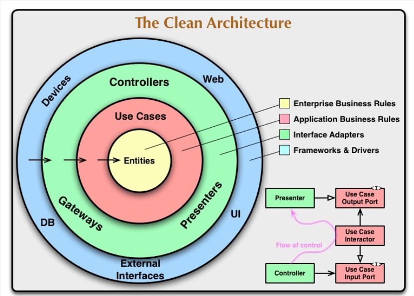

<p align="center">
  
</p>

<br>

<h1 align="center">Inmuebles El Guarzo</h1>

<p align="center">
  Plataforma backend inmobiliaria moderna desarrollada con arquitectura escalable y enfoque cloud-native.
</p>

<p align="center">

  

  

  

  

  

</p>

---

# Información del documento

| Campo       | Información                     |
| ----------- | ------------------------------- |
| Proyecto    | Inmuebles El Guarzo             |
| Versión     | 1.0                             |
| año         | 2026                            |
| Universidad | Universidad Católica de Oriente |
| Asignatura  | Ingeniería de Software 2        |

---

# Integrantes del equipo

| Integrante               | Rol               |
| ------------------------ | ----------------- |
| Samuel Giraldo Villada   | Backend Developer |
| Juan Camilo Urrea Garcia | Backend Developer |

---

# Tabla de contenido

---

# Objetivo del documento

El presente documento tiene como propósito describir la arquitectura de software definida para la plataforma Inmuebles El Guarzo, incluyendo decisiones de diseño, restricciones, atributos de calidad, componentes arquitectónicos y estrategias adoptadas durante el desarrollo del sistema.

Asimismo, busca servir como referencia técnica para comprender la estructura general de la solución, facilitar su evolución futura y respaldar las decisiones arquitectónicas tomadas durante el proyecto.

---

# 1. Descripción general del proyecto

## 1.1. Contexto y problemática

Inmuebles El Guarzo surge como respuesta a las dificultades que enfrentan muchas personas al buscar inmuebles mediante redes sociales, publicaciones dispersas o plataformas desconectadas, donde la información suele ser inconsistente, limitada o difícil de verificar.

Actualmente, gran parte de la gestión inmobiliaria continúa realizándose de manera manual o mediante herramientas poco integradas, dificultando la trazabilidad de procesos, la atención de clientes y la administración eficiente de propiedades.

---

## 1.2. Objetivo de la plataforma

El objetivo del proyecto es desarrollar una plataforma inmobiliaria moderna que permita centralizar, gestionar y optimizar la publicación y consulta de propiedades, ofreciendo una experiencia más organizada, segura y escalable tanto para clientes como para asesores inmobiliarios.

La plataforma permite administrar propiedades, gestionar ofertas, procesar solicitudes de publicación, manejar contactos y centralizar la comunicación mediante distintos canales digitales.

Además del enfoque funcional del negocio inmobiliario, el sistema fue diseñado siguiendo principios modernos de arquitectura de software, priorizando mantenibilidad, escalabilidad, seguridad y evolución tecnológica.

---

# 2. Arquitectura del sistema

## 2.1. Enfoque arquitectónico

El backend de Inmuebles El Guarzo fue diseñado bajo un enfoque de Monolito Modular complementado con principios de Clean Architecture.

Esta decisión arquitectónica responde directamente a las necesidades reales del negocio, al alcance actual del proyecto y a la necesidad de mantener una base de código mantenible, desacoplada y preparada para evolucionar progresivamente.

---

## 2.2. ¿Por qué un Monolito Modular?

El sistema maneja procesos altamente relacionados entre sí, como:

- Gestión de propiedades.
- Publicaciones inmobiliarias.
- Ofertas.
- Contactos.
- Notificaciones.
- Auditoría.
- Autenticación y autorización.

Debido a esta alta cohesión del dominio, se optó por un Monolito Modular, ya que permite:

- Mantener una única unidad de despliegue.
- Reducir complejidad operativa.
- Evitar problemas de comunicación distribuida.
- Garantizar consistencia transaccional.
- Facilitar el mantenimiento del sistema.
- Organizar el proyecto mediante módulos desacoplados.

A diferencia de una arquitectura de microservicios, este enfoque evita introducir complejidad temprana relacionada con orquestación, observabilidad distribuida, comunicación entre servicios y administración de infraestructura adicional.

Además, la separación modular del sistema deja preparada la aplicación para una posible migración futura hacia microservicios, debido a que los límites del dominio ya se encuentran claramente definidos.

---

## 2.3. Uso de Clean Architecture

Sobre el monolito modular se implementó Clean Architecture, propuesta por Robert C. Martin (Uncle Bob).

Esta arquitectura permite separar las reglas de negocio de los detalles técnicos y de infraestructura, promoviendo un diseño desacoplado y mantenible.

Cada módulo se divide en capas claramente definidas:

| Capa             | Responsabilidad                   |
| ---------------- | --------------------------------- |
| `domain`         | Reglas y entidades del negocio    |
| `application`    | Casos de uso y orquestación       |
| `infrastructure` | Persistencia y servicios externos |
| `presentation`   | Exposición HTTP y controladores   |

<p align="center">
  
</p>

<p align="center">
  Representación conceptual de Clean Architecture propuesta por Robert C. Martin.
</p>

---

## 2.4. Motivadores arquitectónicos

Las decisiones arquitectónicas del proyecto estuvieron guiadas por los siguientes motivadores:

| Motivador               | Impacto en el diseño                                  |
| ----------------------- | ----------------------------------------------------- |
| Mantenibilidad          | Organización modular y separación por capas           |
| Escalabilidad evolutiva | Crecimiento progresivo por dominios                   |
| Seguridad               | Integración centralizada de autenticación y auditoría |
| Desacoplamiento         | Uso de puertos y adaptadores                          |
| Testabilidad            | Casos de uso independientes de infraestructura        |
| Evolución tecnológica   | Independencia de frameworks y proveedores externos    |
| Claridad organizacional | Estructura consistente y predecible                   |

---

## 2.5. Estructura general del backend

```text
src/
 ├── modules/
 │    ├── properties/
 │    ├── offers/
 │    ├── contacts/
 │    ├── publications/
 │    ├── notifications/
 │    ├── iam/
 │    └── ...
 │
 ├── shared-kernel/
 │
 ├── app.module.ts
 └── main.ts
```

---

# 3. Restricciones técnicas

## 3.1. Definición e impacto en el diseño

Las restricciones técnicas representan el conjunto de condiciones, estándares y lineamientos que limitan o guían las decisiones de diseño, desarrollo y despliegue del sistema.

Estas restricciones permiten garantizar que la solución cumpla criterios mínimos de:

- Calidad de software
- Seguridad
- Escalabilidad
- Mantenibilidad
- Observabilidad
- Automatización
- Rendimiento operativo

En el contexto de Inmuebles El Guarzo, las restricciones técnicas influyen directamente en la arquitectura del sistema, la selección de tecnologías, la organización del código, las prácticas DevOps y la estrategia de aseguramiento de calidad.

Además, estas restricciones permiten establecer estándares consistentes de desarrollo que facilitan la evolución progresiva del proyecto y reducen riesgos técnicos durante el ciclo de vida del software.

---

## 3.2. Restricciones de prácticas DevOps

Esta categoría agrupa las restricciones relacionadas con automatización de despliegues, integración continua, estabilidad operativa y estrategias de entrega del software.

| Restricción                          | Justificación                                              |
| ------------------------------------ | ---------------------------------------------------------- |
| Implementación de CI/CD automatizado | Garantiza validación automática y despliegues consistentes |
| Ejecución automática de smoke tests  | Permite detectar fallos críticos tras cada despliegue      |
| Soporte de rollback rápido           | Reduce impacto operativo ante errores en producción        |
| Estrategia estructurada de ramas     | Facilita el trabajo colaborativo y control de versiones    |
| Downtime máximo controlado           | Mejora disponibilidad y continuidad del servicio           |

---

## 3.3. Restricciones de diseño y arquitectura

Estas restricciones definen lineamientos relacionados con la estructura interna del sistema, modularidad y desacoplamiento de componentes.

| Restricción                    | Justificación                                  |
| ------------------------------ | ---------------------------------------------- |
| Uso de Clean Architecture      | Mantiene separación clara de responsabilidades |
| Uso de puertos y adaptadores   | Facilita independencia tecnológica             |
| Comunicación basada en eventos | Permite desacoplamiento entre módulos          |
| Reutilización de componentes   | Reduce duplicidad y deuda técnica              |

---

## 3.4. Restricciones de calidad y código limpio

Estas restricciones buscan mantener estándares consistentes de desarrollo y legibilidad del código.

| Restricción                               | Justificación                               |
| ----------------------------------------- | ------------------------------------------- |
| Validación automática de linting y tipado | Garantiza consistencia y calidad del código |
| Máximo de líneas por función              | Reduce complejidad y mejora mantenibilidad  |
| Máximo de líneas por archivo              | Favorece separación de responsabilidades    |
| Logging estructurado                      | Facilita monitoreo y diagnóstico            |
| Límite de dependencias externas           | Reduce complejidad y vulnerabilidades       |

---

## 3.5. Restricciones de testing y aseguramiento de calidad

Estas restricciones establecen mecanismos mínimos para garantizar estabilidad y confiabilidad del sistema.

| Restricción                                  | Justificación                                 |
| -------------------------------------------- | --------------------------------------------- |
| Cobertura mínima de pruebas                  | Mejora confiabilidad del sistema              |
| Pruebas de integración para módulos críticos | Validan comportamiento real del sistema       |
| Seeds versionados e idempotentes             | Facilitan pruebas y configuración de entornos |
| Gestión formal de incidentes                 | Permite trazabilidad y mejora continua        |

---

## 3.6. Restricciones de seguridad

Estas restricciones buscan proteger la información, reducir vulnerabilidades y garantizar buenas prácticas de seguridad.

| Restricción                           | Justificación                            |
| ------------------------------------- | ---------------------------------------- |
| Uso obligatorio de HTTPS              | Protege la comunicación cliente-servidor |
| Validación y sanitización de entradas | Previene ataques de inyección            |
| Implementación de rate limiting       | Reduce abuso y ataques automatizados     |
| Protección de errores internos        | Evita exposición de información sensible |
| Protección anti-bots                  | Reduce spam y automatización maliciosa   |

---

## 3.7. Restricciones de documentación técnica

Estas restricciones garantizan trazabilidad técnica y facilidad de mantenimiento del proyecto.

| Restricción                            | Justificación                                        |
| -------------------------------------- | ---------------------------------------------------- |
| README técnico documentado             | Facilita onboarding de desarrolladores               |
| Registro de decisiones arquitectónicas | Conserva contexto técnico del sistema                |
| Documentación automática de API        | Mantiene sincronización entre código y documentación |

---

## 3.8. Restricciones metodológicas

Estas restricciones definen lineamientos relacionados con la organización y gestión del desarrollo del proyecto.

| Restricción                                    | Justificación                           |
| ---------------------------------------------- | --------------------------------------- |
| Desarrollo iterativo                           | Facilita adaptación continua            |
| Gestión de backlog centralizada                | Mejora organización y trazabilidad      |
| Seguimiento de tareas mediante GitHub Projects | Permite control del avance del proyecto |

---

# 4. Restricciones de negocio

## 4.1. Definición e impacto en el diseño

Las restricciones de negocio representan el conjunto de condiciones organizacionales, operativas, legales, económicas y estratégicas que influyen directamente en el alcance, desarrollo y evolución del sistema.

Estas restricciones permiten establecer límites y prioridades para la toma de decisiones técnicas y funcionales, garantizando que la solución desarrollada responda adecuadamente a las necesidades reales del negocio y del contexto operativo del proyecto.

En el contexto de Inmuebles El Guarzo, las restricciones de negocio impactan directamente aspectos como:

- Priorización de funcionalidades
- Alcance del sistema
- Selección tecnológica
- Estrategia de despliegue
- Organización del equipo
- Gestión del tiempo
- Escalabilidad progresiva
- Sostenibilidad operativa

Además, estas restricciones condicionan múltiples decisiones arquitectónicas y metodológicas adoptadas durante el desarrollo, buscando equilibrar factores como complejidad técnica, tiempo de entrega, costos operativos y mantenibilidad del sistema.

---

## 4.2. Restricciones humanas

Estas restricciones están relacionadas con la capacidad operativa, tamaño del equipo y disponibilidad de recursos humanos para el desarrollo del proyecto.

| Restricción          | Justificación   | Plan de acción   |
| -------------------- | --------------- | ---------------- |
| [Restricción humana] | [Justificación] | [Plan de acción] |
| [Restricción humana] | [Justificación] | [Plan de acción] |

---

## 4.3. Restricciones de tiempo

Estas restricciones contemplan limitaciones relacionadas con cronogramas de entrega, duración del proyecto y tiempos de implementación.

| Restricción             | Justificación   | Plan de acción   |
| ----------------------- | --------------- | ---------------- |
| [Restricción de tiempo] | [Justificación] | [Plan de acción] |
| [Restricción de tiempo] | [Justificación] | [Plan de acción] |

---

## 4.4. Restricciones legales

Estas restricciones agrupan condiciones relacionadas con cumplimiento normativo, protección de datos y requisitos legales aplicables al sistema.

| Restricción         | Justificación   | Plan de acción   |
| ------------------- | --------------- | ---------------- |
| [Restricción legal] | [Justificación] | [Plan de acción] |
| [Restricción legal] | [Justificación] | [Plan de acción] |

---

## 4.5. Restricciones presupuestales

Estas restricciones están asociadas a limitaciones económicas y costos de infraestructura, herramientas y servicios externos.

| Restricción                | Justificación   | Plan de acción   |
| -------------------------- | --------------- | ---------------- |
| [Restricción presupuestal] | [Justificación] | [Plan de acción] |
| [Restricción presupuestal] | [Justificación] | [Plan de acción] |

---

## 4.6. Restricciones de escalabilidad

Estas restricciones contemplan limitaciones y estrategias relacionadas con el crecimiento progresivo del sistema y su capacidad operativa futura.

| Restricción                    | Justificación   | Plan de acción   |
| ------------------------------ | --------------- | ---------------- |
| [Restricción de escalabilidad] | [Justificación] | [Plan de acción] |
| [Restricción de escalabilidad] | [Justificación] | [Plan de acción] |

---

## 4.7. Restricciones organizacionales

Estas restricciones están relacionadas con procesos internos, coordinación del equipo y lineamientos organizativos definidos para el proyecto.

| Restricción                  | Justificación   | Plan de acción   |
| ---------------------------- | --------------- | ---------------- |
| [Restricción organizacional] | [Justificación] | [Plan de acción] |
| [Restricción organizacional] | [Justificación] | [Plan de acción] |

---

# 5. Atributos de calidad

## 5.1 Definición e impacto en el diseño

Los atributos de calidad representan las características no funcionales que determinan qué tan bien debe comportarse un sistema frente a distintos escenarios operativos, técnicos y de negocio.

A diferencia de los requerimientos funcionales, los atributos de calidad no describen qué hace el sistema, sino cómo debe hacerlo, estableciendo criterios relacionados con desempeño, seguridad, confiabilidad, mantenibilidad y capacidad de evolución.

En el contexto de Inmuebles El Guarzo, los atributos de calidad fueron fundamentales para orientar decisiones arquitectónicas, tecnológicas y operativas del proyecto, permitiendo priorizar aspectos críticos como la seguridad de la información, la estabilidad del sistema, la escalabilidad de la plataforma y la facilidad de mantenimiento.

La priorización de estos atributos se realizó considerando las necesidades del negocio, los riesgos identificados, los objetivos del sistema y el análisis de usuarios realizado mediante herramientas como mapas de empatía y evaluación de escenarios arquitectónicos.

---

## 5.2 Atributos de calidad priorizados

Los siguientes atributos de calidad fueron seleccionados y organizados según su nivel de prioridad dentro del proyecto:

| Prioridad | Atributo de calidad             | Descripción                                                                                                   |
| --------- | ------------------------------- | ------------------------------------------------------------------------------------------------------------- |
| 1         | Confiabilidad                   | Garantizar que el sistema funcione correctamente y mantenga estabilidad operativa ante distintos escenarios.  |
| 2         | Usabilidad                      | Facilitar la interacción de los usuarios con la plataforma de manera clara, intuitiva y eficiente.            |
| 3         | Seguridad                       | Proteger la información, autenticación y comunicación del sistema frente a amenazas y accesos no autorizados. |
| 4         | Disponibilidad                  | Mantener el sistema accesible y operativo la mayor cantidad de tiempo posible.                                |
| 5         | Rendimiento                     | Garantizar tiempos de respuesta adecuados y eficiencia en el procesamiento de solicitudes.                    |
| 6         | Conformidad                     | Cumplir estándares técnicos, organizacionales y buenas prácticas de desarrollo.                               |
| 7         | Trazabilidad                    | Permitir seguimiento de eventos, operaciones y cambios realizados dentro del sistema.                         |
| 8         | Capacidad para ser administrado | Facilitar la supervisión, monitoreo y gestión operativa de la plataforma.                                     |
| 9         | Escalabilidad                   | Permitir el crecimiento progresivo del sistema sin afectar su estabilidad.                                    |
| 10        | Flexibilidad                    | Facilitar la adaptación del sistema frente a cambios futuros de negocio o tecnología.                         |
| 11        | Capacidad para ser probado      | Permitir la validación eficiente del comportamiento del sistema mediante pruebas.                             |
| 12        | Capacidad para ser desplegado   | Facilitar procesos de integración y despliegue continuo.                                                      |
| 13        | Capacidad para ser mantenido    | Reducir la complejidad de mantenimiento y evolución del software.                                             |
| 14        | Costo                           | Optimizar el uso de recursos tecnológicos y operativos del proyecto.                                          |

---

## 5.3 Relación de los atributos de calidad con la arquitectura

La priorización de estos atributos influyó directamente en múltiples decisiones arquitectónicas y tecnológicas del proyecto, incluyendo:

- Implementación de Clean Architecture para mejorar mantenibilidad, escalabilidad y separación de responsabilidades.
- Uso de Docker y contenedores para facilitar despliegues consistentes y automatizados.
- Integración de herramientas DevOps para fortalecer trazabilidad y automatización.
- Implementación de mecanismos de autenticación y protección perimetral para reforzar la seguridad.
- Organización modular del sistema para favorecer flexibilidad y evolución progresiva.
- Uso de servicios cloud-native para mejorar disponibilidad y rendimiento operativo.

---

## 5.4 Priorización y análisis de atributos

La selección y priorización de atributos de calidad se realizó mediante análisis de necesidades del negocio, escenarios de uso y evaluación de expectativas de los usuarios.

Para ello se utilizaron herramientas de apoyo como matrices de priorización y mapas de empatía, los cuales permitieron identificar los atributos más relevantes para el contexto operativo de la plataforma.

<table align="center">
  <tr>
    <td align="center">
      
    </td>
    <td align="center">
      
    </td>
  </tr>
</table>

---

<p align="center">
  Calidad de software · Escalabilidad · Seguridad · Arquitectura empresarial
</p>

---

# 6. Funcionalidades críticas del sistema

## 6.1 Definición e impacto en el diseño

Las funcionalidades críticas representan el conjunto de procesos, capacidades y operaciones esenciales para el correcto funcionamiento del sistema y el cumplimiento de los objetivos del negocio.

Estas funcionalidades corresponden a aquellos componentes cuyo correcto desempeño resulta fundamental para garantizar la continuidad operativa de la plataforma, la experiencia de los usuarios y la integridad de la información.

En el contexto de Inmuebles El Guarzo, las funcionalidades críticas permitieron identificar los procesos más relevantes del dominio inmobiliario, orientando decisiones relacionadas con arquitectura, seguridad, organización modular, persistencia de datos y diseño de APIs.

Además, estas funcionalidades influyen directamente en la priorización de atributos de calidad como confiabilidad, disponibilidad, seguridad y rendimiento, debido a que representan las operaciones centrales sobre las cuales se soporta la plataforma.

---

## 6.2 Funcionalidades críticas identificadas

| ID    | Funcionalidad crítica  | Historia de usuario                                       | Justificación                                                                   | Observaciones                                                        |
| ----- | ---------------------- | --------------------------------------------------------- | ------------------------------------------------------------------------------- | -------------------------------------------------------------------- |
| FC-01 | [Nombre funcionalidad] | Como [tipo de usuario], quiero [acción], para [objetivo]. | [Razón por la cual esta funcionalidad es crítica para el negocio o el sistema.] | [Observaciones técnicas, dependencias o consideraciones especiales.] |
| FC-02 | [Nombre funcionalidad] | Como [tipo de usuario], quiero [acción], para [objetivo]. | [Justificación.]                                                                | [Observaciones.]                                                     |
| FC-03 | [Nombre funcionalidad] | Como [tipo de usuario], quiero [acción], para [objetivo]. | [Justificación.]                                                                | [Observaciones.]                                                     |
| FC-04 | [Nombre funcionalidad] | Como [tipo de usuario], quiero [acción], para [objetivo]. | [Justificación.]                                                                | [Observaciones.]                                                     |
| FC-05 | [Nombre funcionalidad] | Como [tipo de usuario], quiero [acción], para [objetivo]. | [Justificación.]                                                                | [Observaciones.]                                                     |
| FC-06 | [Nombre funcionalidad] | Como [tipo de usuario], quiero [acción], para [objetivo]. | [Justificación.]                                                                | [Observaciones.]                                                     |
| FC-07 | [Nombre funcionalidad] | Como [tipo de usuario], quiero [acción], para [objetivo]. | [Justificación.]                                                                | [Observaciones.]                                                     |
| FC-08 | [Nombre funcionalidad] | Como [tipo de usuario], quiero [acción], para [objetivo]. | [Justificación.]                                                                | [Observaciones.]                                                     |
| FC-09 | [Nombre funcionalidad] | Como [tipo de usuario], quiero [acción], para [objetivo]. | [Justificación.]                                                                | [Observaciones.]                                                     |

---

## 6.3 Relación de las funcionalidades críticas con la arquitectura

Las funcionalidades críticas identificadas influyeron directamente en la definición de múltiples decisiones arquitectónicas del sistema, incluyendo:

- Modularización de componentes mediante bounded contexts.
- Separación de responsabilidades utilizando Clean Architecture.
- Priorización de mecanismos de seguridad y autenticación.
- Diseño de APIs desacopladas y escalables.
- Estrategias de persistencia y validación de datos.
- Implementación de procesos automatizados de despliegue y monitoreo.
- Definición de integraciones con servicios externos.

Estas funcionalidades también permitieron establecer prioridades técnicas dentro del proyecto, enfocando esfuerzos de desarrollo sobre los procesos con mayor impacto funcional y operativo.

---

<p align="center">
  Funcionalidades críticas · Arquitectura empresarial · Procesos de negocio · Diseño del sistema
</p>

---

# 7. Tácticas y estrategias arquitectónicas

## 7.1 Definición e impacto en el diseño

Las tácticas y estrategias arquitectónicas representan el conjunto de decisiones, enfoques y mecanismos utilizados para cumplir los atributos de calidad, restricciones técnicas y necesidades funcionales del sistema.

Las estrategias corresponden a enfoques generales de diseño y organización del sistema, mientras que las tácticas representan mecanismos técnicos más específicos implementados para alcanzar objetivos concretos relacionados con seguridad, rendimiento, escalabilidad, mantenibilidad y confiabilidad.

En el contexto de Inmuebles El Guarzo, las tácticas y estrategias arquitectónicas permitieron orientar decisiones relacionadas con modularización, seguridad, automatización, despliegue, monitoreo y desacoplamiento del sistema.

Además, estas decisiones fueron fundamentales para responder a los escenarios de calidad identificados durante el análisis arquitectónico y para garantizar que las funcionalidades críticas del sistema pudieran evolucionar de manera sostenible y escalable.

---

## 7.2 Estrategias arquitectónicas identificadas

| ID    | Estrategia          | Prioridad | Descripción                             | Justificación                                       |
| ----- | ------------------- | --------- | --------------------------------------- | --------------------------------------------------- |
| EA-01 | [Nombre estrategia] | Alta      | [Descripción general de la estrategia.] | [Razón por la cual la estrategia fue seleccionada.] |
| EA-02 | [Nombre estrategia] | Alta      | [Descripción.]                          | [Justificación.]                                    |
| EA-03 | [Nombre estrategia] | Media     | [Descripción.]                          | [Justificación.]                                    |
| EA-04 | [Nombre estrategia] | Media     | [Descripción.]                          | [Justificación.]                                    |
| EA-05 | [Nombre estrategia] | Baja      | [Descripción.]                          | [Justificación.]                                    |

---

## 7.3 Tácticas arquitectónicas identificadas

| ID    | Táctica          | Atributo de calidad asociado                  | Prioridad | Descripción                          | Justificación              |
| ----- | ---------------- | --------------------------------------------- | --------- | ------------------------------------ | -------------------------- |
| TA-01 | [Nombre táctica] | [Seguridad, rendimiento, escalabilidad, etc.] | Alta      | [Descripción técnica de la táctica.] | [Razón de implementación.] |
| TA-02 | [Nombre táctica] | [Atributo asociado]                           | Alta      | [Descripción.]                       | [Justificación.]           |
| TA-03 | [Nombre táctica] | [Atributo asociado]                           | Media     | [Descripción.]                       | [Justificación.]           |
| TA-04 | [Nombre táctica] | [Atributo asociado]                           | Media     | [Descripción.]                       | [Justificación.]           |
| TA-05 | [Nombre táctica] | [Atributo asociado]                           | Baja      | [Descripción.]                       | [Justificación.]           |
| TA-06 | [Nombre táctica] | [Atributo asociado]                           | Baja      | [Descripción.]                       | [Justificación.]           |

---

## 7.4 Relación de tácticas y estrategias con los escenarios de calidad

Las tácticas y estrategias arquitectónicas fueron analizadas con el objetivo de responder a los escenarios de calidad definidos para el sistema, permitiendo fortalecer aspectos como:

- Seguridad y protección de la información.
- Escalabilidad progresiva del sistema.
- Disponibilidad y estabilidad operativa.
- Facilidad de despliegue y automatización.
- Desacoplamiento entre componentes.
- Mantenibilidad y evolución del software.
- Observabilidad y monitoreo de eventos.
- Optimización del rendimiento operativo.

Estas decisiones también permitieron establecer una arquitectura preparada para futuras integraciones, crecimiento funcional y adaptación tecnológica.

---

## 7.5 Relación con funcionalidades críticas

Las tácticas y estrategias implementadas también se alinean con las funcionalidades críticas del sistema, garantizando que procesos esenciales como autenticación, gestión de propiedades, comunicación con usuarios y administración operativa puedan ejecutarse de manera segura, confiable y escalable.

La implementación de patrones arquitectónicos, mecanismos de desacoplamiento y automatización contribuye directamente a reducir riesgos técnicos y mejorar la sostenibilidad del proyecto a largo plazo.

---

## 7.6 Observaciones arquitectónicas

Debido a la naturaleza evolutiva del proyecto, las tácticas y estrategias arquitectónicas pueden ajustarse progresivamente conforme aumenten las necesidades funcionales, los requerimientos del negocio y la complejidad operativa de la plataforma.

Por esta razón, la arquitectura fue diseñada buscando flexibilidad, modularidad y capacidad de adaptación frente a futuros cambios tecnológicos y organizacionales.

---

<p align="center">
  Arquitectura empresarial · Escenarios de calidad · Tácticas arquitectónicas · Estrategias de diseño
</p>

---

# 8. Arquetipo de solución

## 8.1 Definición e impacto en el diseño

Un arquetipo de solución representa una visión conceptual y estructural de la arquitectura del sistema, permitiendo identificar los principales componentes tecnológicos, sus relaciones y las responsabilidades que cumplen dentro de la solución.

Este arquetipo sirve como referencia arquitectónica para comprender cómo interactúan los distintos elementos del ecosistema tecnológico, facilitando la toma de decisiones relacionadas con integración, despliegue, seguridad, escalabilidad y mantenibilidad.

A diferencia de una arquitectura completamente implementada, el arquetipo de solución se construye de manera agnóstica, enfocándose en las capacidades necesarias del sistema más que en tecnologías específicas.

En el contexto de Inmuebles El Guarzo, el arquetipo de solución permitió establecer una estructura tecnológica base para soportar los procesos críticos del negocio inmobiliario, priorizando modularidad, automatización, seguridad y capacidad de evolución.

Además, este arquetipo orientó la selección de componentes desarrollados y adoptados, garantizando coherencia arquitectónica entre infraestructura, backend, servicios externos y mecanismos de integración.

---

## 8.2 Objetivos del arquetipo de solución

El arquetipo de solución fue definido con el propósito de:

- Establecer una visión arquitectónica global del sistema.
- Identificar los principales componentes funcionales y tecnológicos.
- Definir relaciones e interacciones entre módulos y servicios.
- Facilitar decisiones relacionadas con integración y despliegue.
- Garantizar alineación con atributos de calidad y restricciones técnicas.
- Promover escalabilidad, mantenibilidad y desacoplamiento.
- Servir como referencia para futuras evoluciones arquitectónicas.

---

## 8.3 Componentes del arquetipo de solución

### 8.3.1 [Nombre del componente]

| Campo               | Descripción                                                    |
| ------------------- | -------------------------------------------------------------- |
| Componente          | [Nombre del componente]                                        |
| Descripción         | [Descripción funcional y técnica del componente.]              |
| Justificación       | [Razón por la cual el componente fue seleccionado o diseñado.] |
| Tipo de adquisición | [Desarrollado / Adoptado]                                      |

---

### 8.3.2 [Nombre del componente]

| Campo               | Descripción                                       |
| ------------------- | ------------------------------------------------- |
| Componente          | [Nombre del componente]                           |
| Descripción         | [Descripción funcional y técnica del componente.] |
| Justificación       | [Razón de adopción o desarrollo.]                 |
| Tipo de adquisición | [Desarrollado / Adoptado]                         |

---

### 8.3.3 [Nombre del componente]

| Campo               | Descripción                        |
| ------------------- | ---------------------------------- |
| Componente          | [Nombre del componente]            |
| Descripción         | [Descripción funcional y técnica.] |
| Justificación       | [Justificación.]                   |
| Tipo de adquisición | [Desarrollado / Adoptado]          |

---

### 8.3.4 [Nombre del componente]

| Campo               | Descripción               |
| ------------------- | ------------------------- |
| Componente          | [Nombre del componente]   |
| Descripción         | [Descripción.]            |
| Justificación       | [Justificación.]          |
| Tipo de adquisición | [Desarrollado / Adoptado] |

---

### 8.3.5 [Nombre del componente]

| Campo               | Descripción               |
| ------------------- | ------------------------- |
| Componente          | [Nombre del componente]   |
| Descripción         | [Descripción.]            |
| Justificación       | [Justificación.]          |
| Tipo de adquisición | [Desarrollado / Adoptado] |

---

> Repetir la estructura anterior para todos los componentes definidos dentro del arquetipo de solución.

---

## 8.4 Relaciones e interacción entre componentes

Los componentes definidos dentro del arquetipo de solución interactúan de manera coordinada para soportar las funcionalidades críticas del sistema y cumplir los atributos de calidad priorizados.

La arquitectura propuesta promueve desacoplamiento entre responsabilidades, separación de capas y comunicación controlada entre componentes internos y servicios externos, permitiendo una evolución progresiva de la plataforma sin comprometer la estabilidad del núcleo del negocio.

Asimismo, la combinación de componentes desarrollados y adoptados permite optimizar tiempos de implementación, reutilizar capacidades existentes y reducir complejidad operativa en distintos escenarios del sistema.

---

## 8.5 Diagrama del arquetipo de solución

El siguiente diagrama representa el arquetipo de solución propuesto para Inmuebles El Guarzo, mostrando los principales componentes arquitectónicos y sus relaciones dentro del ecosistema tecnológico de la plataforma.

<p align="center">
  
</p>

---

## 8.6 Consideraciones arquitectónicas

El arquetipo de solución fue diseñado siguiendo principios de modularidad, separación de responsabilidades y arquitectura cloud-native, buscando garantizar:

- Escalabilidad progresiva del sistema.
- Flexibilidad frente a cambios tecnológicos.
- Seguridad e integridad de la información.
- Automatización operativa y despliegues consistentes.
- Mantenibilidad y facilidad de evolución.
- Integración eficiente con servicios externos.

Estas decisiones arquitectónicas permiten que la plataforma pueda crecer de manera sostenible conforme evolucionen las necesidades del negocio y aumente la complejidad operativa del sistema.

---

<p align="center">
  Arquetipo de solución · Arquitectura cloud-native · Integración de componentes · Diseño empresarial
</p>

---

# 9. Arquitectura de solución

## 9.1 Definición e impacto en el diseño

La arquitectura de solución representa la materialización tecnológica del sistema, definiendo de manera concreta los componentes, plataformas, servicios, frameworks y herramientas seleccionadas para implementar la solución.

A diferencia del arquetipo de solución, que describe una visión conceptual y agnóstica de la arquitectura, la arquitectura de solución especifica las tecnologías reales adoptadas dentro del proyecto, permitiendo comprender cómo será construido, desplegado y operado el sistema.

En el contexto de Inmuebles El Guarzo, la arquitectura de solución fue diseñada buscando equilibrio entre escalabilidad, mantenibilidad, seguridad, automatización y optimización de costos, priorizando tecnologías modernas compatibles con entornos cloud-native y prácticas DevOps.

Además, esta arquitectura permite establecer estándares técnicos consistentes para el desarrollo del backend, integración de servicios externos, automatización de despliegues y administración de infraestructura.

---

## 9.2 Objetivos de la arquitectura de solución

La arquitectura de solución fue definida con los siguientes objetivos:

- Materializar técnicamente el arquetipo de solución.
- Definir tecnologías concretas para cada capacidad del sistema.
- Garantizar alineación con atributos de calidad y restricciones técnicas.
- Facilitar escalabilidad y evolución progresiva del proyecto.
- Promover automatización y despliegues consistentes.
- Reducir acoplamiento entre componentes tecnológicos.
- Optimizar costos operativos y de infraestructura.
- Mejorar seguridad, monitoreo y mantenibilidad del sistema.

---

## 9.3 Componentes tecnológicos de la arquitectura de solución

### 9.3.1 [Nombre del componente]

| Campo                  | Descripción                                                 |
| ---------------------- | ----------------------------------------------------------- |
| Tipo de adquisición    | [Desarrollado / Adoptado]                                   |
| Componente             | [Nombre del componente]                                     |
| Fabricante             | [Empresa, organización o proveedor.]                        |
| Nombre comercial       | [Nombre oficial de la tecnología.]                          |
| Versión                | [Versión utilizada.]                                        |
| Tipo de licenciamiento | [Open Source, Comercial, SaaS, Freemium, etc.]              |
| Justificación          | [Razón técnica y arquitectónica de selección.]              |
| Motivación             | [Opcional. Aplica principalmente para desarrollos propios.] |

---

### 9.3.2 [Nombre del componente]

| Campo                  | Descripción               |
| ---------------------- | ------------------------- |
| Tipo de adquisición    | [Desarrollado / Adoptado] |
| Componente             | [Nombre del componente]   |
| Fabricante             | [Proveedor.]              |
| Nombre comercial       | [Tecnología.]             |
| Versión                | [Versión.]                |
| Tipo de licenciamiento | [Tipo.]                   |
| Justificación          | [Justificación.]          |
| Motivación             | [Opcional.]               |

---

### 9.3.3 [Nombre del componente]

| Campo                  | Descripción               |
| ---------------------- | ------------------------- |
| Tipo de adquisición    | [Desarrollado / Adoptado] |
| Componente             | [Nombre del componente]   |
| Fabricante             | [Proveedor.]              |
| Nombre comercial       | [Tecnología.]             |
| Versión                | [Versión.]                |
| Tipo de licenciamiento | [Tipo.]                   |
| Justificación          | [Justificación.]          |
| Motivación             | [Opcional.]               |

---

### 9.3.4 [Nombre del componente]

| Campo                  | Descripción               |
| ---------------------- | ------------------------- |
| Tipo de adquisición    | [Desarrollado / Adoptado] |
| Componente             | [Nombre del componente]   |
| Fabricante             | [Proveedor.]              |
| Nombre comercial       | [Tecnología.]             |
| Versión                | [Versión.]                |
| Tipo de licenciamiento | [Tipo.]                   |
| Justificación          | [Justificación.]          |
| Motivación             | [Opcional.]               |

---

### 9.3.5 [Nombre del componente]

| Campo                  | Descripción               |
| ---------------------- | ------------------------- |
| Tipo de adquisición    | [Desarrollado / Adoptado] |
| Componente             | [Nombre del componente]   |
| Fabricante             | [Proveedor.]              |
| Nombre comercial       | [Tecnología.]             |
| Versión                | [Versión.]                |
| Tipo de licenciamiento | [Tipo.]                   |
| Justificación          | [Justificación.]          |
| Motivación             | [Opcional.]               |

---

> Repetir la estructura anterior para todos los componentes tecnológicos definidos en la arquitectura de solución.

---

## 9.4 Relación entre componentes tecnológicos

La arquitectura de solución integra múltiples componentes tecnológicos especializados que trabajan de manera coordinada para soportar las funcionalidades críticas y atributos de calidad priorizados del sistema.

La interacción entre backend, bases de datos, herramientas DevOps, mecanismos de seguridad y servicios externos permite construir una plataforma desacoplada, escalable y preparada para evolucionar progresivamente conforme aumenten las necesidades del negocio.

Asimismo, la adopción de tecnologías cloud-native y herramientas de automatización favorece la reducción de complejidad operativa y mejora la consistencia de despliegues en distintos entornos.

---

## 9.5 Diagrama de arquitectura de solución

El siguiente diagrama representa la arquitectura de solución implementada para Inmuebles El Guarzo, mostrando los componentes tecnológicos concretos, sus relaciones y las principales integraciones del sistema.

<p align="center">
  
</p>

---

## 9.6 Consideraciones tecnológicas

La selección de tecnologías dentro de la arquitectura de solución se realizó considerando criterios relacionados con:

- Compatibilidad con arquitectura cloud-native.
- Facilidad de integración y automatización.
- Comunidad y soporte tecnológico.
- Escalabilidad y mantenibilidad.
- Seguridad y estabilidad operativa.
- Curva de aprendizaje y productividad del equipo.
- Costos operativos y disponibilidad de servicios.

Estas decisiones permiten construir una plataforma moderna, flexible y alineada con las necesidades actuales y futuras del proyecto.

---

<p align="center">
  Arquitectura de solución · Cloud Native · Integración tecnológica · DevOps · Escalabilidad
</p>

---

# 10. Diagramas de componentes

## 10.1 Definición e impacto en el diseño

Un diagrama de componentes representa la organización estructural de los principales módulos, servicios y elementos funcionales que conforman un sistema de software, mostrando sus responsabilidades y relaciones de interacción.

Este tipo de diagramas permite visualizar cómo se divide la solución en componentes desacoplados, facilitando la comprensión de la arquitectura interna del sistema y la distribución de responsabilidades técnicas y funcionales.

En el contexto de Inmuebles El Guarzo, los diagramas de componentes fueron utilizados para representar la organización del backend y frontend de la plataforma, permitiendo identificar módulos funcionales, capas arquitectónicas, integraciones y relaciones entre componentes principales del sistema.

Además, estos diagramas sirven como apoyo para tareas de mantenimiento, evolución tecnológica, incorporación de nuevas funcionalidades y comunicación arquitectónica dentro del equipo de desarrollo.

---

# 10.2 Diagrama de componentes del backend

## 10.2.1 Descripción general

El diagrama de componentes del backend representa la estructura modular del sistema, mostrando los principales módulos funcionales, capas arquitectónicas, servicios internos y componentes de infraestructura que soportan la lógica de negocio de la plataforma.

La organización propuesta sigue principios de Clean Architecture y modularidad, buscando mantener separación clara de responsabilidades y desacoplamiento entre dominio, aplicación e infraestructura.

---

## 10.2.2 Componentes identificados

### [Nombre del componente]

| Campo       | Descripción                                       |
| ----------- | ------------------------------------------------- |
| Componente  | [Nombre del componente backend]                   |
| Descripción | [Descripción funcional y técnica del componente.] |

---

### [Nombre del componente]

| Campo       | Descripción                     |
| ----------- | ------------------------------- |
| Componente  | [Nombre del componente backend] |
| Descripción | [Descripción.]                  |

---

### [Nombre del componente]

| Campo       | Descripción                     |
| ----------- | ------------------------------- |
| Componente  | [Nombre del componente backend] |
| Descripción | [Descripción.]                  |

---

### [Nombre del componente]

| Campo       | Descripción                     |
| ----------- | ------------------------------- |
| Componente  | [Nombre del componente backend] |
| Descripción | [Descripción.]                  |

---

> Repetir la estructura anterior para todos los componentes identificados en el backend.

---

## 10.2.3 Diagrama de componentes del backend

<p align="center">
  
</p>

---

# 10.3 Diagrama de componentes del frontend

## 10.3.1 Descripción general

El diagrama de componentes del frontend representa la organización estructural de la interfaz de usuario, mostrando páginas, módulos visuales, componentes reutilizables, mecanismos de navegación y servicios de comunicación con el backend.

Este diagrama permite comprender cómo se distribuyen las responsabilidades dentro de la capa de presentación y cómo interactúan los distintos componentes de experiencia de usuario.

La arquitectura frontend fue diseñada buscando reutilización, mantenibilidad, escalabilidad visual y separación lógica entre componentes de interfaz y lógica de consumo de servicios.

---

## 10.3.2 Componentes identificados

### [Nombre del componente]

| Campo       | Descripción                      |
| ----------- | -------------------------------- |
| Componente  | [Nombre del componente frontend] |
| Descripción | [Descripción funcional.]         |

---

### [Nombre del componente]

| Campo       | Descripción                      |
| ----------- | -------------------------------- |
| Componente  | [Nombre del componente frontend] |
| Descripción | [Descripción.]                   |

---

### [Nombre del componente]

| Campo       | Descripción                      |
| ----------- | -------------------------------- |
| Componente  | [Nombre del componente frontend] |
| Descripción | [Descripción.]                   |

---

### [Nombre del componente]

| Campo       | Descripción                      |
| ----------- | -------------------------------- |
| Componente  | [Nombre del componente frontend] |
| Descripción | [Descripción.]                   |

---

> Repetir la estructura anterior para todos los componentes identificados en el frontend.

---

## 10.3.3 Diagrama de componentes del frontend

<p align="center">
  
</p>

---

## 10.4 Relación entre componentes del sistema

Los componentes definidos dentro del backend y frontend interactúan de manera coordinada para soportar las funcionalidades críticas del sistema y garantizar el cumplimiento de los atributos de calidad priorizados.

La separación entre capas de presentación, lógica de negocio, persistencia e infraestructura permite reducir acoplamiento, facilitar mantenibilidad y favorecer la evolución progresiva del proyecto.

Asimismo, la modularización de componentes facilita pruebas, reutilización de funcionalidades y escalabilidad funcional de la plataforma.

---

## 10.5 Consideraciones arquitectónicas

La definición de componentes del sistema fue realizada considerando principios de:

- Modularidad y separación de responsabilidades.
- Desacoplamiento entre capas arquitectónicas.
- Reutilización de componentes.
- Escalabilidad funcional y técnica.
- Facilidad de mantenimiento y evolución.
- Integración con servicios externos.
- Consistencia estructural del sistema.

Estas decisiones permiten mantener una arquitectura organizada y preparada para futuras ampliaciones funcionales y tecnológicas.

---

<p align="center">
  Diagramas de componentes · Clean Architecture · Modularidad · Backend · Frontend
</p>

---

# 11. Diagramas de paquetes

## 11.1 Definición e impacto en el diseño

Un diagrama de paquetes representa la organización lógica del sistema mediante agrupaciones estructuradas de módulos, componentes o elementos relacionados según sus responsabilidades y dependencias.

Este tipo de diagramas permite visualizar cómo se distribuyen las distintas áreas funcionales y técnicas dentro del proyecto, facilitando la comprensión de la arquitectura interna, la modularización del sistema y las relaciones entre paquetes.

En el contexto de Inmuebles El Guarzo, los diagramas de paquetes fueron utilizados para representar la organización estructural tanto del backend como del frontend, permitiendo identificar agrupaciones funcionales, separación de responsabilidades y dependencias entre módulos del sistema.

Además, estos diagramas ayudan a mantener consistencia arquitectónica, facilitar mantenimiento y apoyar la evolución progresiva de la solución.

---

# 11.2 Diagrama de paquetes del backend

## 11.2.1 Descripción general

El diagrama de paquetes del backend representa la organización lógica de módulos, capas y dominios funcionales que conforman la arquitectura interna del sistema.

La estructura propuesta sigue principios de Clean Architecture y modularización basada en bounded contexts, buscando mantener independencia entre componentes, separación clara de responsabilidades y reducción de acoplamiento entre capas.

---

## 11.2.2 Paquetes identificados

### [Nombre del paquete]

| Campo         | Descripción                                    |
| ------------- | ---------------------------------------------- |
| Paquete       | [Nombre del paquete]                           |
| Paquete padre | [Nombre del paquete contenedor o raíz.]        |
| Descripción   | [Descripción funcional y técnica del paquete.] |

---

### [Nombre del paquete]

| Campo         | Descripción                 |
| ------------- | --------------------------- |
| Paquete       | [Nombre del paquete]        |
| Paquete padre | [Nombre del paquete padre.] |
| Descripción   | [Descripción.]              |

---

### [Nombre del paquete]

| Campo         | Descripción                 |
| ------------- | --------------------------- |
| Paquete       | [Nombre del paquete]        |
| Paquete padre | [Nombre del paquete padre.] |
| Descripción   | [Descripción.]              |

---

### [Nombre del paquete]

| Campo         | Descripción                 |
| ------------- | --------------------------- |
| Paquete       | [Nombre del paquete]        |
| Paquete padre | [Nombre del paquete padre.] |
| Descripción   | [Descripción.]              |

---

> Repetir la estructura anterior para todos los paquetes identificados dentro del backend.

---

## 11.2.3 Diagrama de paquetes del backend

<p align="center">
  
</p>

---

# 11.3 Diagrama de paquetes del frontend

## 11.3.1 Descripción general

El diagrama de paquetes del frontend representa la organización lógica de módulos visuales, páginas, componentes reutilizables y servicios de comunicación que conforman la interfaz de usuario de la plataforma.

La arquitectura propuesta busca mantener separación entre presentación, navegación, consumo de APIs y componentes compartidos, favoreciendo mantenibilidad, reutilización y escalabilidad visual del sistema.

---

## 11.3.2 Paquetes identificados

### [Nombre del paquete]

| Campo         | Descripción                      |
| ------------- | -------------------------------- |
| Paquete       | [Nombre del paquete]             |
| Paquete padre | [Nombre del paquete contenedor.] |
| Descripción   | [Descripción funcional.]         |

---

### [Nombre del paquete]

| Campo         | Descripción                 |
| ------------- | --------------------------- |
| Paquete       | [Nombre del paquete]        |
| Paquete padre | [Nombre del paquete padre.] |
| Descripción   | [Descripción.]              |

---

### [Nombre del paquete]

| Campo         | Descripción                 |
| ------------- | --------------------------- |
| Paquete       | [Nombre del paquete]        |
| Paquete padre | [Nombre del paquete padre.] |
| Descripción   | [Descripción.]              |

---

### [Nombre del paquete]

| Campo         | Descripción                 |
| ------------- | --------------------------- |
| Paquete       | [Nombre del paquete]        |
| Paquete padre | [Nombre del paquete padre.] |
| Descripción   | [Descripción.]              |

---

> Repetir la estructura anterior para todos los paquetes identificados dentro del frontend.

---

## 11.3.3 Diagrama de paquetes del frontend

<p align="center">
  
</p>

---

## 11.4 Relación entre paquetes del sistema

Los paquetes definidos dentro del backend y frontend permiten organizar el sistema en agrupaciones lógicas coherentes, facilitando la separación de responsabilidades y reduciendo dependencias innecesarias entre módulos.

La organización estructural propuesta favorece:

- Modularidad y desacoplamiento.
- Escalabilidad funcional.
- Facilidad de mantenimiento.
- Reutilización de componentes.
- Evolución progresiva de la arquitectura.
- Claridad organizacional del proyecto.

Asimismo, esta estructura facilita la incorporación de nuevas funcionalidades y la administración de dependencias técnicas dentro del sistema.

---

## 11.5 Consideraciones arquitectónicas

La definición de paquetes fue realizada siguiendo principios de arquitectura empresarial y buenas prácticas de organización de software, buscando mantener consistencia estructural entre backend y frontend.

Estas decisiones permiten construir una solución organizada, mantenible y preparada para futuras ampliaciones funcionales y tecnológicas.

---

<p align="center">
  Diagramas de paquetes · Modularidad · Clean Architecture · Organización estructural · Arquitectura empresarial
</p>
